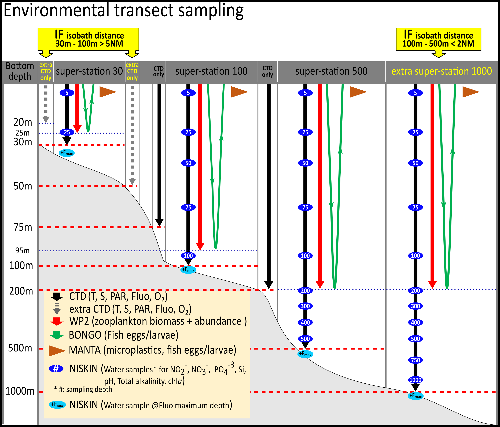

```{r setup, include=FALSE}
knitr::opts_chunk$set(echo = TRUE, fig.cap = TRUE, message = FALSE, warning = FALSE)

options(skipen=999)
#For dates to display in the proper way the locale needs to be set to English on the local machine
invisible(Sys.setlocale(locale = "English"))
#Load required packages
packages <- c("knitr", "readxl", "bookdown", "tidyverse", "ftExtra", "qdapRegex", "flextable", "officer", "imager", "officedown", "janitor", "formatR")

installed_packages <- packages %in% rownames(installed.packages())
if (any(installed_packages == FALSE)) {
  install.packages(packages[!installed_packages], repos = "http://cran.us.r-project.org")
}

# Packages loading
invisible(lapply(X = packages, FUN = require, character.only = TRUE))

# End of Packages loading
# Suppress dplyr's summarizing info
options(dplyr.summarise.inform = FALSE)
opts_knit$set(eval.after = "fig.cap")
opts_knit$set(eval.after = "fig.asp")

```

```{r data_loading, message=FALSE, warning=FALSE, include=FALSE, results='hide'}
#Loading of data, tidying up and preparation of the data for further usage
#Read in info from the input_dataframes excel file
input_dataframes_filepath <- list.files(path = "./_tables/", pattern = "input_dataframes.xlsx", full.names = TRUE)

input_dataframes_filepath <- input_dataframes_filepath[!str_detect(input_dataframes_filepath,"~$")]

sheets <- excel_sheets(input_dataframes_filepath)
input_dataframes <- lapply(excel_sheets(input_dataframes_filepath), 
                           function(x) 
                             data.frame(read_excel( input_dataframes_filepath, x, col_names = TRUE, col_types = "text")))

names(input_dataframes) <- sheets
input_dataframes <- purrr::map(.x = input_dataframes, .f = ~rename_with(.x, ~ gsub(".", " ", .x, fixed = TRUE)))

```

```{r setTableFormat, message=FALSE, warning=FALSE, include=FALSE, results='hide'}
# This chunck of code set the format (background color, padding, etc) of the tables produced in the report, so to have it standardized throughout.
set_flextable_defaults(big.mark = " ", 
  font.family = 'cambria',
  font.size = 8, 
  theme_fun = theme_zebra, 
  line_spacing = 0.6,
  padding.bottom = 2.5,
  padding.top = 2.5,
  padding.left = 2,
  padding.right = 2,
  extra_css = "caption {text-align: left;}")

```

# **SURVEY PLAN FOR** `r input_dataframes$surveyplantab$Survey`

<br>

The survey will start with Legs 5.1 and 5.2 both starting and ending in Dakar, Senegal, while Leg 5.3 will start and end in Las Palmas, Spain (Table \@ref(tab:surveyplantab)).

```{r surveyplantab, echo=FALSE, tidy=TRUE, label="surveyplantab"}
ft_surveyplan <- flextable(input_dataframes$surveyplantab) %>% theme_booktabs(bold_header = TRUE) %>% bg(bg='transparent', part = "header") %>% ftExtra::colformat_md()
ft_surveyplan <- line_spacing(ft_surveyplan, space = 1.0, part = "all")
ft_surveyplan <- flextable::align(ft_surveyplan, align = "center", j = -c(1), part = "all")
# Add caption
autonum <- run_autonum(seq_id = "tab", bkm = "surveyplantab", pre_label = "Table ", start_at=1)
ft_surveyplan <- set_caption(ft_surveyplan, caption = paste(input_dataframes$tab_captions[input_dataframes$tab_captions$`tab name`=="surveyplantab","caption"]), style = "Table Caption", autonum=autonum)

# # set table width to span page width
set_table_properties(ft_surveyplan,layout = "autofit")
```

## **Survey objectives**

The last transboundary pelagic survey off Northwest Africa took place in 2019.
The survey in 2022 will have the same scope and objectives as in 2019, covering the pelagic resources of Senegal, The Gambia, Mauritania and Morocco.
The survey will take place from 6 October 2022 to 16 December 2022 in three sub-legs, starting off from Dakar and ending in Las Palmas.
As such, the survey timing coincides with the time when most of the pelagic surveys with the R/V *Dr. Fridtjof Nansen* have been conducted in this region and will therefore add to the time series of pelagic fish biomass estimates.

The general objectives of Leg 5 surveys are:

-   Obtaining information on pelagic fish species abundance, their distribution and size structure, as well as the species composition of the pelagic fish assemblage.

-   Standard biological sampling of prioritized pelagic species (length, weight, sex and maturity).

-   Map the physical and chemical properties of the water column and the subsurface layer at the study area (temperature, salinity, dissolved O~2~, chlorophyll, nutrients, pH and total alkalinity), as well as the underwater currents and light penetration.

-   Sampling of zooplankton and ichthyoplankton.

-   Sampling for the presence of microplastic particles in surface waters.

-   Sampling fish for microplastics, food safety and nutrition studies.

Collected data will be used to prepare a survey report, and various scientific reports/papers as part of the EAF-Nansen Science Plan.
The data collected will also feed into regional fisheries resource assessment work (Fishery Committee for the Eastern Central Atlantic, CECAF <https://www.fao.org/cecaf/overview/en/>)

**Survey area**

The survey area for Leg 5 covers the northwest African continental shelf area: Leg 5.1 will cover the pelagic fish resources of The Gambia and Senegal.
Leg 5.2 will cover Mauritania and the region from Cape Blanc to Cape Bojador.
Leg 5.3 will cover the region from Cape Bojador to Tangier.

The area to be surveyed by the R/V *Dr. Fridtjof Nansen* in Leg 5, along with the planned acoustic transects, is shown in Figure \@ref(fig:surveyareamap).
The vessel can safely operate in depths \>20 m, thus acoustic transects will not cover shallower areas.

```{r surveyareamap, echo=FALSE, fig.cap=paste(input_dataframes$fig_captions[input_dataframes$fig_captions$`fig name`=="surveyareamap","caption"]), fig.align='center', fig.width=6.5, fig.height=4,  label='surveyareamap'}
knitr::include_graphics("./_images/surveyareamap.png")
```

## **Proposed participation in different legs and experience required**

Typically, the surveys with the R/V *Dr. Fridtjof Nansen* include participants from different countries and institutions.
Regarding qualifications, a mix of experienced and less experienced scientists /technicians will receive on-the-job training in sampling procedures.

An overview of the main types of expertise and number of participants required for Leg 5 is provided in [ANNEX I](#ANNEX_I) and the list of the planned survey participants is shown in [ANNEX II](#ANNEX_II).

It should be noted that a maximum number of 19 local participants can be allowed, in addition to the scientific crew from Norway and the DFN Core Team.

# **SCIENTIFIC RATIONALE**

The overall framework and rationale for the surveys carried out by the R/V *Dr. Fridtjof Nansen* are provided by the EAF-Nansen Programme Science Plan which covers three main pillars (Figure \@ref(fig:scienceplan)).
Within this framework, the scope and objectives of the surveys in 2022 have been identified with partners, based on national and regional priorities.
In addition, data recorded, and samples collected during the survey will be analysed through collaborations within the various Science Plan Themes.

```{r scienceplan, echo=FALSE, fig.cap=paste(input_dataframes$fig_captions[input_dataframes$fig_captions$`fig name`=="scienceplan","caption"]), fig.align='center', fig.width=6.5, fig.height=4.25, label='scienceplan'}
knitr::include_graphics("./_images/scienceplan.png")
```

An overview of the Science Plan themes for which this survey is most relevant and associated projects is provided in Table \@ref(tab:sciencethemestab).

```{r sciencethemestab, echo=FALSE, tidy=TRUE, label="sciencethemestab"}
ft_sciencethemestab <- flextable(input_dataframes$sciencethemestab) %>% theme_booktabs(bold_header = TRUE) %>% bg(bg='transparent', part = "header") %>% ftExtra::colformat_md()
ft_sciencethemestab <- line_spacing(ft_sciencethemestab, space = 1.0, part = "all")
# Add caption
autonum <- run_autonum(seq_id = "tab", bkm = "sciencethemestab", pre_label = "Table ")
ft_sciencethemestab <- set_caption(ft_sciencethemestab, caption = paste(input_dataframes$tab_captions[input_dataframes$tab_captions$`tab name`=="sciencethemestab","caption"]), style = "Table Caption"
                             , autonum=autonum
                             )

# # set table width to span page width
set_table_properties(ft_sciencethemestab,layout = "autofit")

```

## **Specific objectives and scientific questions for the survey**

The specific objectives of the Leg 5 surveys are listed below (note that some of the listed items are not valid for all sub-legs):

-   Hydrography and biogeochemical description:

    -   Map the physical and chemical properties of the water column and the subsurface layer at the study area (temperature, salinity, dissolved O~2~, chlorophyll *a*, pH, total alkalinity, pCO₂ and nutrients), as well as the underwater currents and light penetration.

-   Phytoplankton, zooplankton, ichthyoplankton and microplastics:

    -   Assess the biomass of the mesozooplankton community, as well as its species composition and distribution patterns.

    -   Provide information on the abundance patterns of the ichthyoplankton community (fish eggs and larvae), at the lowest possible taxonomic level to identify possible spawning areas for commercial valuable fish species.

    -   Map the occurrence of microplastics to identify hotspots and degree of pollution.

-   Pelagic resources:

    -   Provision of acoustic backscatter estimates (as a proxy for biomass) for the following acoustics groups: sardinella, horse mackerel, sardine ("Pilchard"), and anchovy.
        Other scatterers will be allocated to "Mackerel", "Pelagic Group I" (cluepeoids), "Pelagic Group II" (carangids, scombrids), "Demersal fish", "Mesopelagic fish", "Plankton" or "Other", as appropriate.

    -   Estimating the biomass and population size structure of sardinella (*Sardinella maderensis* and *S. aurita*), horse mackerel (*Trachurus trecae*, *T. capensis, T. picturatus*), anchovy (*Engraulis encrasicolus*), sardine (*Sardina pilchardus*) by means of echo integration and midwater trawling.
        For Pelagic Group I (clupeids) and Pelagic Group II (scombrids, carangids) only biomass estimates to be provided.

    -   Collection of biological data (length, wet body weight, sex, gonad maturity stage) for defined priority species (Table \@ref(tab:biosamplingtab)).

    -   Total catch weight and numbers of all fish species caught in the midwater trawl hauls.

-   Other trawl-related sampling:

    -   Mapping the occurrence, abundance and biological parameters (length, weight, sex, and maturity staging for males) of cartilaginous fish.

    -   Collection of rare or unidentified fish species for taxonomy studies.

    -   Collecting samples for future analysis of nutrient profiles, contaminants and microplastics of sardinella and anchovy.

    -   Collecting samples for analysis of microplastic in fish.

    -   Record the occurrence of marine debris collected during midwater trawling by using the available draft protocol and take photos for future inclusion in the protocol itself.

-   Other objectives:

    -   On-the-job training in the various laboratories.

    -   Communication through social media.

# **SAMPLING METHODS**

## **Survey design**

The survey design will consist of a systematic survey track with pseudo-parallel, equally-spaced acoustic transect lines perpendicular to the coast (approximately 10 nautical miles apart).
The survey track emulates past surveys in the time series to provide comparable biomass indices between the 20 and 500 m isobaths.
Coverage will be harmonized to the area surveyed during past surveys.

The proposed cruise track will allow systematic coverage and acquisition of acoustic backscatter records, hydrographic conditions, and abundance and distribution of plankton.

The ship will sample the entire shelf from Senegal's border to Guinnea-Bissau in the south to the border with Mauritania on Leg 5.1 including The Gambia.
Subsequently, Mauritania (St. Louis to Cape Blanc) and the region up to Cape Bojador will be surveyed on Leg 5.2.
Finally, Leg 5.3 will cover the region from Cape Bojador to Tangier, after which the vessel will sail to Las Palmas, Spain.
Crew changes will take place in Dakar on October 18 and November 15, and the vessel will return to Las Palmas after completing Leg 5, on December 19.

**Superstations**

Specific environmental transects with super-stations will be carried out according to a regular grid (every 1° or 60NM).

Typically, these transects covers the depth region from 20 to 500 m or even 1000 m.

When these environmental transects are extended, specifically from 20 m to 2000 m bottom depth isobath (CTD to 1000 m, other instruments down to 200 m), they will then be referred to as "Master sections".

A super-station is defined as a station containing a set of sampling devices deployed in close connection to each other, like a CTD (hydrographic parameters), WP II net (zooplankton), Bongo net (ichthyoplankton) and a manta trawl (microplastics and ichthyoplankton).

An overview of equipment and sampling depths of the superstations conducted at the environmental transects is shown in (Figure \@ref(fig:envtransects)).

CTD deployments will be carried out at super-stations along the environmental transects involving historical monitoring transect as well as at every pelagic trawl station up to a depth of 300 m (Figure \@ref(fig:surveyareamap)).

```{r envtransects, echo=FALSE, fig.cap=paste(input_dataframes$fig_captions[input_dataframes$fig_captions$`fig name`=="envtransects","caption"]), fig.align='center', fig.width=6, fig.height=5, label='envtransects'}

```

[**Acoustics**]{.underline}

Acoustic transects will be surveyed northwards in ascending order of transect number for each Leg (Fig. \@ref(fig:surveyareamap)).

The Cruise leader/Co-Cruise leader may truncate, extend or omit lines as necessary to alleviate time constraints due to adverse weather or other reasons (e.g. obstacles at sea).

As most of the pelagic species are likely to be concentrated close inshore, it is imperative that the inshore position of each transect, and the inshore transits between transects, be placed as close inshore as safety permits.

It is noted that the ultimate decision on the position of transects and the need to deviate from transects for safety reasons lie with the Captain of the vessel.

When the acoustic transect line is interrupted (such as break-off for trawling) the transect must be resumed from the point of interruption, preferably with a small overlap to the interrupted transect.
This ensures continuous acoustic data coverage along the intended transect line.

Parallel transect with R/V from Senegal, Mauritania and Morocco, respectively, will be conducted on each of the surveys, pending to availability of partner countries' vessels.
Calibration of echosounders will take place in Senegal at the beginning of Leg 5.

**The Simrad EK80 echosounder, EM710, SU90 and the ADCP must run synchronized with each other via the k-sync system to ensure no interference on the recorded EK80 data.**  

EK80, EM710, SU90 and the 150 kHz ADCP will be the only actively transmitting acoustic instruments to be used continuously in this survey.
Occasional use of other sonars and echosounders may occur (unexpected), and if so, they must run synchronized via k-sync with all the other acoustic equipment while on the acoustic transects.

**EK80**

Acoustic backscatter data at all available frequencies (18, 38, 70, 120, 200, and 333 kHz) from the Simrad EK80 echo sounder operating with **narrowband (continuous wave, 'CW') pulses of 1.024 ms duration and "Fast taper"** transmission is to be collected continuously while the ship is steaming along and between transects.
The chief instrument operator must ensure that only calibrated EK80 settings are used for the acoustic data collection.
EK80 calibration will be done at the beginning of Leg 5.1.
If not possible, the most recent valid EK80 calibration results and settings (at the date of writing this is Cape Verde, 2021 Dec., 2021407) will be used for the acoustic backscatter data collection.

EK80 echosounders will operate with both **drop keels in extended positions** to minimize signal loss due to air bubbles running along the hull and keel.

Acoustic backscatter data (EK80) is to be logged down to 700 m depth, with recording range adjustments according to the bottom depth in shallower waters.
The effective echosounder operational range is frequency dependent.
The recording ranges at higher nominal acoustic frequencies can be set separately to reduce the size of the acoustic data files (e.g., 150 m for 333 kHz, 300 m for 200 kHz, 600 m for 120 kHz, 1200 m for 70 kHz, and 2000 m for 38 and 18 kHz).
Appropriate cut-off limits will be set for each frequency at the beginning of the survey, ensuring all valid data are retained.
The acoustic operators must remain vigilant of the water depth and adjust the recording range logged by the EK80 as appropriate; it is paramount that both the pelagic and part of the bottom echo always are included in the recording range for 18 and 38 kHz that are essential for the survey.

@RokasKubilius to provide feedback on the part below

------------------------------------------------------------------------

**The ping rate** of Simrad EK80 will be set to 'maximum' or 'fixed' (e.g., ping interval 2000 ms, that is 1 ping per 2 sec. for bottom depths up to about 1400 m) depending on k-sync acoustic equipment synchronization system needs.
Frequent EK80 ping rate adjustments (manual or automatic) may be required, depending on bathymetry conditions.

Weather and sea permitting, a **survey speed of 10 knots** will normally be maintained.
However, the vessel may have to be slowed even further at the request of the cruise leader or acoustic watch-keeper to reduce acoustic noise.

The acoustic nautical area scattering coefficient (NASC) at 38 kHz integrated across the water column for the target species is to be estimated onboard using the LSSS acoustic data post-processing software.
Target species include taxa listed in Table \@ref(tab:biosamplingtab).
The acoustic scrutinization, i.e., the splitting of total backscatter into target/mix groups and non-targets such as plankton in the LSSS post-processing system will be carried out twice daily by the cruise leader, co-cruise leader, and instrument chief.
The Deep Vision subsea video system may be mounted onto the MultPelt trawl upon specific request of the cruise leader to provide in-trawl imagery to aid the scrutinization process.
The usage of Deep Vision should be cautious, as the Deep Vision system is vitally important for the subsequent surveys.

The **Simrad SU90 sonar** will be operated continuously along and between transects to record acoustic data continuously during the survey.

The sonar must be set to a frequency of 26 kHz, in FM Normal mode and operated using "Trawl 2" (old "Bow up/180 deg") operation mode with the bearing of the vertical beams 90 deg, perpendicular to the vessel direction with a range of 450m and with the horizontal beams set to 450m with a tilt angle of 3 deg.
Default filter values must be used except for the Noise filter which must be turned off.
These settings including range and tilt must be kept the same during the whole survey except during trawling operations where the sonar can at times be used actively to focus in on targets.
If time allows, scrutinizing of sonar data will be done daily.

The two **ADCPs** will also be operated continuously along the survey.

**The EK80 echosounder, the EM710, the SU90 multibeam sonar and ADCPs must run synchronized with each other via k-sync to ensure no interference on the recorded EK80 data.**

------------------------------------------------------------------------

[**Midwater trawling**]{.underline}

Frequent *ad hoc* target identification tows will be made at the request of the cruise leader/co-cruise leader, or the acoustic watch-keeper, using either the bottom trawl (Gisund Super) with floats, the small pelagic (Åkra trawl) or the large pelagic (MultPelt) trawl.

Species composition, length frequencies and biological sampling must be done for each trawl sample.
The number of trawl samples will depend on the density and distribution of acoustic targets observed and the need for species identification.
Trawls may be requested at any time during day and night.
The frequency of tows will depend on the presence and degree of mixing of acoustic targets requiring identification as judged by the acoustic watch keeper, but allowance has been made for an average of 6 hours trawling per day.
This is an average figure, and on some days more than 6 hours may be requested.
The emphasis will be on catching relatively small quantities of fish in good condition for target identification and to conduct biological analysis.
To carry out a trawl haul, the ship will break off from the survey grid.
After completion of the trawl, the ship is to return to the point at which the survey was interrupted.

If there **are strong echoes on the echogram, and a subsequent trawl fails to collect a decent sample (at least 40 fish of the dominant species), the acoustic operator will need to request another trawl straight away to try and get a representative sample.**

## **Meteorological and hydrographic sampling in surface water**

### *Weather Station*

Wind direction, wind speed, air pressure, relative humidity, air temperature and solar radiation data are averaged every 60 seconds and logged continuously from the Aanderaa Automatic Weather Station 2700.

### *Thermosalinograph*

Two SBE 21 SeaCAT Thermosalinographs (TSG) run continuously during the survey, obtaining samples at 4 m and 6 m depths to measure seawater salinity and temperature every 10 seconds.

The 4 m TSG measures water from the intake for the engine cooling water, whereas the 6 m TSG measures water from the intake located on the drop keel.

The 4 m TSG is equipped with a Turner Designs C3 Submersible Fluorometer and the 6 m TSG is equipped with a Sea-Bird WETStar Fluorometer.

### *Underway pCO~2~*

Seawater from the vessel's 4 m intake is pumped through the flow head of a CONTROS HydroC^®^ CO~2~ FT sensor where dissolved gases are diffused through a composite membrane into an internal gas circuit leading to a detector chamber.

The partial pressure of CO₂ is then determined via IR absorption spectrometry.

Water samples will be collected from the sensor's water outflow to measure pH and total alkalinity to validate the sensor's pCO₂ values.

### *Current speed and direction measurements - ADCP*

Ocean current data is collected with a vessel-mounted Teledyne RDI Ocean Surveyor Acoustic Doppler Profiler operating at 150 kHz with a depth range of 400 m.
The ADCP runs in narrow band mode and averages data in 8 m vertical bins.
Heading, pitch, roll and positional data are acquired by a Kongsberg Marine SEAPATH unit.
Teledyne's VmDAS software is used to collect the raw current data, whereas the data is processed using software created at IMR.

## **Hydrographic sampling in the water column**

**CTD-Rosette system**

A Sea-Bird 911plus CTD with the following sensors is mounted to a 12-bottle rosette water sampler for use at every hydrographic station.
All sensor data logging and real-time profiling is performed using Sea-Bird's Seasave software.

• 2 x SBE 3Plus Temperature ('T') sensors

• 2 x SBE 4C Conductivity sensors for salinity ('S')

• Digiquartz Pressure ('P') sensor

• SBE 43 Dissolved Oxygen ('DO') sensor

• WET Labs ECO-AFL Fluorometer ('F')

• Sea-Bird ECO FLNTU Fluorometer and Turbidity sensor

• Satlantic Photosynthetically Active Radiation ('PAR') LOG ICSW sensor

CTD-Rosette deployments will be carried out at every trawl station as well as at every station where environmental sampling is conducted ('super-station', see below), in accordance with IMRs standard depth designations shown in Figure \@ref(fig:envtransects).
Additional sampling devices will be deployed for collection of plankton (including ichthyoplankton) and microplastics.

The water samples from the Niskin bottles attached to the Rosette will be used for measurements of pH, total alkalinity, dissolved nutrients (nitrite, nitrate, silicate, and phosphate), dissolved oxygen, chlorophyll a and salinity.
Detailed sampling protocols for these parameters can be found in the Nansen manual site (<http://nansen-surveys.imr.no/doku.php?id=ctd_lab_information>).


### Ocean Acidification parameters - pH and total alkalinity

Seawater samples for the analysis of pH and total alkalinity are collected together in 250 ml borosilicate glass bottles with silicone tubing.
Samples are collected from the rosette water sampler in accordance with IMR's Standard Depth designations.
If oxygen water samples are not being collected, these pH/AT samples will be collected first from the rosette bottles due to their gas sensitivity that will alter the pH.

• pH is determined using an Agilent Cary 8454 UV-Vis Diode Array spectrophotometer and a 2-mM m-cresol purple indicator dye solution.
See the pH protocol for further details in addition to sampling and analysis procedures.

• Total alkalinity is determined via an open-cell potentiometric titration using a 0.05 M HCl solution with a sodium chloride background as the titrant (Dickson et al., 2007).
See the total alkalinity protocol for further details in addition to sampling and analysis procedures.
To assess the ocean acidification state and change in the region, the pH and total alkalinity data will be combined with phosphate, silicate, temperature, salinity, and depth to calculate additional parameters of the carbonate system such as dissolved inorganic carbon, and the calcium carbonate saturation states for aragonite and calcite.

### Dissolved Nutrients

Seawater samples for the analysis of nitrite, nitrate, silicate, and phosphate are collected in 20 ml polyethylene vials at all super-stations and frozen for preservation (Becker et al., 2019).
When ready for analysis, samples will be thawed in a 50°C water bath for 40 minutes and then allowed to cool to room temperature for 45 minutes (Becker et al., 2019).
The nutrient samples will be measured on board the vessel before November 2022 with a SEAL QuAAtro39 continuous segmented flow analyser (QuAAtro Methods: Q-070-05 Rev. 7; Q-068-05 Rev. 12; Q-064-05 Rev. 8; Q-038-04 Rev. 4 (multitest MT3B).

## **Phytoplankton**

Seawater samples for the analysis of chlorophyll *a* are collected in 276 ml high-density polyethylene bottles from depths ranging from 5 to 200 m at all super-stations.
Samples are filtered with 25 mm Munktell MG F filters with a 0.7 µm particle retention on a 200 mm Hg vacuum pumped filtration system.
The filters are stored in a -20°C freezer until ready for extraction for 15-24 hours with 10 ml of 90% acetone at 4°C.
Samples are then centrifuged and transferred to cuvettes for analysis on a Turner Designs 10AU Fluorometer (Welschmeyer, 1994; Jeffrey and Humphrey, 1975).
Samples are first measured without acid for chlorophyll *a* determination and then a second time with two drops of 5% HCl for phaeopigment determination.
The 10AU fluorometer is calibrated once a year with standard solutions created from a chlorophyll *a* solid from spinach.
In addition, blank measurements with 90% acetone and stability measurements with a 10AU Solid Secondary Standard are carried out before and after every sample set analysis.

Water samples for phytoplankton community composition analysis will be collected at the stations of the five national monitoring lines (Cunene, Namibe, Lobito, Luanda, Congo).
Water will be collected at predefined depths (5, 15, 25, 50, 75 m) with Niskin bottles on the CTD-Rosette, with \*\*75 m\*\* as the maximum depth of sample collection.
Samples will be fixed in 2% formaldehyde solution.

## **Zooplankton**

Zooplankton samples are to be collected at three "superstation" stations positioned at the isobaths 30 m, 100 m, 500 or 1000 m).
The standard sampling depths for zooplankton will be 30 m, 100 m and 500 m, but if the distance between the 500 m and 1000 m isobath is less than 2 NM we will take zooplankton samples at the 1000 m station instead of at 500 m.
Additional zooplankton sampling will be done at the stations of the five national monitoring lines.
All samples will be collected by vertical hauls of a WP2 net (56 cm diameter, mesh size 180 µm) at a speed of 0.5 m sec^-1^.
The net will be towed **within 5 m above the bottom** to the surface, or from 200 m depth to the surface at deep stations.
The plankton leader should ensure that this procedure is followed accurately on deck, write the actual depth of the tow (displayed in the monitor), and take flowmeter counts before and after the tow.
In summary, the WP2 samples will be processed as follows:

• The sample will be halved into parts with a Motoda splitter.

• One half will be used for biomass estimation (size fractionation through 2000 μm, 1000 μm and 180 μm mesh sizes).

• The second half will be preserved in 4% borax buffered formaldehyde solution and will be processed onboard through the FlowCam Macro.
The exact procedure to be followed is described in detail in the **Nansen Plankton Guidelines (see <https://nansen-surveys.imr.no/doku.php?id=plankton_lab_information> )**.

## **Ichthyoplankton**

Ichthyoplankton is collected at the same super stations as the zooplankton samples are collected, with double oblique tows of a Bongo net (60 cm diameter) equipped with 405 μm nets.
The Bongo will be towed obliquely within 5 m above the bottom or a maximum depth of 200 m to the surface at deep stations.
**Wire speed and the vessel speed should strictly follow the Nansen Plankton Guidelines (see <https://nansen-surveys.imr.no/doku.php?id=plankton_lab_information>)**.\
Once the Bongo net is on board, the samples will be transferred in the lab and will be processed as follows:

• The sample of the right net (H) will be preserved directly in 95% ethanol.

• The sample of the left net (V) will be preserved directly in 4% borax buffered formaldehyde solution solution (especially made for ichthyoplankton).
If time allows this sample will be examined under the microscope and all fish larvae (and eggs if possible) will be sorted out.
Plankton examination should be done thoroughly and in small amounts.
When sorting has finished, the bulk sample will be used for the estimation of the Zooplankton Displacement Volume (details in the Nansen Plankton Guidelines).
Finally, the sample will be stored back in its bottle using the same 4% formaldehyde.
The sorted ichthyoplankton will be photographed and preserved with 4% formaldehyde solution (especially made for ichthyoplankton) in small-labelled scintillation vials indicating clearly which net was used for sorting, the preservative, station etc.
More details on the sample processing can be found in the **Nansen Plankton Guidelines (see <https://nansen-surveys.imr.no/doku.php?id=plankton_lab_information>)**.

If Bongo deployment is not possible due to net malfunction etc., ichthyoplankton will be sampled by Multinet (Midi or Mammoth) according to the instructions in the **Nansen Plankton Guidelines (see <https://nansen-surveys.imr.no/doku.php?id=plankton_lab_information>)**

In addition, larval fish collected by the Manta trawl (see also 3.8), these will be sorted, photographed, preserved in 96% ethanol for genetics in small scintillation vials.

## Bottom depth

Bottom depth read is obtained continuously from the EK80 echosounder (down to 700 m depth, 38kHz) and registered into the Olex bottom mapping system used by the vessel.
The information is also registered in the "Survey Logger" (Toktlogger) system, through the appropriate NMEA message.

When sampling station bottom depth exceeds 700m (and it needs bottom depth read input to "Survey Logger"), a temporary manual adjustment to EK80 settings will be made to obtain local bottom depth read (implies adjustment to a slower ping rate than the standard 1 Hz).

## Microplastics

Microplastics are collected at the same superstations as the zooplankton samples with a Manta trawl and the operation is carried out concurrently with the tow of the Bongo net.
The Manta trawl (19 cm (height) × 61 cm (width), 335 μm mesh size) is towed outside the wake of the vessel at 2-3 knots (ca. 1.5 m/s) for 15 min.
Procedures of sampling and sample processing are described in the Nansen Plankton Guidelines (see Nansen wiki).
Sampling processing in summary involves sorting of:

**Microplastics**: These should be photographed, washed in fresh water, and stored in labelled Eppendorf tubes with the station information.
Polymer identification to be done by ATR FTIR in Bergen, Norway.

The bulk of neuston samples also collected with the Manta trawl should be preserved, after sorting, in 96% ethanol.
In case of lack of time for sorting or adverse weather conditions, samples should be directly preserved in 96% ethanol and processed later.
Non-methylated ethanol should be used in all cases.


## **Biological sampling of fisheries resources**

According to the size of the catch, either the whole catch is sorted and measured, or subsamples are collected, and total catch estimated from subsample ratios.

At all trawl hauls, the catch is sorted according to species, and number and weight measurements will be completed for all species caught.

For the defined priority species length and weight are recorded using an electronic fish meter connected to a standard data acquisition system used on board the vessel (Fish2Data and Biotic Editor) that is connected to the server of the vessel.
Biological sampling will be completed for defined priority species (Table \@ref(tab:biosamplingtab)).

The fish lab workflow overview and the specific scales to be used on the survey are described in [ANNEX III](#ANNEX_III) and [ANNEX IV](#ANNEX_IV). As a preparation for the work in the fish lab, an onboard training course on the use of the electronic fish meter, Fish2Data and Biotic Editor software will be provided at the beginning of the survey.

The Fish2Data software will be pre-configured with the sampling protocol and will be accessible through the iPads facilitating the biological measurements.

<!---BLOCK_LANDSCAPE_START--->

```{r biosamplingtab, echo=FALSE, tidy=TRUE, label="biosamplingtab"}
ft_biosamplingtab <- flextable(input_dataframes$biosamplingtab) %>% theme_booktabs(bold_header = TRUE) %>% bg(bg='transparent', part = "header") %>% ftExtra::colformat_md()
ft_biosamplingtab <- line_spacing(ft_biosamplingtab, space = 1.0, part = "all")
# Add caption

ft_biosamplingtab <- flextable::align(ft_biosamplingtab, align = "center", j = -c(1), part = "all")


autonum <- run_autonum(seq_id = "tab", bkm = "biosamplingtab", pre_label = "Table ")
ft_biosamplingtab <- set_caption(ft_biosamplingtab, caption = paste(input_dataframes$tab_captions[input_dataframes$tab_captions$`tab name`=="biosamplingtab","caption"]), style = "Table Caption"
                             , autonum=autonum
                             )

# # set table width to span page width
set_table_properties(ft_biosamplingtab,layout = "autofit")

```

<!---BLOCK_LANDSCAPE_STOP--->

<!-- ### Demersal species -->

<!-- *Not relevant for the survey.* -->

### Pelagic species

The primary objectives of sampling midwater trawl catches are to obtain information on species composition and size frequency to allow acoustic estimation of the biomass of the different species.

[**No fish or any other organisms are to be taken from the deck or from the trawl without the expressed permission of the fish team leader.**]

**Fish team leaders must ensure adherence BY ALL FISH TEAM MEMBERS to the sampling protocol given below.**

@ Cruise leaders/co-cruise leaders and fish lab team leaders: Correct the following section between hashtags accordingly

#######################################
The following tasks are to be carried out:

1.  **Estimation of species composition** of the catch through sorting and weighing of species-specific sub-samples.

2.  **Length distributions (Caudal length to the nearest 0.5 cm) and sample mass (kg to 3 decimal places) of a random sample of AT LEAST 100 INDIVIDUALS of pelagic species (*Sardinella aurita*, *Sardinella maderensis*, horse mackerels *Trachurus trecea* and *Trachurus trachurus*, anchovy *Engraulis encrasicolus*, European pilchard (sardine) *Sardina pilchardus*, and mackerel *Scomber colias*) from every trawl must be taken (all fish must be measured in trawls where \<100 fish of a particular species are captured)**.

IN THE CASE OF BIMODAL LENGTH DISTRIBUTIONS, A MINIMUM OF 200 INDIVIDUALS OF THESE SPECIES ARE TO BE MEASURED. Each fish in the sample should be assigned a unique number that is then recorded with the caudal length (CL; to the nearest mm) on the data sheet / electronic system provided.

Retain anchovy, sardine, and horse mackerel for later collection of biological data, otoliths and samples for subsequent analyses.

[THE ENTIRE CATCH MUST BE RETAINED ONBOARD UNTIL ALL SAMPLING IS COMPLETED TO ENSURE THAT ADEQUATE NUMBERS OF FISH OF THE MINOR SPECIES ARE AVAILABLE FOR LENGTH FREQUENCY ESTIMATION IN MULTISPECIES CATCHES!!!]{.underline}

3.  **Full biological analysis** of fifty (50) individuals of anchovy, sardine and horse mackerel selected from the length frequency samples.

Care should be taken that this sub-sample covers the size range observed in the length frequency distribution.

The wet body weight (to the nearest 0.1 g) of each fish is to be measured, then the visceral cavity of each fish must be opened and their sex, gonad maturity stage and fat stage assigned following visual assessment of their gonads and mesenteric fat levels ([ANNEX IV](#ANNEX_IV)) and recorded for each fish on the data sheet / electronic system provided (corresponding to the unique number, and caudal length assigned to each fish in point 2 above).

**LENGTH FREQUENCY DETERMINATIONS AND FULL BIOLOGICALS MUST BE DONE FOR EVERY SINGLE TRAWL.**

4.  **For all pelagic target species, the otoliths** of the first 20 fish from which biological data were collected should be extracted, **cleaned in fresh water**, dried with a tissue and stored dry in a vial.

The vial should contain a numbered label that corresponds to the unique fish number recorded on the data sheet electronic system.

Vials can then be placed into a sealed plastic bag with a label containing the trawl information (species, date, station and grid numbers) and marked "***SPECIES*** **AGEING**".
+++
+++
+++


### *Other trawl-related sampling*

#### *Demersal fish and shellfish* {.unnumbered}

All demersal species caught in bottom trawls areas were bottom depth requires the use of bottom trawling (\<50 m) are to be registered according to standard sampling protocol.

#### *Fish and macroinvertebrates samples for regional taxonomy course and post-survey taxonomic studies* {.unnumbered}

Unidentified fish and macroinvertebrates taxa are to be preserved according to standard protocols.

#### *Cartilaginous fish* {.unnumbered}

Individual length and weight, sex and maturity status shall be measured of all cartilaginous fish caught.

Vulnerable species that are alive shall be released as soon as possible after the catch is on deck.
If the individuals are too large to weigh individually only length is to be measured.

The protocol that will be followed for cartilaginous will be the same as for demersal / pelagic resources described above.

Specimens for taxonomic courses will be collected also following the protocol described above.
Species that cannot be identified should be preserved in formalin or frozen (and labelled according to the procedure above) and sent to taxonomic experts for identification after the survey.

#### *Samples for food safety studies and nutrition* {.unnumbered}

-------------------------------------------------------


#### *Marine debris* {.unnumbered}

Marine debris will be registered and classified at each station according to the categories listed in the sampling protocol for marine litter (<https://nansen-surveys.imr.no/doku.php?id=biological_sampling_procedures>).
All pieces of litter should be weighed and counted, and when possible, photos should be taken of the individual pieces for a reference catalogue.
Data should be recorded in designated Excel sheet and photos should be clearly labelled and saved in a folder in the work catalogue marked 'Marine Debris'.
One person from each shift will be responsible for recording this data.

<!-- #### *Epibenthos* {.unnumbered} -->

<!-- Not relevant for the survey. -->

<!-- ### *Demersal fish biomass estimated based on the swept area method* -->

<!-- Not relevant for the survey. -->

### *Pelagic fish biomass estimated based on acoustics (EK80)*

The biomass indices of priority pelagic fish will be estimated by the acoustic estimate method (<https://nansen-surveys.imr.no/doku.php?id=biomass_calculations>) using the [StoX (stoxproject.github.io)](https://stoxproject.github.io/StoX/) software.

This requires as input, the integrated acoustic backscatter (S~A~/NASC) per 10 NM or shorter ESDU for each of the species listed, the species composition from the trawls, the length frequency per species and the length frequency sample mass per species, the transect length and the survey area (per stratum).

Biomass indices will be estimated as total biomass per species per stratum and as numbers at length per stratum (for the species with sufficient length data) and for the total survey area.

Allocation of acoustic densities to species groups will be done according to Table \@ref(tab:acousticcattab) for the relevant to the survey acoustic groups only.

```{r acousticcattab, echo=FALSE, tidy=TRUE, label="acousticcattab"}
ft_acousticcattab <- flextable(input_dataframes$acousticcattab) %>% theme_booktabs(bold_header = TRUE) %>% bg(bg='transparent', part = "header") %>% ftExtra::colformat_md()

ft_acousticcattab <- flextable::height(ft_acousticcattab,  height = .45, unit = "cm")
ft_acousticcattab <- flextable::hrule(ft_acousticcattab, rule = "exact")
ft_acousticcattab <- flextable::valign(ft_acousticcattab, valign = "top", part = "body")
ft_acousticcattab <- flextable::fontsize(ft_acousticcattab, size = 7.5, part = "body")
ft_acousticcattab <- line_spacing(ft_acousticcattab, space = 0.75, part = "all")

# Add caption
autonum <- run_autonum(seq_id = "tab", bkm = "acousticcattab", pre_label = "Table ")
ft_acousticcattab <- set_caption(ft_acousticcattab, caption = paste(input_dataframes$tab_captions[input_dataframes$tab_captions$`tab name`=="acousticcattab","caption"]), style = "Table Caption"
                             , autonum=autonum
                             )

# # set table width to span page width
set_table_properties(ft_acousticcattab,layout = "autofit")
```

\newpage

# **DATA COLLECTED AND STANDARD PROCEDURE FOR HANDING OVER SAMPLES TO PARTNERS**

In line with the Nansen Data Policy, the Cruise Leader is to ensure that each national institution represented in the survey receives a copy of the draft report and the basic data (e.g. catch data) pertaining to the particular survey and for **their national waters** before leaving the vessel.

An overview of the equipment that is going to be used for the collection of the various data can be found in Table \@ref(tab:equipmenttab) ([ANNEX V](#ANNEX_V)).

The different types of data expected to be recorded, their storage and delivery can be found in Table \@ref(tab:datahandovertab) ([ANNEX VI](#ANNEX_VI)).

Finally, the samples to be collected, their preservation and planned follow-up work is detailed in Table \@ref(tab:collectedsamplestab) ([ANNEX VII](#ANNEX_VII)).

The Cruise Leader is expected to document what data and samples have been shared and with whom.

The cruise participants are expected to sign and conform to the Data policy of the EAF-Nansen Programme.

Persons responsible for samples need to inform about the status of analysis, and report about this at the post-survey meeting, as well as send a copy of the analysis/results to IMR ([nansen_data\@hi.no](mailto:nansen_data@hi.no)).

IMR, as a data custodian for the EAF-Nansen Programme, is required to have an overview of the samples/analysis at any point in time to;

1.  Ensure that data life-cycle management is carried out in the expected way

2.  Be used for capacity building purposes (e.g. workshops, training courses, etc.)

3.  Advance collaboration and publishing through the EAF-Nansen Science Plan

4.  Maintain reference libraries (e.g., for taxonomic purposes) and DNA barcoding.

5.  Plan efficiently future surveys in the same area.

-------------------------------------------------------

# **REFERENCES** {.unnumbered}

Becker, S.; Aoyama, M.; Woodward, E.M.S.; Bakker, K.; Coverly.
S.; Mahaffey, C.
and Tanhua, T.
(2019) GO-SHIP Repeat Hydrography Nutrient Manual: The precise and accurate determination of dissolved inorganic nutrients in seawater, using Continuous Flow Analysis methods.
In: GO-SHIP Repeat Hydrography Manual: A Collection of Expert Reports and Guidelines.
Version 1.1, [56pp.].
DOI: <http://dx.doi.org/10.25607/OBP-555>.

Demer, D. A., Berger, L., Bernasconi, M., Bethke, E., Boswell, K., Chu, D., Domokos, R., et al. 2015.
Calibration of acoustic instruments.
ICES Cooperative Research Report No. 326: 133 pp. <http://dx.doi.org/110.25607/OBP-25185>.

Dickson, A.G., Sabine, C.L.
and Christian, J.R.
(Eds.) 2007.
Guide to Best Practices for Ocean CO2 Measurements.
PICES Special Publication 3, 191 pp.

Jeffrey, S.W., Humphrey, G.F.
(1975).
New Spectrophotometric Equations for Determining Chlorophylls a, b c1 and c2 in Higher Plants, Algae and Natural Phytoplankton.
Biochem.
Physiol.
Plantzen, 167: 191-194.

Welschmeyer, N.A.
(1994).
Fluorometric analysis of chlorophyll a in the presence of chlorophyll b and phaeopigments.
Limnol.Oceanogr.
39: 1985-1992.

\newpage

# **ANNEXES** {.unnumbered}

## **ANNEX I. Requested participation** {#ANNEX_I .unnumbered}

```{r reqparttab, echo=FALSE, tidy=TRUE, label="reqparttab"}
reqparttab <- input_dataframes$reqparttab %>% 
  rename("Position / laboratory"=`Position  laboratory `,
         "DFN core team (IMR)"=`DFN core team  IMR `,
         "DFN core team (non-IMR)"=`DFN core team  non IMR `,
         "FAO / External experts"=`FAO  External experts `,
         "Total non-IMR personnel"=`Total non IMR personnel`
         ) %>%
  dplyr::select(-c("Min personnel","Missing personnel","Grand total")) %>%
  mutate(across(.cols = -c("Leg","Position / laboratory"), .fns = as.numeric)) %>%
  arrange(Leg) %>% 
  group_by(Leg) %>% 
  nest() %>%
  mutate(data = map(data, ~ .x %>% adorn_totals(where = c("row"), name = "Total", fill = "", na.rm = T))) %>%
  mutate(data = map(data, ~ .x %>% adorn_totals(where = c("col"), name = "Total", fill = "", na.rm = T, ... = c("DFN core team (IMR)","Total non-IMR personnel")))) %>%
  unnest(cols = c(data))

ft_reqparttab <- flextable(reqparttab) %>% theme_booktabs(bold_header = TRUE) %>% bg(bg='transparent', part = "header") %>% ftExtra::colformat_md()
ft_reqparttab <- line_spacing(ft_reqparttab, space = 1.0, part = "all")
ft_reqparttab <- flextable::align(ft_reqparttab, j = c(3:10), align = "center", part = "all")
# Add caption
autonum <- run_autonum(seq_id = "tab", bkm = "reqparttab", pre_label = "Table ")
ft_reqparttab <- set_caption(ft_reqparttab, caption =  paste(input_dataframes$tab_captions[input_dataframes$tab_captions$`tab name`=="reqparttab","caption"]), style = "Table Caption"
                             , autonum=autonum
                             )

# # set table width to span page width
set_table_properties(ft_reqparttab,layout = "autofit")

```

\newpage

## **ANNEX II. Planned participants** {#ANNEX_II .unnumbered}

```{r plannedparticipantstab, echo=FALSE, tidy=TRUE, label="plannedparticipantstab"}
plannedparticipantstab <- input_dataframes$plannedparticipantstab %>% mutate(No=seq.int(nrow(input_dataframes$plannedparticipantstab))) %>% relocate(No)

ft_plannedparticipantstab <- flextable(plannedparticipantstab) %>% theme_booktabs(bold_header = TRUE) %>% bg(bg='transparent', part = "header") %>% ftExtra::colformat_md()

ft_plannedparticipantstab <- flextable::height(ft_plannedparticipantstab,  height = .7, unit = "cm")
ft_plannedparticipantstab <- flextable::hrule(ft_plannedparticipantstab, rule = "exact")
ft_plannedparticipantstab <- flextable::valign(ft_plannedparticipantstab, valign = "top", part = "body")
ft_plannedparticipantstab <- flextable::fontsize(ft_plannedparticipantstab, size = 8, part = "body", j = -c(1:3))
ft_plannedparticipantstab <- line_spacing(ft_plannedparticipantstab, space = 1.5, part = "all")

# Add caption
autonum <- run_autonum(seq_id = "tab", bkm = "plannedparticipantstab", pre_label = "Table ")
ft_plannedparticipantstab <- set_caption(ft_plannedparticipantstab, caption =  paste(input_dataframes$tab_captions[input_dataframes$tab_captions$`tab name`=="plannedparticipantstab","caption"]), style = "Table Caption"
                             , autonum=autonum
                             )

# # set table width to span page width
set_table_properties(ft_plannedparticipantstab,layout = "autofit")

```

\newpage

## **ANNEX III. Fish lab workflow** {#ANNEX_III .unnumbered}

```{r catchsamplingworkflow, echo=FALSE, fig.cap=paste(input_dataframes$fig_captions[input_dataframes$fig_captions$`fig name`=="catchsamplingworkflow","caption"]), fig.align='center', fig.width=6.5, fig.height=3.5,  label='catchsamplingworkflow'}
knitr::include_graphics("./_images/catchsamplingworkflow.png")
```

\newpage

## **ANNEX IV. Non-standard scales** {#ANNEX_IV .unnumbered}

<br>

```{r matstagetab, echo=FALSE, tidy=TRUE, label="matstagetab"}
ft_matstagetab <- flextable(input_dataframes$matstagetab) %>% theme_booktabs(bold_header = TRUE) %>% bg(bg='transparent', part = "header") 
#%>% ftExtra::colformat_md()
ft_matstagetab <- line_spacing(ft_matstagetab, space = 1.0, part = "all")
# Add caption
autonum <- run_autonum(seq_id = "tab", bkm = "matstagetab", pre_label = "Table ")
ft_matstagetab <- set_caption(ft_matstagetab, caption = paste(input_dataframes$tab_captions[input_dataframes$tab_captions$`tab name`=="matstagetab","caption"]), style = "Table Caption"
                             , autonum=autonum
                             )
           
# # set table width to span page width
set_table_properties(ft_matstagetab,layout = "autofit")
                  
```

\newpage

```{r fatstageanchtab, echo=FALSE, tidy=TRUE, label="fatstageanchtab"}
ft_fatstageanchtab <- flextable(input_dataframes$fatstageanchtab) %>% theme_booktabs(bold_header = TRUE) %>% bg(bg='transparent', part = "header") 
#%>% ftExtra::colformat_md()
ft_fatstageanchtab <- line_spacing(ft_fatstageanchtab, space = 1.0, part = "all")
# Add caption
autonum <- run_autonum(seq_id = "tab", bkm = "fatstageanchtab", pre_label = "Table ")
ft_fatstageanchtab <- set_caption(ft_fatstageanchtab, caption = paste(input_dataframes$tab_captions[input_dataframes$tab_captions$`tab name`=="fatstageanchtab","caption"]), style = "Table Caption"
                             , autonum=autonum
                             )

# # set table width to span page width
set_table_properties(ft_fatstageanchtab,layout = "autofit")

```

<br>

```{r anchovyfat, echo=FALSE, fig.cap=paste(input_dataframes$fig_captions[input_dataframes$fig_captions$`fig name`=="anchovyfat","caption"]), fig.align='center', fig.width=4, fig.height=6,  label='anchovymat'}
knitr::include_graphics("./_images/anchovyfat.png")
```

\newpage

```{r fatstagesarhtab, echo=FALSE, tidy=TRUE, label="fatstagesarhtab"}
ft_fatstagesarhtab <- flextable(input_dataframes$fatstagesarhtab) %>% theme_booktabs(bold_header = TRUE) %>% bg(bg='transparent', part = "header") 
#%>% ftExtra::colformat_md()
ft_fatstagesarhtab <- line_spacing(ft_fatstagesarhtab, space = 1.0, part = "all")
# Add caption
autonum <- run_autonum(seq_id = "tab", bkm = "fatstagesarhtab", pre_label = "Table ")
ft_fatstagesarhtab <- set_caption(ft_fatstagesarhtab, caption = paste(input_dataframes$tab_captions[input_dataframes$tab_captions$`tab name`=="fatstagesarhtab","caption"]), style = "Table Caption"
                             , autonum=autonum
                             )

# # set table width to span page width
set_table_properties(ft_fatstagesarhtab,layout = "autofit")

```

<br>

```{r sardinefat, echo=FALSE, fig.cap=paste(input_dataframes$fig_captions[input_dataframes$fig_captions$`fig name`=="sardinefat","caption"]), fig.align='center', fig.width=4, fig.height=6,  label='sardinemat'}
knitr::include_graphics("./_images/sardinefat.png")
```

\newpage

## **ANNEX V. Overview of component sampled and equipment used during the survey** {#ANNEX_VI .unnumbered}

```{r equipmenttab, echo=FALSE, tidy=TRUE, label="equipmenttab"}
ft_equipmenttab <- flextable(input_dataframes$equipmenttab) %>% theme_booktabs(bold_header = TRUE) %>% bg(bg='transparent', part = "header") 
#%>% ftExtra::colformat_md()

ft_equipmenttab <- flextable::height(ft_equipmenttab,  height = .8, unit = "cm")
ft_equipmenttab <- flextable::hrule(ft_equipmenttab, rule = "exact")
ft_equipmenttab <- flextable::valign(ft_equipmenttab, valign = "top", part = "body")
ft_equipmenttab <- flextable::align(ft_equipmenttab, align = "left", part = "all")
ft_equipmenttab <- flextable::fontsize(ft_equipmenttab, size = 8, part = "body")
ft_equipmenttab <- line_spacing(ft_equipmenttab, space = 1.0, part = "all")

# Add caption
autonum <- run_autonum(seq_id = "tab", bkm = "equipmenttab", pre_label = "Table ")
ft_equipmenttab <- set_caption(ft_equipmenttab, caption = paste(input_dataframes$tab_captions[input_dataframes$tab_captions$`tab name`=="equipmenttab","caption"]), style = "Table Caption"
                             , autonum=autonum
                             )

# # set table width to span page width
set_table_properties(ft_equipmenttab,layout = "autofit")

```

\newpage

## **ANNEX VI. Data to be collected and handover plan** {#ANNEX_VII .unnumbered}

```{r datahandovertab, echo=FALSE, tidy=TRUE, label="datahandovertab"}
datahandovertab <- input_dataframes$datahandovertab %>% 
  rename("not collected / stored"=`not collected stored`)
  
ft_datahandovertab <- flextable(datahandovertab) %>% theme_booktabs(bold_header = TRUE) %>% bg(bg='transparent', part = "header") 
#%>% ftExtra::colformat_md()
ft_datahandovertab <- flextable::align(ft_datahandovertab, j = c(3:8), align = "center", part = "all")
ft_datahandovertab <- line_spacing(ft_datahandovertab, space = 1.0, part = "all")
# Add caption
autonum <- run_autonum(seq_id = "tab", bkm = "datahandovertab", pre_label = "Table ")
ft_datahandovertab <- set_caption(ft_datahandovertab, caption = paste(input_dataframes$tab_captions[input_dataframes$tab_captions$`tab name`=="datahandovertab","caption"]), style = "Table Caption"
                             , autonum=autonum
                             )

# # set table width to span page width
set_table_properties(ft_datahandovertab,layout = "autofit")

```

\newpage

<!---BLOCK_LANDSCAPE_START--->

## **ANNEX VII. Samples to be collected, preservation and follow-up work** {#ANNEX_VIII .unnumbered}

```{r collectedsamplestab, echo=FALSE, tidy=TRUE, label="collectedsamplestab"}
collectedsamplestab <- input_dataframes$collectedsamplestab %>% 
  rename("Gear / equipment"=`Gear equipment`,
         "Contact details Leg 4.1(name, email, phone no)"=`Contact details Leg 4 1 name  email  phone no `)

ft_collectedsamplestab <- flextable(collectedsamplestab) %>% theme_booktabs(bold_header = TRUE) %>% bg(bg='transparent', part = "header") %>% ftExtra::colformat_md()

ft_collectedsamplestab <- flextable::height(ft_collectedsamplestab,  height = 1.25, part="header", unit = "cm")
ft_collectedsamplestab <- flextable::height(ft_collectedsamplestab,  height = 1.50, part="body", unit = "cm")
ft_collectedsamplestab <- flextable::height(ft_collectedsamplestab,  height = 3.0,i=nrow(input_dataframes$collectedsamplestab), part="body", unit = "cm")
ft_collectedsamplestab <- flextable::hrule(ft_collectedsamplestab, rule = "exact")
ft_collectedsamplestab <- flextable::valign(ft_collectedsamplestab, valign = "top", part = "body")
ft_collectedsamplestab <- line_spacing(ft_collectedsamplestab, space = 1.0, part = "all")


# Add caption
autonum <- run_autonum(seq_id = "tab", bkm = "collectedsamplestab", pre_label = "Table ")
ft_collectedsamplestab <- set_caption(ft_collectedsamplestab, caption = paste(input_dataframes$tab_captions[input_dataframes$tab_captions$`tab name`=="collectedsamplestab","caption"]), style = "Table Caption"
                             , autonum=autonum
                             )

# # set table width to span page width
set_table_properties(ft_collectedsamplestab,layout = "autofit")

```

<!---BLOCK_LANDSCAPE_STOP--->

\newpage

## ANNEX VIII. Acoustics transects

```{r transectpostab, eval=FALSE, include=FALSE, label="transectpostab", tidy=TRUE}
ft_transectpostab <- flextable(input_dataframes$transectpostab) %>% theme_booktabs(bold_header = TRUE) %>% bg(bg='transparent', part = "header") 
#%>% ftExtra::colformat_md()
ft_transectpostab <- line_spacing(ft_transectpostab, space = 1.0, part = "all")
# Add caption
autonum <- run_autonum(seq_id = "tab", bkm = "transectpostab", pre_label = "Table ")
ft_transectpostab <- set_caption(ft_transectpostab, caption = paste(input_dataframes$tab_captions[input_dataframes$tab_captions$`tab name`=="transectpostab","caption"]), style = "Table Caption"
                             , autonum=autonum
                             )

# # set table width to span page width
set_table_properties(ft_transectpostab,layout = "autofit")

```

<br>

```{r transectranktab, eval=FALSE, include=FALSE, label="transectranktab", tidy=TRUE}
ft_transectranktab <- flextable(input_dataframes$transectranktab) %>% theme_booktabs(bold_header = TRUE) %>% bg(bg='transparent', part = "header") %>% ftExtra::colformat_md()
ft_transectranktab <- line_spacing(ft_transectranktab, space = 1.0, part = "all")

# Add caption
autonum <- run_autonum(seq_id = "tab", bkm = "transectranktab", pre_label = "Table ")
ft_transectranktab <- set_caption(ft_transectranktab, caption = paste(input_dataframes$tab_captions[input_dataframes$tab_captions$`tab name`=="transectranktab","caption"]), style = "Table Caption"
                             , autonum=autonum
                             )

# # set table width to span page width
set_table_properties(ft_transectranktab,layout = "autofit")

```

<!-- \newpage -->

<!-- ## ANNEX X. Collection of genetic samples - protocol -->

<!-- -   Collect muscle (or fin tip) samples for genetic analysis of adult orange roughy; -->

<!-- -   Collect 30-50 samples per trawl. -->

<!--     Samples should not come all from the same trawl, but should be spread through degree of latitude; -->

<!-- -   With sterilized scissors remove a small piece of muscle (or fin) from the fish. -->

<!--     Refer to figure @ref(fig:geneticsamplingprot) for rough amount; -->

<!-- -   Clean the scalpel/scissors between individuals either by passing it through a flame or through a paper towel soaked with 96% ethanol; -->

<!-- -   Place tissue in a pre-filled (with 96% or 100% ethanol) 2 mm vial labelled with a unique tag; -->

<!-- -   Ethanol should cover the entire sample; -->

<!-- -   Attempts should be made to sample fish of a similar size from all selected trawls but where this is not possible the largest fish should be retained; -->

<!-- -   If possible, record biological information (size, weight, sex, reproductive stage) for each sample; -->

<!-- -   Samples should be kept at 4^o^C until use, and if long-term storage is needed, ethanol should be checked periodically and refilled to ensure that the sample will not dry out. -->

<!-- ```{r geneticsamplingprot, echo=FALSE, fig.cap=paste(input_dataframes$fig_captions[input_dataframes$fig_captions$`fig name`=="geneticsamplingprot","caption"]), fig.align='center', fig.width=3, fig.height=2.75,  label='geneticsamplingprot'} -->

<!-- knitr::include_graphics("./_images/geneticsamplingprot.png") -->

<!-- ``` -->
