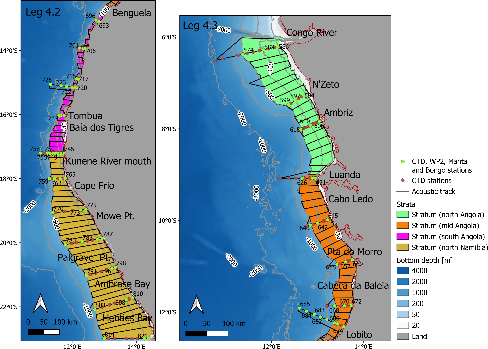
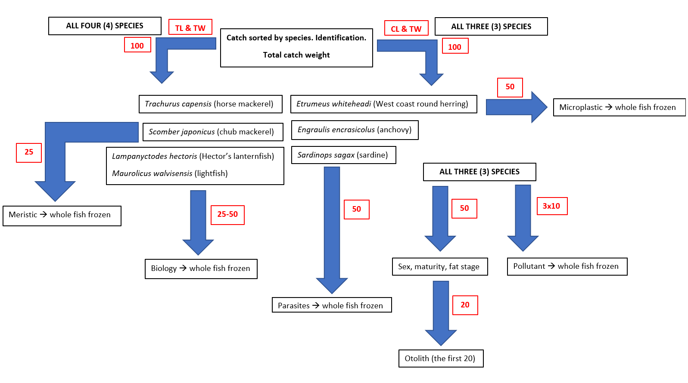
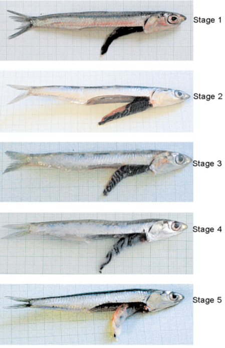
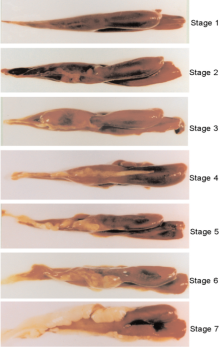
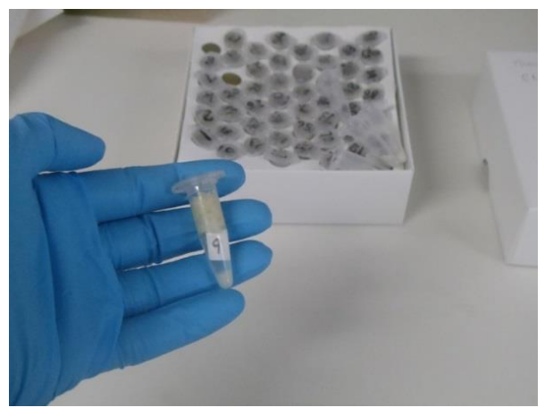

```{r setup, include=FALSE}
knitr::opts_chunk$set(echo = TRUE, fig.cap = TRUE, message = FALSE, warning = FALSE)

options(skipen=999)
#For dates to display in the proper way the locale needs to be set to English on the local machine
invisible(Sys.setlocale(locale = "English"))
#Load required packages
packages <- c("knitr", "readxl", "bookdown", "tidyverse", "ftExtra", "qdapRegex", "flextable", "officer", "imager", "officedown", "janitor")

installed_packages <- packages %in% rownames(installed.packages())
if (any(installed_packages == FALSE)) {
  install.packages(packages[!installed_packages], repos = "http://cran.us.r-project.org")
}

# Packages loading
invisible(lapply(X = packages, FUN = require, character.only = TRUE))

# End of Packages loading
# Suppress dplyr's summarizing info
options(dplyr.summarise.inform = FALSE)
opts_knit$set(eval.after = "fig.cap")
opts_knit$set(eval.after = "fig.asp")

```

```{r data_loading, message=FALSE, warning=FALSE, include=FALSE, results='hide'}
#Loading of data, tidying up and preparation of the data for further usage
#Read in info from the input_dataframes excel file
input_dataframes_filepath <- list.files(path = "./_tables/", pattern = "input_dataframes.xlsx", full.names = TRUE)

sheets <- excel_sheets(input_dataframes_filepath)
input_dataframes <- lapply(excel_sheets(input_dataframes_filepath), 
                           function(x) 
                             data.frame(read_excel( input_dataframes_filepath, x, col_names = TRUE, col_types = "text")))

names(input_dataframes) <- sheets
input_dataframes <- purrr::map(.x = input_dataframes, .f = ~rename_with(.x, ~ gsub(".", " ", .x, fixed = TRUE)))

```

```{r setTableFormat, message=FALSE, warning=FALSE, include=FALSE, results='hide'}
# This chunck of code set the format (background color, padding, etc) of the tables produced in the report, so to have it standardized throughout.
set_flextable_defaults(big.mark = " ", 
  font.family = 'cambria',
  font.size = 8, 
  theme_fun = theme_zebra, 
  line_spacing = 0.6,
  padding.bottom = 2.5,
  padding.top = 2.5,
  padding.left = 2,
  padding.right = 2,
  extra_css = "caption {text-align: left;}")

```

# **SURVEY PLAN FOR** `r input_dataframes$surveyplantab$Survey`

The survey will start in Walvis Bay, Namibia and end in Cape Town, South Africa (Table \@ref(tab:surveyplantab)).

```{r surveyplantab, echo=FALSE, tidy=TRUE, label="surveyplantab"}
ft_surveyplan <- flextable(input_dataframes$surveyplantab) %>% theme_booktabs(bold_header = TRUE) %>% bg(bg='transparent', part = "header") %>% ftExtra::colformat_md()
ft_surveyplan <- line_spacing(ft_surveyplan, space = 1.0, part = "all")
# Add caption
autonum <- run_autonum(seq_id = "tab", bkm = "surveyplantab", pre_label = "Table ", start_at=1)
ft_surveyplan <- set_caption(ft_surveyplan, caption = paste(input_dataframes$tab_captions[input_dataframes$tab_captions$`tab name`=="surveyplantab","caption"]), style = "Table Caption", autonum=autonum)

# # set table width to span page width
set_table_properties(ft_surveyplan,layout = "autofit")
```

## **Survey objectives**

The overall objectives of this regional survey effort in the BCC (South Africa, Namibia and Angola) area were discussed in connection with the EAF-Nansen Programme Annual Forum in Benin in 2019.
These plans were not further developed because of the Covid-19 pandemic.
As the surveys with the DFN vessel were resumed in 2021, a zoom meeting was held on 27 July 2021 to reschedule the proposed surveys and revise survey objectives as it may be desirable (Filomena Vaz Velho, Virgilio Estevao, Beau Tjizou, Paul
Kainge, Janet Coetzee, Carl van der Lingen, Deon Durholtz, Gabriella Bianchi participated in the meeting).

The general feedback indicated that the overall objectives as earlier agreed were still relevant.
**Leg 4 consists of 3 surveys** that aim at covering the pelagic fish resources on the shelf and the upper slope outside South Africa, Namibia and Angola.
While fishery resources represent the key priority, other aspects are also addressed to improve knowledge on composition and diversity of pelagic communities and habitats, understanding the environmental conditions within which they are found, including the presence of marine debris.
Leg 4.1 is thus part of a larger effort, even though the focus will be on the biomass, population structure, distribution and behavioral patterns of the commercially important epipelagic fish species, as well as of mesopelagic fish species.

The collected data will be used to prepare a survey report, and various scientific reports/papers as part of the EAF-Nansen Science Plan, as well as provide input to the regional fisheries resource assessment work (Benguela Current Convention (BCC): [<https://www.benguelacc.org/home>](https://www.bengualacc.org/home)).

## **Survey area**

The survey area for Leg 4 covers the southwest and south African continental shelf area including the Benguela upwelling system, one of the major upwelling regions of the world, characterized by high productivity and important pelagic and demersal fishery resources.
Leg 4.1 will cover the pelagic and mesopelagic fish resources of South Africa, from Orange River to Port Alfred.
Leg 4.2 will cover the area
from Walvis Bay (Namibia) northwards to about Benguela (Angola).
Leg 4.3 will continue from Benguela northwards up to the Congo River mouth.
In both Leg 4.2 and 4.3 the commercially important pelagic resources will be targeted.

During Leg 4.1, the survey will be adjusted to the needs of South Africa, focusing largely on the epipelagic and mesopelagic fishery resources.
As such, standard sampling as conducted during most surveys with the R/V *Dr Fridtjof Nansen* (e.g., oceanographic conditions, including ocean pH and carbonate system, primary productivity, food safety, microplastics, marine debris, biodiversity, and pelagic fish resources), will not be carried out.
Sampling protocols have been standardized, to the extent possible, to allow comparability across larger geographic scales.

Leg 4.1 will start on 11 June in Walvis Bay.
The vessel will start the first acoustic transect off Orange River and work its way southwards, towards Port Alfred.
There will be a port call in Cape Town on 26 June 2022.
The vessel will return to Cape Town by latest 12 July 2022.

The Leg 4 area to be surveyed by the R/V *Dr Fridtjof Nansen* in 2022 includes the continental shelf and upper slope off south and southwest Africa.
The area to be surveyed by the R/V *Dr Fridtjof Nansen* in Leg 4.1, along with the planned acoustic transects, is shown in Figure \@ref(fig:surveyareamap).
Based on past knowledge about the resources, the coverage will be largely limited inside of the 200m isobath.

```{r surveyareamap, echo=FALSE, fig.cap=paste(input_dataframes$fig_captions[input_dataframes$fig_captions$`fig name`=="surveyareamap","caption"]), fig.align='center', fig.width=6.5, fig.height=4,  label='surveyareamap'}

```

## **Proposed participation in different legs and experience required**

Typically, the surveys with the R/V *Dr Fridtjof Nansen* include participants from different countries and
institutions.
Regarding qualifications, a mix of experienced and less experienced scientists /technicians will receive on-the-job training in sampling procedures.
An overview of the main types of expertise and number of participants required for Leg 4.1 is provided in [ANNEX I](#ANNEX_I) and the list of the planned survey participants for Leg 4.1 is shown in [ANNEX II](#ANNEX_II).

It should be noted that a maximum number of 19 local participants can be allowed, in addition to the scientific crew from Norway and the DFN Core Team.

\newpage

# **SCIENTIFIC RATIONALE**

The overall framework and rationale for the surveys carried out by the R/V *Dr Fridtjof Nansen* are provided by the EAF-Nansen Programme Science Plan which covers three main pillars (Figure \@ref(fig:scienceplan)).
Within this framework, the scope and objectives of the surveys in 2022 have been identified with partners, based on national and regional priorities.
In addition, data recorded, and samples collected during the survey will be analysed through collaborations within the various Science Plan Themes.

```{r scienceplan, echo=FALSE, fig.cap=paste(input_dataframes$fig_captions[input_dataframes$fig_captions$`fig name`=="scienceplan","caption"]), fig.align='center', fig.width=6.5, fig.height=4.25, label='scienceplan'}
knitr::include_graphics("./_images/scienceplan.png")
```

An overview of the Science Plan themes for which this survey is most relevant and associated projects is provided in Table \@ref(tab:sciencethemestab).

```{r sciencethemestab, echo=FALSE, tidy=TRUE, label="sciencethemestab"}
ft_sciencethemestab <- flextable(input_dataframes$sciencethemestab) %>% theme_booktabs(bold_header = TRUE) %>% bg(bg='transparent', part = "header") %>% ftExtra::colformat_md()
ft_sciencethemestab <- line_spacing(ft_sciencethemestab, space = 1.0, part = "all")
# Add caption
autonum <- run_autonum(seq_id = "tab", bkm = "sciencethemestab", pre_label = "Table ")
ft_sciencethemestab <- set_caption(ft_sciencethemestab, caption = paste(input_dataframes$tab_captions[input_dataframes$tab_captions$`tab name`=="sciencethemestab","caption"]), style = "Table Caption"
                             , autonum=autonum
                             )

# # set table width to span page width
set_table_properties(ft_sciencethemestab,layout = "autofit")

```

## **Specific objectives and scientific questions for the survey**

The specific objectives of the Leg 4.1 survey are listed below; emphasis will be placed on local needs and scientific importance.

-   Acoustic sampling:

    -   Estimation of the biomass and population size structure of anchovy, sardine, round herring, horse mackerel and meso-pelagic fish off South Africa by means of echo-integration and midwater trawling.

    -   Provision of acoustic backscatter estimates (as a proxy for biomass) for the following acoustics groups: sardine ("Pilchard"), anchovy, round herring ("Redeye"), horse mackerel, lanternfish,
        lightfish and jellyfish.
        Other scatterers will be allocated to "Mackerel", "Pelagic Group I" (cluepeoids),  "Pelagic Group II" (carangids, scombrids), "Demersal fish", "Mesopelagic fish",
        "Plankton" or "Other", as appropriate.

    -   Mapping spatial distribution of commercially harvested pelagic and mesopelagic fish.

-   Fish biological sampling:

    -   Species composition and diversity of the pelagic and mesopelagic communities (all species caught in the pelagic trawl)

    -   Total catch weight and numbers of all fish species caught in each pelagic trawl haul.

    -   Length-weight relationships for priority fish and jellyfish species caught in the pelagic trawl.
        A
        representative catch subsample at each trawl station is taken and a minimum of 100 individuals (or 50 jellyfish) are measured, more as needed to achieve representative length distributions.

    -   Collection of biological data (wet body weight, sex, gonad maturity stage and fat stage) for sardine, anchovy and round herring.

    -   Collection of otoliths from sardine, anchovy and round herring for age determination studies.

    -   Collection of sardine (juveniles and adults) for an analysis of infection by "tetracotyle" type
        digenean parasite.

    -   Collection of round herring for monitoring of microplastic pollutants in the SA marine pelagos.

    -   Collection of sardine, anchovy and round herring for assessment of their anthropogenic pollutant (herbicides, pharmaceuticals) levels.

    -   Collection of chub mackerel for collection of meristic information for stock/species identification.

    -   Collection of Hector's lanternfish and lightfish for basic biology studies.

    -   Collection of uncommon and/or unidentified mesopelagic fish species for basic biology studies.

    -   Collection of pelagic gobies for basic biology studies.

-   Other trawl-related sampling:

    -   Map occurrence, abundance and biological parameters (length, weight, sex, and maturity staging for males) of priority cartilaginous fish.

        -   Collection of jellyfish (Chrysaora and Aequorea) tissue for genetic analysis

-   Ichthyoplankton sampling:

    -   Collection of ichthyoplankton samples (with custom-CUFES and only underway) during Leg 2 of the survey and from Line 61 to Line 80 only for mapping of sardine and round herring (and, if
        present anchovy) egg distributions.

-   Other objectives:

    -   Standard collection of underway data with the thermosalinograph, meteorological station and the Acoustic Dopler Current Profiler

    -   On-the-job training in the various laboratories

    -   Communication through social media

**Note that there will be NO fixed-station oceanographic sampling during the survey.**

\newpage

# **SAMPLING METHODS**

## **Survey design** {.unnumbered}

Transects will be surveyed southwards in ascending order of transect number (Fig. \@ref(fig:surveyareamap)).

The ship will sample up to at least Cape Agulhas (Transect 50) before returning to Cape Town for exchange of scientists 26^th^ June.

As soon as possible, the ship will then return to Cape Agulhas and continue eastward as far as Port Alfred, returning to Cape Town at the end of the survey on 12th July.

The Cruise leader/Co-Cruise leader may truncate, extend or omit lines as necessary in accordance with the transect ranking (Table 2) to maximize survey efficiency according to the fish distribution found, or to alleviate time constraints.

As anchovy recruits, in particular, are likely to be concentrated close inshore, it is imperative that the inshore position of each transect, and the inshore transits between transects, be placed as close inshore as safety permits.

It is noted that the ultimate decision on the position of transects and the need to deviate from transects for safety reasons lie with the Captain of the vessel.

When the acoustic transect line is interrupted (such as break-off for trawling) the transect must be resumed from the point of interruption, preferably with a small overlap to the interrupted transect.
This ensures continuous acoustic data coverage along the intended transect line.

[**Acoustics**]{.ul}

Acoustic data at all available frequencies (18, 38, 70, 120, 200 and 33 kHz) from the Simrad EK80 echo sounder operating in **CW (narrow band)** mode is to be collected continuously while the ship is steaming along and between transects.

Acoustic data is to be logged to 500 m depth and adjusted according to bottom depth in shallow waters.
This requires that the acoustic operators at all times remain aware of the water depth and adjust the maximum depth logged by the EK80 as appropriate.

Copies of the .Raw data files and LSSS workfiles are to be stored on a removable hard drive for processing with Echoview.

Weather and sea permitting, a constant survey speed of 10 knots will normally be maintained.
However, at times the vessel may have to be slowed (at the request of the acoustic watch-keeper) to reduce acoustic noise.

The pulse duration of all transducers is to be standardized at 1ms throughout the survey at maximum ping rate.

The acoustic backscattering coefficient at 38 kHz integrated across the water column for the target species is to be estimated on board using both Echoview and the LSSS.
Target species include sardine ("Pilchard"), anchovy, round herring ("Redeye"), horse mackerel, lanternfish and lightfish with the aim to produce abundance estimates for these species.
Scrutinization exercises, i.e., splitting total backscatter into target/mix groups and non-targets such as plankton will be carried out twice daily.

The Captain/Navigating officer on watch must inform the acoustic watch keeper when the vessel starts/ends each transect or when the vessel crosses a boundary line between strata (see Fig. \@ref(fig:surveyareamap)) so that the ship's log and the time can be recorded for later use in data processing.

**EK80 and SU90 must run synchronized with each other (EK80 is the "master"). The SU90 is the only active sonar to be used on this survey.**

**ADCPs will be operated continuously along the survey. However, great care must be taken to ensure that the ping order/ multiplexing is set up such that there can be no interference from the SU90 and ADCPs on the recorded EK80 data.**

[**Sonar**]{.ul}

The Simrad SU90 sonar will be used to record acoustic data continuously during the survey.

The sonar must be set to a frequency of 26 kHz, in FM Normal mode and operated using "Trawl 2" (old "Bow up/180 deg") operation mode with the bearing of the vertical beams 90 deg, perpendicular to
the vessel direction with a range of 450m and with the horizontal beams set to 450m with a tilt angle of 3 deg.
Default filter values must be used except for the Noise filter which must be turned off.
These settings including range and tilt must be kept the same during the whole survey except during trawling operations where the sonar can at times be used actively to focus in on targets.
If time allows, scrutinizing of sonar data will be done daily.

[**Midwater trawling**]{.ul}

Frequent *ad hoc* target identification tows will be made at the request of the cruise leader/co-cruise
leader, or the acoustic watch-keeper, using either the bottom trawl (Gisund Super) with floats, the small pelagic (Åkra trawl) or the large pelagic (MultPelt) trawl.
The DeepVision system will be installed and operated in the MultPelt trawl, with video data being logged for each trawl.

Species composition, length frequencies and biological sampling must be done for each trawl sample.
The number of trawl samples will depend on the density and distribution of acoustic targets observed and the need for species identification.
Trawls may be requested at any time during day and night.
The frequency of tows will depend on the presence and degree of mixing of acoustic targets requiring identification as judged by the acoustic watch keeper, but allowance has been made for an average of 6 hours trawling per day.
This is an average figure, and on some days more than 6 hours may be requested.
The emphasis will be on catching relatively small quantities of fish in good condition for target identification and to conduct biological analysis.
To carry out a trawl haul, the ship will break off from the survey grid.
After completion of the trawl, the ship is to return to the point at which the survey was interrupted.

If there **are strong echoes on the echogram, and a subsequent trawl fails to collect a decent sample (at least 40 fish of the dominant species), the acoustic operator will need to request another trawl straight away to try and get a representative sample.**

## **Meteorological and hydrographic sampling in surface water**

### *Weather Station*

Wind direction, wind speed, air pressure, relative humidity, air temperature and solar radiation data are
averaged every 60 seconds and logged continuously from the Aanderaa Automatic Weather Station 2700.

### *Thermosalinograph*

A SBE 21 SeaCAT Thermosalinograph (TSG) will run continuously during the survey, obtaining samples at 4 m depth to measure seawater salinity and temperature every 10 seconds.
The 4 m engine cooling water intake is also equipped with a Turner Designs C3 Submersible Fluorometer with added turbidity detection capability.

### *Underway pCO~2~*

Not relevant for the survey.

### *Current speed and direction measurements - ADCP*

Ocean current data is collected with a vessel-mounted Teledyne RDI Ocean Surveyor Acoustic Doppler Profiler operating at 150 kHz with a depth range of 400 m.
The ADCP runs in narrow band mode and
averages data in 8 m vertical bins.
Heading, pitch, roll and positional data are acquired by a Kongsberg Marine SEAPATH unit.
Teledyne's VmDAS software is used to collect the raw current data, whereas the data is processed using software created at IMR.

## **Hydrographic sampling in the water column**

Not relevant for the survey.

### *CTD*

Not relevant for the survey.

### *Ocean Acidification parameters - pH and total alkalinity*

Not relevant for the survey.

### *Dissolved Nutrients*

Not relevant for the survey.

## **Primary productivity**

Not relevant for the survey.

## **Zooplankton**

Not relevant for the survey.

## **Ichthyoplankton**

Ichthyoplankton sampling will be conducted using a custom Continuous Underway Fish Egg Sampler (custom-CUFES) and only from Line 61 onwards to the end of the survey (Line 80).
Ichthyoplankton samples are to be collected along EVERY survey transect and along **ALL** inshore and offshore transits.

Ichthyoplankton sampling intervals will be of 30 minutes duration (equivalent to approximately 5 nautical miles of survey transect, and 15 000 liters assuming a flow rate of 500 l.min^-1^).
The flow-rate is to be estimated once each interval by recording the time taken to fill a 25 liters plastic bucket).

The ichthyoplankton sample should be examined under a dissection microscope immediately after collection (and before preservation), and on-board estimates of sardine and round herring eggs and
comments (e.g. lots of copepods, no copepods, etc.) should be recorded in the ichthyoplankton sampling logbook for each sample together with pertinent information (date, sample number, sample grid, begin and end times, and estimated flow rate).

The ichthyoplankton sampling logbook is to be checked by the fish team leader at the end of each shift.

The custom-CUFES concentrator is to be regularly checked for blockage of the mesh; if this occurs the pump is to be stopped and the mesh cleaned.
Fish team members should alternate with regard to
ichthyoplankton sampling duties; all fish team members are to do a sampling watch for ichthyoplankton, and one member of the fish team is to be designated this responsibility at all times.

Ichthyoplankton samples are to be preserved in 5% formalin in plastic sample jars with the sample information written on a label placed inside the jar and on the lid of the jar.

## **Benthos and benthic habitats**

### *Bottom topography*

Bottom depth is obtained continuously from the EK80 echosounder (down to 700m depth, 38kHz) and passed into the Olex bottom mapping system used by the vessel.
The information is also registered in the "Survey Logger" (Toktlogger) system, through the appropriate NMEA message.

### *Bottom habitats*

Not relevant for the survey.

## **Microplastics**

Not relevant for the survey.

## **Biological sampling of fisheries resources**

According to the size of the catch, either the whole catch is sorted and measured, or subsamples are collected, and total catch estimated from subsample ratios.

At all trawl hauls, the catch is sorted according to species, and number and weight measurements will be completed for all species caught.
For the defined priority species length and weight are recorded using an electronic fish meter connected to a standard data acquisition system used on board the vessel (Fish2Data and Biotic Editor) that is connected to the server of the vessel.
Biological sampling will be completed for defined priority species (Table \@ref(tab:biosamplingtab)).

<!---BLOCK_LANDSCAPE_START--->

```{r biosamplingtab, echo=FALSE, tidy=TRUE, label="biosamplingtab"}
ft_biosamplingtab <- flextable(input_dataframes$biosamplingtab) %>% theme_booktabs(bold_header = TRUE) %>% bg(bg='transparent', part = "header") %>% ftExtra::colformat_md()
ft_biosamplingtab <- line_spacing(ft_biosamplingtab, space = 1.0, part = "all")
# Add caption

ft_biosamplingtab <- flextable::align(ft_biosamplingtab, align = "center", j = -c(1), part = "all")


autonum <- run_autonum(seq_id = "tab", bkm = "biosamplingtab", pre_label = "Table ")
ft_biosamplingtab <- set_caption(ft_biosamplingtab, caption = paste(input_dataframes$tab_captions[input_dataframes$tab_captions$`tab name`=="biosamplingtab","caption"]), style = "Table Caption"
                             , autonum=autonum
                             )

# # set table width to span page width
set_table_properties(ft_biosamplingtab,layout = "autofit")

```

<!---BLOCK_LANDSCAPE_STOP--->

The fish lab workflow overview and guidelines on the detailed sampling protocols in the fish lab are described in [ANNEX III](#ANNEX_III) and [ANNEX IV](#ANNEX_IV). As a preparation for the work in the fish lab, an onboard training course on the use of the electronic fish meter, Fish2Data and Biotic Editor software will be provided at the beginning of the survey.

The Fish2Data software will be pre-configured with the sampling protocol and will be accessible through the iPads facilitating the biological measurements.

### Demersal species

*Not relevant for the survey.*

### Pelagic species

The primary objectives of sampling midwater trawl catches are to obtain information on species composition and size frequency to allow acoustic estimation of the biomass of the different
species.
Subsidiary objectives relate to other projects within DFFE.
[**No fish or any other organisms are to be taken for fries and/or bait from the deck or from the trawl without the expressed permission of the fish team leader.**]{.ul}

**Fish team leaders must ensure adherence BY ALL FISH TEAM MEMBERS to the sampling protocol given below.**

The following tasks are to be carried out.

1.  **Estimation of species composition** of the catch through sorting and weighing of species-specific sub-samples.

2.  **Length distributions (Caudal length to the nearest 0.5 cm) and sample mass (kg to 3 decimal places) of a random sample of AT LEAST 100 INDIVIDUALS of epipelagic (anchovy *Engraulis
    encrasicolus*, West Coast round herring *Etrumeus whiteheadi*, and sardine *Sardinops sagax*), and (total length to the nearest 0.5 cm) of horse mackerel *Trachurus capensis*, mackerel *Scomber japonicus*, mesopelagic (Hector's lanternfish *Lampanyctodes hectoris* and lightfish *Maurolicus walvisensis*) fish species from every trawl must be taken (all fish must be
    measured in trawls where \<100 fish of a particular species are captured)**.

IN THE CASE OF BIMODAL LENGTH DISTRIBUTIONS, A MINIMUM OF 200 INDIVIDUALS OF THESE SPECIES ARE TO BE MEASURED. Each fish in the sample should be assigned a unique number that is
then recorded with the caudal length (CL; to the nearest mm) on the data sheet / electronic system provided.

Retain anchovy, sardine, and round herring for later collection of biological data, otoliths and samples for subsequent analyses.

[THE ENTIRE CATCH MUST BE RETAINED ONBOARD UNTIL ALL SAMPLING IS COMPLETED TO ENSURE THAT ADEQUATE NUMBERS OF FISH OF THE MINOR SPECIES ARE AVAILABLE FOR LENGTH FREQUENCY ESTIMATION IN MULTISPECIES CATCHES!!!]{.ul}

3.  **Full biological analysis** of fifty (50) individuals of anchovy, sardine and West Coast round
    herring selected from the length frequency samples.

Care should be taken that this sub-sample covers the size range observed in the length frequency distribution.

The wet body weight (to the nearest 0.1 g) of each fish is to be measured, then the visceral cavity of each fish must be opened and their sex, gonad maturity stage and fat stage assigned following visual assessment of their gonads and mesenteric fat levels [ANNEX III](#ANNEX_III) and [ANNEX IV](#ANNEX_IV) and recorded for each fish on the data sheet / electronic system provided (corresponding to the unique number, and caudal length assigned to each fish in point 2 above).

**LENGTH FREQUENCY DETERMINATIONS AND FULL BIOLOGICALS MUST BE DONE FOR EVERY SINGLE TRAWL.**

4.  **For all three epipelagic species, the otoliths** of the first 20 fish from which biological data were collected should be extracted, **cleaned in fresh water**, dried with a tissue and stored dry in a vial.

The vial should contain a numbered label that corresponds to the unique fish number recorded on the data sheet electronic system.

Vials can then be placed into a sealed plastic bag with a label containing the trawl information (species, date, station and grid numbers) and marked "***SPECIES*** **AGEING**".

5.  **Collection of sardine for analysis of infection by a "tetracotyle" type digenean parasite**. Samples of 50 sardine, covering the observed size range, are to be collected per trawl (where possible; if there are insufficient fish a sample of 20 will suffice) and are to be placed in zip-lock bags containing a label
    (written using a 2B pencil) with the date, grid and station numbers, and marked "***SARDINE*** **PARASITES**" and then immediately blast frozen.

A record of the date, grid and station numbers, number of fish and their size range, is to be kept by the fish team leader.

6.  **Collection of West Coast round herring for monitoring micro-plastic pollution in the SA marine pelagos**. Samples of 50 round herring, covering the observed size range, are to be retained from two trawls per stratum (i.e. 100 fish per stratum are to be collected) and stored in zip-lock bags containing a label (written using a 2B pencil) with the date, grid and station numbers, and marked "**ROUND HERRING MICROPLASTICS**", then immediately blast frozen.

A record of the date, grid and station numbers, and number of fish per species, is to be kept by the fish team leader.

7.  **Collection of sardine, anchovy and round herring for assessment of their anthropogenic pollutant (herbicides, pharmaceuticals, etc) levels**.

Samples of 3 fish (of similar size) per species are to be taken from each of 10 trawls spread approximately equally across the survey area between the Orange River mouth and Port Alfred, with 5 trawls sampled to the west of Cape Agulhas and 5 trawls to the east of Cape Agulhas (so 15 individual fish collected WoCA and 15 individuals EoCA per species).

Ideally, fish of each species should be collected from the same trawls, but in case this cannot be achieved "back-up" samples of each species should be collected so as to ensure full coverage of the surveyed area (final samples for analysis can be selected after the survey).

Each fish is to be placed in its own zip-lock plastic bag, and the three individuals collected from each trawl are then to be placed together in a larger zip-lock plastic bag containing a label (written using a 2B pencil) with the date, grid and station numbers, and marked "***SPECIES*** **NAME ANTHROP. POLLUTANTS**", then immediately blast frozen.

A record of the date, grid and station numbers, and number of fish per species, is to be kept by the fish team leader.

8.  **Collection of chub mackerel (*Scomber* sp.) for collection of meristic and morphometric information for stock/species identification**.

Ten to 25 individual chub mackerel are to be collected from trawls where this species is caught in sufficient numbers, with several samples to be collected from the west (west of Cape Agulhas),
south (Cape Agulhas to Mossel Bay) and the southeast (Mossel Bay to Port Alfred) coasts to enable wide spatial coverage.

Samples are to be placed in zip-lock bags containing a label (written using a 2B pencil) with the date, grid and station numbers, and marked externally "**CHUB MACKEREL**" with a koki pen, and then immediately blast frozen.

A record of the date, grid and station numbers, numbers of fish and their approximate size range for samples of all species is to be kept by each fish team leader.

9.  **Collection of Hector's lanternfish and lightfish for basic biological studies**.

Samples of 25-50 individuals of these species are to be collected from each trawl in which they are caught, placed in zip-lock bags (separated by species) containing a label (written using a 2B pencil) with the date, grid and station numbers, and marked externally "**LANTERNFISH/LIGHTFISH**" with a koki pen, and then immediately blast frozen.

A record of the date, grid and station numbers, numbers of fish and their approximate size range for samples of all species is to be kept by each fish team leader.

10. **Collection of uncommon mesopelagic fish species for identification and basic biological studies. ALL mesopelagic fishes other than Hector's lanternfish or lightfish are to be retained; particularly bogue lanternfish *Symbolophorus boops*.**

Mesopelagic fishes are to be placed in zip-lock bags (separated by genus/species/type if feasible) containing a label (written using a 2B pencil) with the date, grid and station numbers, and marked
externally "UNIDENTIFIED/OTHER MESOPELAGICS" with a koki pen, and then immediately blast frozen.

A record of the date, grid and station numbers, numbers of fish and their approximate size range for samples of all species is to be kept by each fish team leader.

Specimens that could not be identified at sea will be identified after the survey and the information sent to the Nansen for inclusion in the survey records.

11. **Collection of pelagic gobies (*Sufflogobius bibarbatus*) for general biological studies**.

A sample of 50 (or all gobies caught in the trawl if this number is \<50) individual pelagic gobies covering the observed size range are to be collected from all trawls in which they occur.

Samples are to be placed in zip-lock bags containing a label (written using a 2B pencil) with the date, grid and station numbers, and marked externally "**GOBIES**" with a koki pen, and then immediately blast frozen.

A record of the date, grid and station numbers, numbers of fish and their approximate size range for samples is to be kept by each fish team leader.

13. **Jellyfish sampling for
    TS-studies and species identification**.

```{=html}
<!-- -->
```
a.  [TS-studies]{.ul}

Umbrella diameter (to the nearest 1 cm) and
sample mass (kg to 3 decimal places) of a random sample of at least 50
individuals of *Chrysaora fulgida* and central disk diameter (to the
nearest 0.5 cm) and sample mass (kg to 3 decimal places) of a random sample of
at least 50 individuals of *Aequorea aequorea*.

 

b.  [Species identification]{.ul}

Specimens of large jellyfish that may be caught in the trawl that are in good condition should be fixed in 4% formalin, **AFTER** a piece of tissue from the oral arms has been removed and fixed in 96% ethanol
with the jar labelled (internally using a **2B** pencil and externally using a marker -- note that ethanol will remove external markings so care should be taken to keep labels legible) with the species, date, grid and station number and "**JELLYFISH -- M GIBBONS**".

The ethanol is to be replaced **TWICE WITHIN 36-48 HOURS AFTER COLLECTION**; the first replacement should occur 6-12 hours after the sample was collected (used ethanol should be discarded) and the second replacement should occur 24 hours later It is important to ensure that the volume of alcohol should be large (4-5 times as much) in comparison with the volume of jellyfish material in the sample jar.

All jars containing jellyfish for genetic analysis are to be kept together in a sample box and all such samples should be clearly labelled as previously.

Species composition, length frequency and biological data (CL, weight, sex, gonad stage and fat stage) are to be entered into the on-board electronic data collection system during processing.
These
data are then to be exported (in CSV format) to the ACCESS AMTS database after the completion of each trawl for subsequent analyses.

All retained samples are to be labelled in the usual way with the Station number, Grid number, Date, Species and sample purpose.
Printouts of each trawl must be provided to the acoustic team
timeously.

The fish team leader of each watch is responsible for validation of the data entered to the on-board electronic data collection system.
Exported data for the AMTS database are the responsibility of South African survey participants in the fish lab: **SUCH VALIDATION MUST BE DONE AFTER EACH TRAWL**.

The trawling/acoustic watch keeper and the fish sampling team leader on watch should work interactively at all stages to ensure the optimum allocation of sampling effort.

In particular, more frequent trawling is required in areas of high fish density, and the fish sampling team leader may adapt the sampling strategy and/or take larger samples in these areas to increase the precision of, for example, age composition estimates.

### *Other trawl-related sampling*

#### *Fish and macroinvertebrates samples for regional taxonomy course and post-survey taxonomic studies* {.unnumbered}

Not relevant for the survey.

#### *Cartilaginous fish* {.unnumbered}

Individual length and weight, sex and maturity status shall be measured of all cartilaginous fish caught.

Vulnerable species that are alive shall be released as soon as possible after the catch is on deck.
If the individuals are too large to weigh individually only length is to be measured.

The protocol that will be followed for cartilaginous will be the same as for demersal / pelagic resources described above.

Specimens for taxonomic courses will be collected also following the protocol described above.
Species that cannot be identified should be preserved in formalin or frozen (and labelled according to the procedure above) and sent to taxonomic experts for identification after the survey.

#### *Samples for food safety studies and nutrition* {.unnumbered}

Not relevant for the survey.

#### *Marine debris* {.unnumbered}

Not relevant for the survey.

#### *Epibenthos* {.unnumbered}

Not relevant for the survey.

### *Demersal fish biomass estimated based on the swept area method*

Not relevant for the survey.

### *Pelagic fish biomass estimated based on acoustics (EK80)*

The biomass indices of priority pelagic fish (see below) will be estimated by the acoustic estimate method (<https://nansen-surveys.imr.no/doku.php?id=biomass_calculations>) using the [StoX (stoxproject.github.io)](https://stoxproject.github.io/StoX/) software.
In addition, the South African Acoustic Biomass Calculation database will be used to estimate the biomass of sardine, anchovy, round herring, horse mackerel, mackerel, lanternfish and lightfish according to the standard method adopted for South African surveys.
This requires as input, the integrated acoustic backscatter (S~A~/NASC) per 10 NM or shorter ESDU for each of the species listed, the species composition from the trawls, the length frequency per species and the length frequency sample mass per species, the transect length and the survey area (per stratum).

Biomass indices will be estimated as total biomass per species per stratum and as numbers at length per stratum and for the total survey area (for the species with sufficient length data).

Biomass indices will be estimated as total biomass and by length groups (for the species with sufficient length data).

<!-- Prior to the survey the EAF Nansen Programme organised a pelagic biomass estimation course (9-13 May 2022) and the survey participants that will have taken part in the course will be given the chance to apply their newly acquired skills in biomass estimation using StoX. -->

Acoustic data post-processing in LSSS and Echoview is to be done daily during the survey.
Allocation of acoustic densities to species groups will be done according to Table \@ref(tab:acousticcattab).

```{r acousticcattab, echo=FALSE, tidy=TRUE, label="acousticcattab"}
ft_acousticcattab <- flextable(input_dataframes$acousticcattab) %>% theme_booktabs(bold_header = TRUE) %>% bg(bg='transparent', part = "header") %>% ftExtra::colformat_md()

ft_acousticcattab <- flextable::height(ft_acousticcattab,  height = .45, unit = "cm")
ft_acousticcattab <- flextable::hrule(ft_acousticcattab, rule = "exact")
ft_acousticcattab <- flextable::valign(ft_acousticcattab, valign = "top", part = "body")
ft_acousticcattab <- flextable::fontsize(ft_acousticcattab, size = 7.5, part = "body")
ft_acousticcattab <- line_spacing(ft_acousticcattab, space = 0.75, part = "all")

# Add caption
autonum <- run_autonum(seq_id = "tab", bkm = "acousticcattab", pre_label = "Table ")
ft_acousticcattab <- set_caption(ft_acousticcattab, caption = paste(input_dataframes$tab_captions[input_dataframes$tab_captions$`tab name`=="acousticcattab","caption"]), style = "Table Caption"
                             , autonum=autonum
                             )

# # set table width to span page width
set_table_properties(ft_acousticcattab,layout = "autofit")
```

\newpage

# **DATA COLLECTED AND STANDARD PROCEDURE FOR HANDING OVER SAMPLES TO PARTNERS**

In line with the Nansen Data Policy, the Cruise Leader is to ensure that each national institution represented in the survey receives a copy of the draft report and the basic data (e.g. catch data) pertaining to the particular survey and for **their national waters** before leaving the vessel.

An overview of the equipment that is going to be used for the collection of the various data can be found in Table \@ref(tab:equipmenttab) ([ANNEX VI](#ANNEX_VI)).

The different types of data expected to be recorded, their storage and delivery can be found in Table \@ref(tab:datahandovertab) ([ANNEX VII](#ANNEX_VII)).

Finally, the samples to be collected, their preservation and planned follow-up work is detailed in Table \@ref(tab:collectedsamplestab) ([ANNEX VIII](#ANNEX_VIII)).

The Cruise Leader is expected to document what data and samples have been shared and with whom.

The cruise participants are expected to sign and conform to the Data policy of the EAF-Nansen Programme.

Persons responsible for samples need to inform about the status of analysis, and report about this at the post-survey meeting, as well as send a copy of the analysis/results to IMR ([nansen_data\@hi.no](mailto:nansen_data@hi.no)).

IMR, as a data custodian for the EAF-Nansen Programme, is required to have an overview of the samples/analysis at any point in time to;

1.  Ensure that data life-cycle management is carried out in the expected way

2.  Be used for capacity building purposes (e.g. workshops, training courses, etc.)

3.  Advance collaboration and publishing through the EAF-Nansen Science Plan

4.  Maintain reference libraries (e.g., for taxonomic purposes) and DNA barcoding.

5.  Plan efficiently future surveys in the same area.

# **REFERENCES** {.unnumbered}

\newpage

# **ANNEXES** {.unnumbered}

## **ANNEX I. Requested participation** {#ANNEX_I .unnumbered}

```{r reqparttab, echo=FALSE, tidy=TRUE, label="reqparttab"}
reqparttab <- input_dataframes$reqparttab %>% 
  rename("Position / laboratory"=`Position laboratory`,
         "DFN core team (IMR)"=`DFN core team  IMR `,
         "DFN core team (non-IMR)"=`DFN core team  non IMR `,
         "FAO / External experts"=`FAO External experts`,
         "Total non-IMR personnel"=`Total non IMR personnel`
         ) %>%
  dplyr::select(-c("Min personnel","Missing personnel","Grand total")) %>%
  mutate(across(.cols = -c("Leg","Position / laboratory"), .fns = as.numeric)) %>%
  arrange(Leg) %>% 
  group_by(Leg) %>% 
  nest() %>%
  mutate(data = map(data, ~ .x %>% adorn_totals(where = c("row"), name = "Total", fill = "", na.rm = T))) %>%
  mutate(data = map(data, ~ .x %>% adorn_totals(where = c("col"), name = "Total", fill = "", na.rm = T, ... = c("DFN core team (IMR)","Total non-IMR personnel")))) %>%
  unnest(cols = c(data))

ft_reqparttab <- flextable(reqparttab) %>% theme_booktabs(bold_header = TRUE) %>% bg(bg='transparent', part = "header") %>% ftExtra::colformat_md()
ft_reqparttab <- line_spacing(ft_reqparttab, space = 1.0, part = "all")
ft_reqparttab <- flextable::align(ft_reqparttab, j = c(3:10), align = "center", part = "all")
# Add caption
autonum <- run_autonum(seq_id = "tab", bkm = "reqparttab", pre_label = "Table ")
ft_reqparttab <- set_caption(ft_reqparttab, caption =  paste(input_dataframes$tab_captions[input_dataframes$tab_captions$`tab name`=="reqparttab","caption"]), style = "Table Caption"
                             , autonum=autonum
                             )

# # set table width to span page width
set_table_properties(ft_reqparttab,layout = "autofit")

```

\newpage

## **ANNEX II. Planned participants** {#ANNEX_II .unnumbered}

```{r plannedparticipantstab, echo=FALSE, tidy=TRUE, label="plannedparticipantstab"}
plannedparticipantstab <- input_dataframes$plannedparticipantstab %>% mutate(No=seq.int(nrow(input_dataframes$plannedparticipantstab))) %>% relocate(No)

ft_plannedparticipantstab <- flextable(plannedparticipantstab) %>% theme_booktabs(bold_header = TRUE) %>% bg(bg='transparent', part = "header") %>% ftExtra::colformat_md()

ft_plannedparticipantstab <- flextable::height(ft_plannedparticipantstab,  height = .7, unit = "cm")
ft_plannedparticipantstab <- flextable::hrule(ft_plannedparticipantstab, rule = "exact")
ft_plannedparticipantstab <- flextable::valign(ft_plannedparticipantstab, valign = "top", part = "body")
ft_plannedparticipantstab <- flextable::fontsize(ft_plannedparticipantstab, size = 8, part = "body", j = -c(1:3))
ft_plannedparticipantstab <- line_spacing(ft_plannedparticipantstab, space = 1.5, part = "all")

# Add caption
autonum <- run_autonum(seq_id = "tab", bkm = "plannedparticipantstab", pre_label = "Table ")
ft_plannedparticipantstab <- set_caption(ft_plannedparticipantstab, caption =  paste(input_dataframes$tab_captions[input_dataframes$tab_captions$`tab name`=="plannedparticipantstab","caption"]), style = "Table Caption"
                             , autonum=autonum
                             )

# # set table width to span page width
set_table_properties(ft_plannedparticipantstab,layout = "autofit")

```

\newpage

## **ANNEX III. Fish lab workflow** {#ANNEX_III .unnumbered}

```{r catchsamplingworkflow, echo=FALSE, fig.cap=paste(input_dataframes$fig_captions[input_dataframes$fig_captions$`fig name`=="catchsamplingworkflow","caption"]), fig.align='center', fig.width=6.5, fig.height=3.5,  label='catchsamplingworkflow'}

```

<br>

```{r matstagetab, echo=FALSE, tidy=TRUE, label="matstagetab"}
ft_matstagetab <- flextable(input_dataframes$matstagetab) %>% theme_booktabs(bold_header = TRUE) %>% bg(bg='transparent', part = "header") 
#%>% ftExtra::colformat_md()
ft_matstagetab <- line_spacing(ft_matstagetab, space = 1.0, part = "all")
# Add caption
autonum <- run_autonum(seq_id = "tab", bkm = "matstagetab", pre_label = "Table ")
ft_matstagetab <- set_caption(ft_matstagetab, caption = paste(input_dataframes$tab_captions[input_dataframes$tab_captions$`tab name`=="matstagetab","caption"]), style = "Table Caption"
                             , autonum=autonum
                             )
           
# # set table width to span page width
set_table_properties(ft_matstagetab,layout = "autofit")
                  
```

\newpage

```{r fatstageanchtab, echo=FALSE, tidy=TRUE, label="fatstageanchtab"}
ft_fatstageanchtab <- flextable(input_dataframes$fatstageanchtab) %>% theme_booktabs(bold_header = TRUE) %>% bg(bg='transparent', part = "header") 
#%>% ftExtra::colformat_md()
ft_fatstageanchtab <- line_spacing(ft_fatstageanchtab, space = 1.0, part = "all")
# Add caption
autonum <- run_autonum(seq_id = "tab", bkm = "fatstageanchtab", pre_label = "Table ")
ft_fatstageanchtab <- set_caption(ft_fatstageanchtab, caption = paste(input_dataframes$tab_captions[input_dataframes$tab_captions$`tab name`=="fatstageanchtab","caption"]), style = "Table Caption"
                             , autonum=autonum
                             )

# # set table width to span page width
set_table_properties(ft_fatstageanchtab,layout = "autofit")

```

<br>

```{r anchovyfat, echo=FALSE, fig.cap=paste(input_dataframes$fig_captions[input_dataframes$fig_captions$`fig name`=="anchovyfat","caption"]), fig.align='center', fig.width=4, fig.height=6,  label='anchovymat'}

```

\newpage

```{r fatstagesarhtab, echo=FALSE, tidy=TRUE, label="fatstagesarhtab"}
ft_fatstagesarhtab <- flextable(input_dataframes$fatstagesarhtab) %>% theme_booktabs(bold_header = TRUE) %>% bg(bg='transparent', part = "header") 
#%>% ftExtra::colformat_md()
ft_fatstagesarhtab <- line_spacing(ft_fatstagesarhtab, space = 1.0, part = "all")
# Add caption
autonum <- run_autonum(seq_id = "tab", bkm = "fatstagesarhtab", pre_label = "Table ")
ft_fatstagesarhtab <- set_caption(ft_fatstagesarhtab, caption = paste(input_dataframes$tab_captions[input_dataframes$tab_captions$`tab name`=="fatstagesarhtab","caption"]), style = "Table Caption"
                             , autonum=autonum
                             )

# # set table width to span page width
set_table_properties(ft_fatstagesarhtab,layout = "autofit")

```

<br>

```{r sardinefat, echo=FALSE, fig.cap=paste(input_dataframes$fig_captions[input_dataframes$fig_captions$`fig name`=="sardinefat","caption"]), fig.align='center', fig.width=4, fig.height=6,  label='sardinemat'}

```

\newpage

## **ANNEX IV. Either to be removed or filled in properly** {#ANNEX_IV .unnumbered}

\newpage

## **ANNEX V. Survey-specific additional sampling** {#ANNEX_V .unnumbered}

\newpage

## **ANNEX VI. Overview of component sampled and equipment used during the survey** {#ANNEX_VI .unnumbered}

```{r equipmenttab, echo=FALSE, tidy=TRUE, label="equipmenttab"}
ft_equipmenttab <- flextable(input_dataframes$equipmenttab) %>% theme_booktabs(bold_header = TRUE) %>% bg(bg='transparent', part = "header") 
#%>% ftExtra::colformat_md()

ft_equipmenttab <- flextable::height(ft_equipmenttab,  height = .8, unit = "cm")
ft_equipmenttab <- flextable::hrule(ft_equipmenttab, rule = "exact")
ft_equipmenttab <- flextable::valign(ft_equipmenttab, valign = "top", part = "body")
ft_equipmenttab <- flextable::align(ft_equipmenttab, align = "left", part = "all")
ft_equipmenttab <- flextable::fontsize(ft_equipmenttab, size = 8, part = "body")
ft_equipmenttab <- line_spacing(ft_equipmenttab, space = 1.0, part = "all")

# Add caption
autonum <- run_autonum(seq_id = "tab", bkm = "equipmenttab", pre_label = "Table ")
ft_equipmenttab <- set_caption(ft_equipmenttab, caption = paste(input_dataframes$tab_captions[input_dataframes$tab_captions$`tab name`=="equipmenttab","caption"]), style = "Table Caption"
                             , autonum=autonum
                             )

# # set table width to span page width
set_table_properties(ft_equipmenttab,layout = "autofit")

```

\newpage

## **ANNEX VII. Data to be collected and handover plan** {#ANNEX_VII .unnumbered}

```{r datahandovertab, echo=FALSE, tidy=TRUE, label="datahandovertab"}
datahandovertab <- input_dataframes$datahandovertab %>% 
  rename("not collected / stored"=`not collected stored`)
  
ft_datahandovertab <- flextable(datahandovertab) %>% theme_booktabs(bold_header = TRUE) %>% bg(bg='transparent', part = "header") 
#%>% ftExtra::colformat_md()
ft_datahandovertab <- flextable::align(ft_datahandovertab, j = c(3:8), align = "center", part = "all")
ft_datahandovertab <- line_spacing(ft_datahandovertab, space = 1.0, part = "all")
# Add caption
autonum <- run_autonum(seq_id = "tab", bkm = "datahandovertab", pre_label = "Table ")
ft_datahandovertab <- set_caption(ft_datahandovertab, caption = paste(input_dataframes$tab_captions[input_dataframes$tab_captions$`tab name`=="datahandovertab","caption"]), style = "Table Caption"
                             , autonum=autonum
                             )

# # set table width to span page width
set_table_properties(ft_datahandovertab,layout = "autofit")

```

\newpage

<!---BLOCK_LANDSCAPE_START--->

## **ANNEX VIII. Samples to be collected, preservation and follow-up work** {#ANNEX_VIII .unnumbered}

```{r collectedsamplestab, echo=FALSE, tidy=TRUE, label="collectedsamplestab"}
collectedsamplestab <- input_dataframes$collectedsamplestab %>% 
  rename("Gear / equipment"=`Gear equipment`,
         "Contact details Leg 4.1(name, email, phone no)"=`Contact details Leg 4 1 name  email  phone no `)

ft_collectedsamplestab <- flextable(collectedsamplestab) %>% theme_booktabs(bold_header = TRUE) %>% bg(bg='transparent', part = "header") 
#%>% ftExtra::colformat_md()

ft_collectedsamplestab <- flextable::height(ft_collectedsamplestab,  height = 1.25, part="header", unit = "cm")
ft_collectedsamplestab <- flextable::height(ft_collectedsamplestab,  height = 1.50, part="body", unit = "cm")
ft_collectedsamplestab <- flextable::height(ft_collectedsamplestab,  height = 3.0,i=12, part="body", unit = "cm")
ft_collectedsamplestab <- flextable::hrule(ft_collectedsamplestab, rule = "exact")
ft_collectedsamplestab <- flextable::valign(ft_collectedsamplestab, valign = "top", part = "body")
ft_collectedsamplestab <- line_spacing(ft_collectedsamplestab, space = 1.0, part = "all")


# Add caption
autonum <- run_autonum(seq_id = "tab", bkm = "collectedsamplestab", pre_label = "Table ")
ft_collectedsamplestab <- set_caption(ft_collectedsamplestab, caption = paste(input_dataframes$tab_captions[input_dataframes$tab_captions$`tab name`=="collectedsamplestab","caption"]), style = "Table Caption"
                             , autonum=autonum
                             )

# # set table width to span page width
set_table_properties(ft_collectedsamplestab,layout = "autofit")

```

<!---BLOCK_LANDSCAPE_STOP--->

\newpage

## ANNEX IX. Acoustics transects

```{r transectpostab, echo=FALSE, tidy=TRUE, label="transectpostab"}
ft_transectpostab <- flextable(input_dataframes$transectpostab) %>% theme_booktabs(bold_header = TRUE) %>% bg(bg='transparent', part = "header") 
#%>% ftExtra::colformat_md()
ft_transectpostab <- line_spacing(ft_transectpostab, space = 1.0, part = "all")
# Add caption
autonum <- run_autonum(seq_id = "tab", bkm = "transectpostab", pre_label = "Table ")
ft_transectpostab <- set_caption(ft_transectpostab, caption = paste(input_dataframes$tab_captions[input_dataframes$tab_captions$`tab name`=="transectpostab","caption"]), style = "Table Caption"
                             , autonum=autonum
                             )

# # set table width to span page width
set_table_properties(ft_transectpostab,layout = "autofit")

```

<br>

```{r transectranktab, echo=FALSE, tidy=TRUE, label="transectranktab"}
ft_transectranktab <- flextable(input_dataframes$transectranktab) %>% theme_booktabs(bold_header = TRUE) %>% bg(bg='transparent', part = "header") %>% ftExtra::colformat_md()
ft_transectranktab <- line_spacing(ft_transectranktab, space = 1.0, part = "all")

# Add caption
autonum <- run_autonum(seq_id = "tab", bkm = "transectranktab", pre_label = "Table ")
ft_transectranktab <- set_caption(ft_transectranktab, caption = paste(input_dataframes$tab_captions[input_dataframes$tab_captions$`tab name`=="transectranktab","caption"]), style = "Table Caption"
                             , autonum=autonum
                             )

# # set table width to span page width
set_table_properties(ft_transectranktab,layout = "autofit")

```

<!-- \newpage -->

<!-- ## ANNEX X. Collection of genetic samples - protocol -->

<!-- -   Collect muscle (or fin tip) samples for genetic analysis of adult orange roughy; -->

<!-- -   Collect 30-50 samples per trawl. -->

<!--     Samples should not come all from the same trawl, but should be spread through degree of latitude; -->

<!-- -   With sterilized scissors remove a small piece of muscle (or fin) from the fish. -->

<!--     Refer to figure @ref(fig:geneticsamplingprot) for rough amount; -->

<!-- -   Clean the scalpel/scissors between individuals either by passing it through a flame or through a paper towel soaked with 96% ethanol; -->

<!-- -   Place tissue in a pre-filled (with 96% or 100% ethanol) 2 mm vial labelled with a unique tag; -->

<!-- -   Ethanol should cover the entire sample; -->

<!-- -   Attempts should be made to sample fish of a similar size from all selected trawls but where this is not possible the largest fish should be retained; -->

<!-- -   If possible, record biological information (size, weight, sex, reproductive stage) for each sample; -->

<!-- -   Samples should be kept at 4^o^C until use, and if long-term storage is needed, ethanol should be checked periodically and refilled to ensure that the sample will not dry out. -->

<!-- ```{r geneticsamplingprot, echo=FALSE, fig.cap=paste(input_dataframes$fig_captions[input_dataframes$fig_captions$`fig name`=="geneticsamplingprot","caption"]), fig.align='center', fig.width=3, fig.height=2.75,  label='geneticsamplingprot'} -->

<!--  -->

<!-- ``` -->
