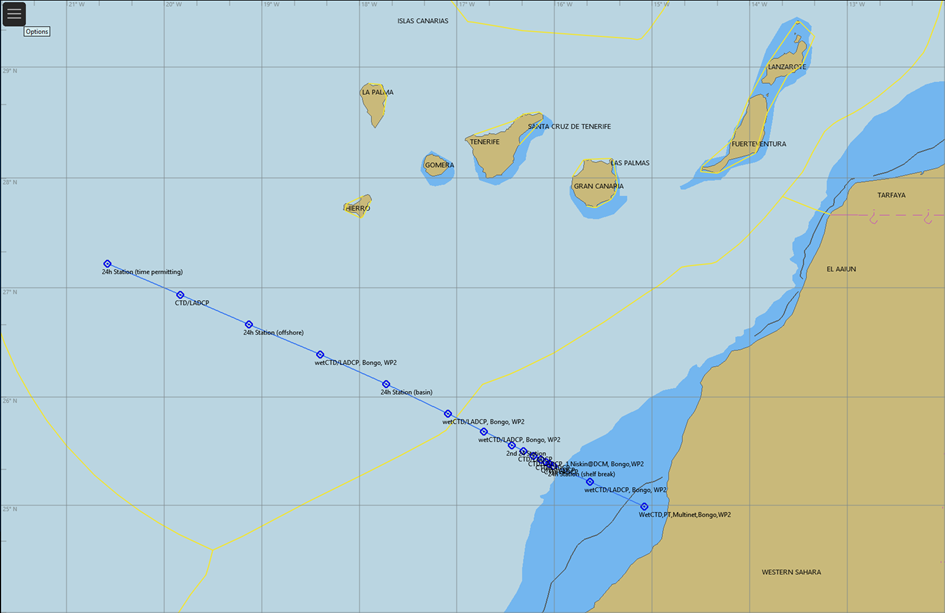

```{r setup, include=FALSE}
knitr::opts_chunk$set(echo = TRUE, fig.cap = TRUE, message = FALSE, warning = FALSE)

options(skipen=999)
#For dates to display in the proper way the locale needs to be set to English on the local machine
invisible(Sys.setlocale(locale = "English"))
#Load required packages
packages <- c("knitr", "readxl", "bookdown", "tidyverse", "ftExtra", "qdapRegex", "flextable", "officer", "imager", "officedown")

installed_packages <- packages %in% rownames(installed.packages())
if (any(installed_packages == FALSE)) {
  install.packages(packages[!installed_packages], repos = "http://cran.us.r-project.org")
}

# Packages loading
invisible(lapply(X = packages, FUN = require, character.only = TRUE))

# End of Packages loading
# Suppress dplyr's summarizing info
options(dplyr.summarise.inform = FALSE)
opts_knit$set(eval.after = "fig.cap")
opts_knit$set(eval.after = "fig.asp")

```

```{r data_loading, message=FALSE, warning=FALSE, include=FALSE, results='hide'}
#Loading of data, tidying up and preparation of the data for further usage
#Read in info from the input_dataframes excel file
input_dataframes_filepath <- list.files(path = "./_tables/", pattern = "input_dataframes.xlsx", full.names = TRUE)

sheets <- excel_sheets(input_dataframes_filepath)
input_dataframes <- lapply(excel_sheets(input_dataframes_filepath), 
                           function(x) 
                             data.frame(read_excel( input_dataframes_filepath, x, col_names = TRUE, col_types = "text")))

names(input_dataframes) <- sheets
input_dataframes <- purrr::map(.x = input_dataframes, .f = ~rename_with(.x, ~ gsub(".", " ", .x, fixed = TRUE)))

```

```{r setTableFormat, message=FALSE, warning=FALSE, include=FALSE, results='hide'}
# This chunck of code set the format (background color, padding, etc) of the tables produced in the report, so to have it standardized throughout.
set_flextable_defaults(big.mark = " ", 
  font.family = 'cambria',
  font.size = 9, 
  theme_fun = theme_zebra, 
  line_spacing = 0.8,
  padding.bottom = 5, 
  padding.top = 5,
  padding.left = 4,
  padding.right = 4,
  extra_css = "caption {text-align: left;}")

```

# **SURVEY PLAN FOR** `r input_dataframes$surveyplantab$Survey`

Leg 4.2 and 4.3 will start and end in Walvis Bay, Namibia (Table \@ref(tab:surveyplantab)).

```{r surveyplantab, echo=FALSE, tidy=TRUE, label="surveyplantab"}
ft_surveyplan <- flextable(input_dataframes$surveyplantab) %>% theme_booktabs(bold_header = TRUE) %>% bg(bg='transparent', part = "header") %>% ftExtra::colformat_md()
# Add caption
autonum <- run_autonum(seq_id = "tab", bkm = "surveyplantab", pre_label = "Table ", start_at=1)
ft_surveyplan <- set_caption(ft_surveyplan, caption = paste(input_dataframes$tab_captions[input_dataframes$tab_captions$`tab name`=="surveyplantab","caption"]), style = "Table Caption", autonum=autonum)

# # set table width to span page width
set_table_properties(ft_surveyplan,layout = "autofit")
```

## **Survey objectives**

The overall objectives of this regional survey effort in South Africa, Namibia and Angola were discussed in connection with the EAF-Nansen Programme Annual Forum in Benin in 2019 for surveys to take place in 2020.
These plans were not further developed because of the Covid-19 pandemic.
As the surveys with the R/V *Dr. Fridtjof Nansen* work were resumed in 2021, a zoom meeting was held on 27 July 2021 to reschedule the proposed surveys and revise survey objectives as it may be desirable (Filomena Vaz Velho, Virgilio Estevao, Beau Tjizou, Paul Kainge, Janet Coetzee, Carl van der Lingen, Deon Durholtz, Gabriella Bianchi participated in the meeting).

The general feedback indicated that the overall objectives as earlier agreed were still relevant.

Leg 4 consists of 3 surveys that aim at covering the pelagic fish resources on the shelf and the upper slope outside South Africa, Namibia and Angola.
Leg 4.2 and 4.3 aim at covering the pelagic fish resources on the shelf and the upper slope from mid Namibia to northern Angola.
While fishery resources represent the key priority, other aspects are also addressed to improve knowledge on composition and diversity of pelagic communities, habitats, understanding the environmental conditions within which they are found, including the presence of marine debris.
On Leg 4.1, the focus will be on the biomass, population structure, distribution and behavioral patterns of the commercially important epipelagic fish species, as well as of mesopelagic fish species.

This Sailing order considers in detail Legs 4.2 and 4.3.
Leg 4.1 has a separate Sailing order.
The general objectives of Leg 4.2 and 4.3 surveys are:

-   Obtaining information on pelagic fish species abundance, their distribution and size structure, as well as the species composition of the pelagic fish assemblage.

-   Standard biological sampling of prioritized pelagic species (length, weight, sex and maturity).

-   Map the physical and chemical properties of the water column and the subsurface layer at the study area (temperature, salinity, dissolved O~2~, chlorophyll, nutrients, pH and total alkalinity), as well as the underwater currents and light penetration.

-   Sampling of zooplankton and ichthyoplankton.

-   Sampling for the presence of microplastic particles in surface waters.

-   Sampling fish for microplastics, food safety and nutrition studies.

    Collected data will be used to prepare a survey report, and various scientific reports/papers as part of the EAF-Nansen Science Plan.
    The data collected will also feed into regional fisheries resource assessment work (Benguela Current Convention BCC -- <https://www.benguelacc.org/home> and the South East Atlantic Fisheries Organization SEAFO -- <http://www.seafo.org/>).

## **Survey area**

The survey area for the Leg 4 covers south-west and south African continental shelf area including the Benguela upwelling system, one of the major upwelling regions of the world, characterized by high productivity and important pelagic and demersal fishery resources.
Leg 4.1 will cover the pelagic fish resources off South Africa, from Orange River to Port Alfred.
Leg 4.2 will cover the area from Walvis Bay (Namibia) northwards to Benguela (Angola).
Leg 4.3 will continue from Benguela northwards to the Congo River mouth (Figure \@ref(fig:surveyareamap).
Sampling will be carried out according to the general R/V *Dr. Fridtjof Nansen* survey protocol, i.e. oceanographic conditions, including ocean pH and carbonate system on selected stations and transects, primary productivity, food safety, microplastics, marine debris, biodiversity, and pelagic fish resources.
Sampling protocols are standardized to the extent possible to allow comparability across larger geographic scales.

The survey Leg 4.2 will start on 19 July in Walvis Bay.
The vessel will start the first acoustic transect off Walvis Bay and progress northwards.
Acoustic transects will be conducted to Benguela (Angola), conditions and time permitting continuing further north.
The vessel will return to Walvis Bay latest by 16 August.
Leg 4.3 will begin on 20 August from Walvis Bay and steam to the last transect completed during Leg 4.2 to continue surveying northwards.
Leg 4.3 will end at the Congo River mouth and will return to Walvis Bay latest by 19 September.

The survey coverage, transect configuration, and bottom depth extent (20-500 m) is consistent with the time series surveys conducted by the Dr. Fridtjof Nansen in Angola since 1985 (Figure \@ref(fig:surveyareamap)).

```{r surveyareamap, echo=FALSE, fig.cap=paste(input_dataframes$fig_captions[input_dataframes$fig_captions$`fig name`=="surveyareamap","caption"]), fig.align='center', fig.width=6.2, fig.height=4.7,  label='surveyareamap'}
knitr::include_graphics("./_images/surveyareamap.png")
```

## **Proposed participation in different Legs and experience required**

The surveys with the R/V *Dr. Fridtjof Nansen* include local participants from different countries and institutions associated with the geographic area.
Qualifications and levels of expertise vary from experienced scientists / technicians to students and less experienced personnel for training purposes.
Training in sampling procedures will be provided on board.

An overview of the main types of expertise and number of participants required for Leg 4.2 and Leg 4.3 is provided in [ANNEX I](ANNEX_V) and the list of the planned survey participants is shown in [ANNEX II](ANNEX_V). It should be noted that a maximum number of 18 local participants on Leg 4.2 can be allowed, in addition to the scientific crew from Norway.
The lack of a fully-trained CTD Team Leader on Leg 4.2 limits the capacity for water sampling and analyses of pH and total alkalinity.
On Leg 4.3 there will be space for 16 local participants since one IMR acoustic expert who will also be on cruise leader training and an FAO expert will also join this Leg.
A CTD Team Leader from IMR will be available on Leg 4.3, thus pH and total alkalinity measurements for the purpose of ocean acidification studies will be carried out.

# **SCIENTIFIC RATIONALE**

The overall framework and rationale for the surveys carried out by the R/V *Dr. Fridtjof Nansen* are provided by the EAF-Nansen Programme Science Plan which covers three main pillars (Figure \@ref(fig:scienceplan)).
Within this framework, the scope and objectives of the surveys in 2022 have been identified with partners, based on national and regional priorities.
In addition, data recorded and samples collected during the survey will be analysed through collaborations initiated through the various Science Plan Themes.

```{r scienceplan, echo=FALSE, fig.cap=paste(input_dataframes$fig_captions[input_dataframes$fig_captions$`fig name`=="scienceplan","caption"]), fig.align='center', fig.width=6.5, fig.height=4,   label='scienceplan'}
knitr::include_graphics("./_images/scienceplan.png")
```

An overview of the Science Plan Themes for which this survey is most relevant and associated projects is provided in Table \@ref(tab:sciencethemestab).

```{r sciencethemestab, echo=FALSE, tidy=TRUE, label="sciencethemestab"}
ft_sciencethemestab <- flextable(input_dataframes$sciencethemestab) %>% theme_booktabs(bold_header = TRUE) %>% bg(bg='transparent', part = "header") %>% ftExtra::colformat_md()
# Add caption
autonum <- run_autonum(seq_id = "tab", bkm = "sciencethemestab", pre_label = "Table ")
ft_sciencethemestab <- set_caption(ft_sciencethemestab, caption = paste(input_dataframes$tab_captions[input_dataframes$tab_captions$`tab name`=="sciencethemestab","caption"]), style = "Table Caption"
                             , autonum=autonum
                             )

# # set table width to span page width
set_table_properties(ft_sciencethemestab,layout = "autofit")

```

## **Specific survey objectives and scientific questions**

The specific objectives of the Leg 4.2 and Leg 4.3 surveys are listed below (note that some items are valid for one but not both surveys):

-   Hydrography and biogeochemical description:

    -   Map the physical and chemical properties of the water column and the subsurface layer at the study area (temperature, salinity, dissolved O~2~, chlorophyll and nutrients), as well as the underwater currents and light penetration.  pH, total alkalinity and pCO₂ will be measured only during Leg 4.3.

-   Phytoplankton, zooplankton, ichthyoplankton and microplastics (both on Leg 4.2 and Leg 4.3):

    -   Describe the species composition of the phytoplankton community on specific transects.

    -   Assess the biomass of the mesozooplankton community, as well as its species composition and distribution patterns.

    -   Provide information on the abundance patterns of the ichthyoplankton community (fish eggs and larvae), at the lowest possible taxonomic level to identify possible spawning areas for commercial valuable fish species.

    -   Map the occurrence of microplastics to identify hotspots and degree of pollution.

-   Pelagic resources (see also section 3.1.2, 3.1.3 and 3.10.5, valid for both Leg 4.2 and 4.3):

    -   Provision of acoustic backscatter estimates for the following acoustic groups: sardinella, horse mackerel, mackerel, sardine ("Pilchard"), anchovy, round herring ("Redeye").
        Other scatterers will be allocated to "Pelagic Group I" (clupeoids), "Pelagic Group II" (carangids, scombrids), "Demersal fish", "Mesopelagic organisms", "Plankton" or "Other", as appropriate.

    -   Estimating the biomass and population size structure of sardinella (*Sardinella maderensis* and *S. aurita*), horse mackerel (*Trachurus trecae*, *T. capensis*), anchovy, sardine ("Pilchard"), Pelagic Group I (clupeids) and Pelagic Group II (scombrids, carangids), by means of echo integration and midwater trawling.

    -   Collection of biological data (length, wet body weight, sex, gonad maturity stage) for target fish species: *S. aurita*, *S. maderensis*, *T. trecae*, *T. capensis*, *Scomber colias*, *Sardinops sagax*, and *Engraulis encrasicolus*.

    -   Total catch weight and numbers of all fish species caught in the pelagic trawl hauls.

    -   Mapping the spatial distribution of pelagic target species and mesopelagic fish.

-   Mesopelagic transect (part of Leg 4.3):

    -   Characterization of the mesopelagic community in terms of abundance, diversity and composition across the productivity gradient from inshore to deep offshore waters along an extended reference oceanographic monitoring line (off Luanda).

    -   Estimation of aggregation densities of mesopelagic fish and other organisms by means of multifrequency acoustics, targeted pelagic trawling and water column positioning by means of the Deep Vision imaging system.

    -   Mapping the physical oceanography features of the water bodies inshore-offshore, including stratification and currents, and linking this to the presence of mesopelagic organisms.

    -   Mapping diurnal migrations and subsequent variations in recorded acoustic backscatter within the mesopelagic community at 3 to 5 distinct 24h diurnal stations located inshore, midshore and offshore along the transect.

    -   Collect samples of mesopelagic fish and jellyfish for taxonomic and trophic studies.

-   Other trawl-related sampling (valid for both Leg 4.2 and 4.3):

    -   Mapping the occurrence, abundance and biological parameters (length, weight, sex, and maturity staging for males) of cartilaginous fish.

    -   Collection of rare or unidentified fish species for taxonomy studies.

    -   Collecting samples for future analysis of nutrient profiles, contaminants and microplastics of sardinella and anchovy

    -   Collecting samples for analysis of microplastic in fish.

    -   Record the occurrence of marine debris collected during pelagic trawling by using the available draft protocol and take photos for future inclusion in the protocol itself.

-   Other objectives (valid for both Leg 4.2 and 4.3):

    -   On-the-job training in the various laboratories.

    -   Communication through social media.

\newpage

# **SAMPLING METHODS**

## **Survey design** {.unnumbered}

The survey design will consist of a systematic survey track with pseudo-parallel, equally-spaced acoustic transect lines perpendicular to the coast (approximately 10 nautical miles apart).
The survey track emulates past surveys in the time series to provide comparable biomass indices between the 20 and 500 m isobaths.
Coverage will be harmonized to the area surveyed during past surveys.
It is noted that the ultimate decision on the position of transects and the need to deviate from transects for safety reasons lie with the captain of the vessel.
When the acoustic transect line is interrupted (such as break-off for trawling) the transect must be resumed from the point of interruption, preferably with a small overlap to the interrupted transect.
This ensures continuous acoustic data coverage along the intended transect line.
The proposed cruise track will allow systematic coverage and acquisition of acoustic backscatter records, hydrographic conditions, and abundance and distribution of plankton.
A dedicated mesopelagic transect at 9 °S (off Luanda) will follow a specific sampling strategy [ANNEX IX](ANNEX_IX).

**Superstations**

Specific environmental transects with super-stations will be carried out according to a regular grid (every 1° or 60NM).
Typically, these transects covers the depth region from 20 to 500 m or even 1000 m.
These When these environmental transects arewill be extended, specifically from 20 m to 2000 m bottom depth isobath (CTD to 1000 m, other instruments down to 200 m), they and will then be referred to as "Master sections".

A super-station is defined as a station contacting containing a set of sampling devices deployed in close connection to each other like a CTD (hydrographic parameters), WP II (zooplankton), Bongo net (ichthyoplankton and a manta trawl (micro plastic and ichthyoplankton).
An overview of equipment and sampling depths of the superstations conducted at the environmental transects are shown in (Figure \@ref(fig:envtransects)).

CTD deployments will be carried out at super-stations along the environmental transects involving historical monitoring transect as well as at every pelagic trawl station (Figure \@ref(fig:surveyareamap)).

```{r envtransects, echo=FALSE, fig.cap=paste(input_dataframes$fig_captions[input_dataframes$fig_captions$`fig name`=="envtransects","caption"]), fig.align='center', fig.width=6, fig.height=5, label='envtransects'}
knitr::include_graphics("./_images/envtransects.png")
```

**Pelagic trawl stations**

Frequent *ad hoc* target identification tows will be made at the request of the cruise leader/co-cruise leader, or the acoustic watch-keeper, using either the bottom trawl (Gisund Super) with floats, the small pelagic (Åkra trawl) or the large pelagic (MultPelt) trawl.
The DeepVision (DV) system will be installed and operated in the MultPelt trawl during the mesopelagic transect and in some additional trawl hauls during the regular coverage.
The video data from the DV will be logged for the trawl hauls were the DV system is used.

Species composition, length frequencies and biological sampling must be conducted according to agreed procedures for each trawl sample.
The number of trawl samples will depend on the density and distribution of acoustic targets observed and the need for species identification.
Trawls may be requested at any time during day and night.
The frequency of tows will depend on the presence and degree of mixing of acoustic targets requiring identification as judged by the acoustic watch keeper, but allowance has been made for an average of 6 hours trawling per day .
This is an average figure, and on some days more than 6 hours may be requested.
The emphasis will be on catching relatively small quantities of fish in good condition for target identification and conducting biological analysis.
To carry out a trawl haul, the ship will break off from the survey grid.
After completion of the trawl, the ship is to return to the point at which the survey was interrupted.

If there are strong echoes on the echogram, and a subsequent trawl fails to collect a decent sample (at least 40 fish of the dominant species), the acoustic operator will need to request another trawl straight away to try and get a representative sample.
Targeted pelagic trawl stations will be conducted based on hydroacoustic recordings (EK80) in order to aid acoustic data interpretation.
The overall goal is to provide a fish stock biomass index for each target species or species group that is comparable to indices obtained in past R/V *Dr. Fridtjof Nansen* voyages at the same geographical area (precision).
The number and allocation of fishing stations will be compromised with the best possible area coverage in Legs 4.2 and 4.3.

Detailed sampling protocols for what is considered as standard sampling on the R/V *Dr. Fridtjof Nansen* can be found in the Nansen wiki (<https://nansen-surveys.imr.no/doku.php>).
Other sampling protocols, area specific information and detailed description of the sampling conducted, will be given below.

### Acoustics

The EK80, SU90, and two ADCP's (75 and 150 kHz) are the only actively pinging acoustic instruments to be used continuously throughout the Leg 4.2 and 4.3 surveys.
Occasional use of SH90, EM710, MS70, or ME70 for navigation and scientific experimentation may occur; these will operate synchronized with all other acoustic equipment via k-sync if used while the ship is sailing on the acoustic transect.
**All actively pinging acoustic instruments used will operate synchronized with each other via k-sync system with the explicit emphasis on EK80 acoustic data quality.** Synchronization of actively pinging acoustic equipment is paramount to avoid interference between the sonars.
Thus, great care must be taken to ensure that the ping order is set up correctly to avoid interference from the SU90 and ADCP's on the EK80 records while ship is sailing on the acoustic transect.
Echosounders will operate with ship **drop-keel extended** which helps avoid unwelcome backscatter from surface and ship hull generated air bubbles.
A constant survey speed of 10 knots will normally be maintained but adjusted according to weather and sea conditions.
However, at times the vessel may have to be slowed (at the request of the acoustic watch-keeper) to reduce acoustic noise experienced by the EK80 system.

**EK80**

Acoustic backscatter data (Simrad EK80) will be collected continually at 1 Hz sampling rate with simultaneous ping setting.
Continuous wave (**'CW', narrow-band**) pulses of 'Fast' taper at nominal frequencies of 18, 38, 70, 120, 200, and 333 kHz will be used with 1.024 ms pulse duration.
Chief instrument operator must ensure that only calibrated EK80 settings are used for on-transect acoustic data collection.
EK80 calibration is done at the start of the pelagic survey whenever practicable (the preferred option).
Otherwise, the most resent valid EK80 calibration of acceptable quality is used.
Acoustic data will be **logged to 550m depth** (survey area bathymetry extent is 20-500m).
Recording range can be adjusted according to the bottom depth in shallow waters but acoustic records must at all times include the entire water column and the sea bottom echo while sailing on the acoustic transect used for stock assessment purposes.
This requires that the acoustic operators remain aware of the water depth and adjust the maximum depth logged by the EK80 as appropriate.
The acoustic nautical area backscattering coefficient (NASC) at 38 kHz integrated across the water column for the target species / acoustic categories will be estimated on board using the LSSS acoustic data post-processing software.
Priority target species have been selected with the aim to produce abundance estimate indexes for these species.
Scrutinization exercises, i.e., splitting total backscatter into target/mix groups and non-targets such as plankton will be carried out during daily acoustic data scrutinization sessions by the instrument chief and the cruise leader.
The Deep Vision in trawl imagery will be used to aid acoustic data interpretation whenever it is available.

**EK80 calibration**

Simrad EK80 echosounder calibration will be conducted during Leg 4.3.
If successful and results are of acceptable quality, this EK80 calibration results will be used for both Leg 4.2 and 4.3 EK80 acoustic data scrutinization products of LSSS.
The Simrad EK80 (provisionally, 2022.08.21, Walvis Bay) and WBAT (2022.08.21, Walvis Bay or later during the survey) echosounders will be calibrated using standard methods (Demer et al., 2015) and metallic spheres of various sizes made of tungsten carbide with 6 percent cobalt binder or copper.
WBAT calibration may or may not occur depending on usage of that instrument.
Both **narrowband and broadband** (used during Leg 4.3 mesopelagic fish transect) pulse settings will be calibrated with priority and emphasis on good quality narrowband (CW) calibrations if local conditions prove to be challenging.
For broadband pulse calibrations, the calibration sphere diameter will be chosen based on the best fit for the bandwidth in question in terms of the "null" positions in the frequency response of the sphere.
A second calibration target of a different size will be used where needed to ensure calibration data across the entire bandwidth of the chosen acoustic pulse and the two calibration results merged as per EK80 software procedures for it.
The complete broadband pulse settings calibration is extensive and may need to be compromised/reduced due to time and local conditions constraints (e.g., no dual-sphere calibration per acoustic channel).
An additional weight (900g led) may be used to stabilize spheres of smaller size (e.g. WC38.1, WC35, WC25, WC22, and WC20) when calibrating ship echosounders.
It will be suspended (bottom depth allowing) 8 m below the calibration target by 0.4mm diameter nylon line.
WC57.2, Cu64, or Cu60 can be used alone with no additional weights.
WBAT (if at all used) will be calibrated as suspended in water by ship crane at 2m depth using dedicated WBAT metal frame with calibration 'arms' (calm water is paramount).
Sphere will be suspended by three lines (0.4 mm diameter nylon) 6-8 m below the probe.

**SU90**

The Simrad SU90 fisheries sonar will be used to record acoustic data continuously during the 4.2 and 4.3 surveys.\
The sonar must be set to a frequency of 26 kHz, in FM Normal mode and operated using "Trawl 2" (old "Bow up/180 deg") operation mode with the bearing of the vertical beams 90 deg, perpendicular to the vessel direction with a range of 450m and with the horizontal beams set to 450m with a tilt angle of 3 deg.
Default filter values must be used except for the noise filter which must be turned off.
These settings including range and tilt must be kept the same during the whole survey except during trawling operations where the sonar can at times be used actively to focus in on targets.

**ADCP**

The ship mounted 75 and 150 kHz ADCP's will operate continuously during the Leg 4.2 and 4.3 surveys.
For more details see section 3.2.4.

## **Meteorological and hydrographic sampling in surface water**

### Weather Station

Wind direction, wind speed, air pressure, relative humidity, air temperature and solar radiation data are averaged every 60 seconds and logged continuously from the Aanderaa Automatic Weather Station 2700.

### Thermosalinograph

Two SBE 21 SeaCAT Thermosalinographs (TSG) run continuously during the survey, obtaining samples at 4 m and 6 m depths to measure seawater salinity and temperature every 10 seconds.
The 4 m TSG measures water from the intake for the engine cooling water, whereas the 6 m TSG measures water from the intake located on the drop keel.
The 4 m TSG is equipped with a Turner Designs C3 Submersible Fluorometer and the 6 m TSG is equipped with a Sea-Bird WETStar Fluorometer.

### Underway pCO~2~

Seawater from the vessel's 4 m intake is pumped through the flow head of a CONTROS HydroC^®^ CO~2~ FT sensor where dissolved gases are diffused through a composite membrane into an internal gas circuit leading to a detector chamber.
The partial pressure of CO₂ is then determined via IR absorption spectrometry.
Water samples will be collected from the sensor's water outflow to measure pH and total alkalinity to validate the sensor's pCO~2~ values.

### Current speed and direction measurements - ADCP

Ocean current data are collected with two vessel-mounted Teledyne RDI Ocean Surveyor Acoustic Doppler Profilers operating at 75 kHz (depth range of 650 m) and 150 kHz (depth range of 400 m).
The ADCPs run in narrow band mode and average data in 8 m vertical bins.
Heading, pitch, roll and positional data are acquired by a Kongsberg Maritime Seapath unit.

Teledyne's VmDAS software is used to collect the raw current data, whereas software created at IMR (QCSYS) is used to process the data.

## **Hydrographic sampling in the water column**

### CTD-Rosette system

A Sea-Bird 911plus CTD with the following sensors is mounted to a 12-bottle rosette water sampler for use at every hydrographic station.
All sensor data logging and real-time profiling is performed using Sea-Bird's Seasave software.

• 2 x SBE 3Plus Temperature ('T') sensors

• 2 x SBE 4C Conductivity sensors for salinity ('S')

• Digiquartz Pressure ('P') sensor

• SBE 43 Dissolved Oxygen ('DO') sensor

• WET Labs ECO-AFL Fluorometer ('F')

• Sea-Bird ECO FLNTU Fluorometer and Turbidity sensor

• Satlantic Photosynthetically Active Radiation ('PAR') LOG ICSW sensor

CTD-Rosette deployments will be carried out at every trawl station as well as at every station where environmental sampling is conducted ('super-station', see below), in accordance with IMRs standard depth designations shown in Figure 3.
Additional sampling devices will be deployed for collection of plankton (including ichthyoplankton) and microplastics.
The water samples from the Niskin bottles attached to the Rosette will be used for measurements of pH, total alkalinity, dissolved nutrients (nitrite, nitrate, silicate, and phosphate), dissolved oxygen, chlorophyll *a* and salinity.
Detailed sampling protocols for these parameters can be found in the Nansen manual site (<http://nansen-surveys.imr.no/doku.php?id=ctd_lab_information>).

### Ocean Acidification parameters - pH and total alkalinity

Seawater samples for the analysis of pH and total alkalinity are collected together in 250 ml borosilicate glass bottles with silicone tubing.
Samples are collected from the rosette water sampler in accordance with IMRs Standard Depth designations.
If oxygen water samples are not being collected, these pH/AT samples will be collected first from the rosette bottles due to their gas sensitivity that will alter the pH.

• pH is determined using an Agilent Cary 8454 UV-Vis Diode Array spectrophotometer and a 2-mM m-cresol purple indicator dye solution.
See the pH protocol for further details in addition to sampling and analysis procedures.

• Total alkalinity is determined via an open-cell potentiometric titration using a 0.05 M HCl solution with a sodium chloride background as the titrant (Dickson et al., 2007).
See the total alkalinity protocol for further details in addition to sampling and analysis procedures.
To assess the ocean acidification state and change in the region, the pH and total alkalinity data will be combined with phosphate, silicate, temperature, salinity, and depth to calculate additional parameters of the carbonate system such as dissolved inorganic carbon, and the calcium carbonate saturation states for aragonite and calcite.

### Dissolved Nutrients

Seawater samples for the analysis of nitrite, nitrate, silicate, and phosphate are collected in 20 ml polyethylene vials at all super-stations and frozen for preservation (Becker et al., 2019).
When ready for analysis, samples will be thawed in a 50°C water bath for 40 minutes and then allowed to cool to room temperature for 45 minutes (Becker et al., 2019).
The nutrient samples will be measured on board the vessel before November 2022 with a SEAL QuAAtro39 continuous segmented flow analyser (QuAAtro Methods: Q-070-05 Rev. 7; Q-068-05 Rev. 12; Q-064-05 Rev. 8; Q-038-04 Rev. 4 (multitest MT3B).

## **Phytoplankton**

Seawater samples for the analysis of chlorophyll *a* are collected in 276 ml high-density polyethylene bottles from depths ranging from 5 to 200 m at all super-stations.
Samples are filtered with 25 mm Munktell MG F filters with a 0.7 µm particle retention on a 200 mm Hg vacuum pumped filtration system.
The filters are stored in a -20°C freezer until ready for extraction for 15-24 hours with 10 ml of 90% acetone at 4°C.
Samples are then centrifuged and transferred to cuvettes for analysis on a Turner Designs 10AU Fluorometer (Welschmeyer, 1994; Jeffrey and Humphrey, 1975).
Samples are first measured without acid for chlorophyll *a* determination and then a second time with two drops of 5% HCl for phaeopigment determination.
The 10AU fluorometer is calibrated once a year with standard solutions created from a chlorophyll *a* solid from spinach.
In addition, blank measurements with 90% acetone and stability measurements with a 10AU Solid Secondary Standard are carried out before and after every sample set analysis.

Water samples for phytoplankton community composition analysis will be collected at the stations of the five national monitoring lines (Cunene, Namibe, Lobito, Luanda, Congo).
Water will be collected at predefined depths (5, 15, 25, 50, 75 m) with Niskin bottles on the CTD-Rosette, with \*\*75 m\*\* as the maximum depth of sample collection.
Samples will be fixed in 2% formaldehyde solution.

## **Zooplankton**

Zooplankton samples are to be collected at three "superstation" stations positioned at the isobaths 30 m, 100 m, 500 or 1000 m).
The standard sampling depths for zooplankton will be 30 m, 100 m and 500 m, but if the distance between the 500 m and 1000 m isobath is less than 2 NM we will take zooplankton samples at the 1000 m station instead of at 500 m.
Additional zooplankton sampling will be done at the stations of the five national monitoring lines.
All samples will be collected by vertical hauls of a WP2 net (56 cm diameter, mesh size 180 µm) at a speed of 0.5 m sec^-1^.
The net will be towed **within 5 m above the bottom** to the surface, or from 200 m depth to the surface at deep stations.
The plankton leader should ensure that this procedure is followed accurately on deck, write the actual depth of the tow (displayed in the monitor), and take flowmeter counts before and after the tow.
In summary, the WP2 samples will be processed as follows:

• The sample will be halved into parts with a Motoda splitter.

• One half will be used for biomass estimation (size fractionation through 2000 μm, 1000 μm and 180 μm mesh sizes).

• The second half will be preserved in 4% borax buffered formaldehyde solution and will be processed onboard through the FlowCam Macro.
The exact procedure to be followed is described in detail in the **Nansen Plankton Guidelines (see <https://nansen-surveys.imr.no/doku.php?id=plankton_lab_information> )**.

## **Ichthyoplankton**

Ichthyoplankton is collected at the same super stations as the zooplankton samples are collected, with double oblique tows of a Bongo net (60 cm diameter) equipped with 405 μm nets.
The Bongo will be towed obliquely within 5 m above the bottom or a maximum depth of 200 m to the surface at deep stations.
**Wire speed and the vessel speed should strictly follow the Nansen Plankton Guidelines (see <https://nansen-surveys.imr.no/doku.php?id=plankton_lab_information>)**.\
Once the Bongo net is on board, the samples will be transferred in the lab and will be processed as follows:

• The sample of the right net (H) will be preserved directly in 95% ethanol.

• The sample of the left net (V) will be preserved directly in 4% borax buffered formaldehyde solution solution (especially made for ichthyoplankton).
If time allows this sample will be examined under the microscope and all fish larvae (and eggs if possible) will be sorted out.
Plankton examination should be done thoroughly and in small amounts.
When sorting has finished, the bulk sample will be used for the estimation of the Zooplankton Displacement Volume (details in the Nansen Plankton Guidelines).
Finally, the sample will be stored back in its bottle using the same 4% formaldehyde.
The sorted ichthyoplankton will be photographed and preserved with 4% formaldehyde solution (especially made for ichthyoplankton) in small-labelled scintillation vials indicating clearly which net was used for sorting, the preservative, station etc.
More details on the sample processing can be found in the **Nansen Plankton Guidelines (see <https://nansen-surveys.imr.no/doku.php?id=plankton_lab_information>)**.

If Bongo deployment is not possible due to net malfunction etc., ichthyoplankton will be sampled by Multinet (Midi or Mammoth) according to the instructions in the **Nansen Plankton Guidelines (see <https://nansen-surveys.imr.no/doku.php?id=plankton_lab_information>)**

In addition, larval fish collected by the Manta trawl (see also 3.8), these will be sorted, photographed, preserved in 96% ethanol for genetics in small scintillation vials.

## Bottom depth

Bottom depth read is obtained continuously from the EK80 echosounder (down to 700m depth, 38kHz) and registered into the Olex bottom mapping system used by the vessel.
The information is also registered in the "Survey Logger" (Toktlogger) system, through the appropriate NMEA message.

Leg 4.2 and 4.3 survey area bottom depth is 20-500m with few extended transect lines beyond 500 m isobath.
When sampling station bottom depth exceeds 700m (and it needs bottom depth read input to "Survey Logger"), a temporary manual adjustment to EK80 settings will be made to obtain local bottom depth read (implies adjustment to a slower ping rate than the standard 1 Hz).

## Microplastics

Microplastics are collected at the same superstations as the zooplankton samples with a Manta trawl and the operation is carried out concurrently with the tow of the Bongo net.
The Manta trawl (19 cm (height) × 61 cm (width), 335 μm mesh size) is towed outside the wake of the vessel at 2-3 knots (ca. 1.5 m/s) for 15 min.
Procedures of sampling and sample processing are described in the Nansen Plankton Guidelines (see Nansen wiki).
Sampling processing in summary involves sorting of:

**Microplastics**: These should be photographed, washed in fresh water, and stored in labelled Eppendorf tubes with the station information.
Polymer identification to be done by ATR FTIR in Bergen, Norway.

The bulk of neuston samples also collected with the Manta trawl should be preserved, after sorting, in 96% ethanol.
In case of lack of time for sorting or adverse weather conditions, samples should be directly preserved in 96% ethanol and processed later.
Non-methylated ethanol should be used in all cases.

## Biological sampling of pelagic species from the pelagic trawl catches

According to the size of the catch, either the whole catch is sorted and measured, or subsamples are taken.
At all trawl hauls, the catch is sorted according to species, and number and weight measurements will be taken for all fish species.
For priority species length and weight are recorded using an electronic fish meter connected to a customized data acquisition system (Fish2Data and Biotic Editor) running on the server of the vessel.

In [ANNEX III](ANNEX_III) and [ANNEX IV](ANNEX_IV), the fish lab workflow overview and guidelines on the detailed sampling protocols in the fish lab can be found.
As a preparation for the work in the fish lab, a training course will be provided on the use of the electronic fish meter, Fish2Data and Biotic Editor software.

### Sampling procedure of priority species at each trawl station

A representative subsample of the catch is obtained for trawl station with a minimum of 100 individuals are measured (length-weight relationships), more if needed to ensure that representative length distributions are sampled (e.g., for the cases of apparent bi- and multimodal length distributions).

For sex and maturity determination 20 fish per 1cm length group will be examined at each fishing station.

The sampling protocol will be programmed into the Fish2Data software and be installed on the iPads used during the measurement of length and weight.

```{r biosamplingtab, echo=FALSE, tidy=TRUE, label="biosamplingtab"}
ft_biosamplingtab <- flextable(input_dataframes$biosamplingtab) %>% theme_booktabs(bold_header = TRUE) %>% bg(bg='transparent', part = "header") %>% ftExtra::colformat_md()
# Add caption
autonum <- run_autonum(seq_id = "tab", bkm = "biosamplingtab", pre_label = "Table ")
ft_biosamplingtab <- set_caption(ft_biosamplingtab, caption = paste(input_dataframes$tab_captions[input_dataframes$tab_captions$`tab name`=="biosamplingtab","caption"]), style = "Table Caption"
                             , autonum=autonum
                             )

# # set table width to span page width
set_table_properties(ft_biosamplingtab,layout = "autofit")

```

## Other trawl-related sampling

### Cartilaginous fish {.unnumbered}

Individual length and weight, sex and maturity status shall be measured of all cartilaginous fish caught.
Vulnerable species that are alive shall be released as soon as possible after the catch is on deck.
If the individuals are too large to weigh individually only length is to be measured.

The protocol that will be followed for cartilaginous will be the same as for demersal / pelagic resources described above.
Specimens for taxonomic courses will be collected also following the protocol described above.
Species that cannot be identified should be preserved in formalin or frozen (and labelled according to the procedure above) and sent to taxonomic experts for identification after the survey.

### Samples for food safety studies and nutrition {.unnumbered}

Samples will be taken of sardinella and anchovy for future analysis of nutrient profiles, contaminants and microplastics.
A total of 25 specimens of each species at 3 different stations, per country, will be frozen and later analyzed for determination of nutrients and food safety parameters.
If catches are small, a minimum sample of 5 fish from each station should be taken.
The fish (whole) will be stored in plastic bags marked with species, station, and date.
The trawl form with station information should follow the samples.
An electronic copy should be sent to [marian.kjellevold\@hi.no](mailto:marian.kjellevold@hi.no).

### Marine debris {.unnumbered}

Marine debris will be registered and classified at each station according to the categories listed in the sampling protocol for marine litter (<https://nansen-surveys.imr.no/doku.php?id=biological_sampling_procedures>).
All pieces of litter should be weighed and counted, and when possible, photos should be taken of the individual pieces for a reference catalogue.
Data should be recorded in designated Excel sheet and photos should be clearly labelled and saved in a folder in the work catalogue marked 'Marine Debris'.
One person from each shift will be responsible for recording this data.

### Pelagic fish biomass estimated based on acoustic backscatter (EK80)

The biomass indices of priority pelagic fish (see below) will be estimated by the acoustic estimate method (<https://nansen-surveys.imr.no/doku.php?id=biomass_calculations>) using the StoX [StoX(stoxproject.github.io)] software.
Biomass indices will be estimated as total biomass and by length groups (for the species with sufficient length data).
Prior to the survey the EAF Nansen Programme organized a pelagic biomass estimation course (9-13 May 2022) and the survey participants that will have taken part in the course will be given the chance to apply their newly acquired skills in biomass estimation using StoX.
Priority pelagic species for biomass estimation by acoustics and targeted trawl sampling:

• *Sardinella aurita* and *Sardinella maderensis* combined as *Sardinella* spp., *Trachurus* spp., Pelagic Group I and Pelagic Group II

• Allocation of acoustic densities to species groups will be done according to Table \@ref(tab:acousticcategorytab)

```{r acousticcategorytab, echo=FALSE, tidy=TRUE, label="acousticcategorytab"}
ft_acousticcategorytab <- flextable(input_dataframes$acousticcategorytab) %>% theme_booktabs(bold_header = TRUE) %>% bg(bg='transparent', part = "header") %>% ftExtra::colformat_md()
# Add caption
autonum <- run_autonum(seq_id = "tab", bkm = "acousticcategorytab", pre_label = "Table ")
ft_acousticcategorytab <- set_caption(ft_acousticcategorytab, caption = paste(input_dataframes$tab_captions[input_dataframes$tab_captions$`tab name`=="acousticcategorytab","caption"]), style = "Table Caption"
                             , autonum=autonum
                             )

# # set table width to span page width
set_table_properties(ft_acousticcategorytab,layout = "autofit")

```

\newpage

## Data collected and standard procedure for handling over samples to partners

In line with the Nansen Data Policy, the Cruise Leader is to ensure that each national institution represented in the survey receives a copy of the draft report and the basic data (e.g., catch data) pertaining to the particular survey and for their national waters before leaving the vessel.
An overview of the equipment that is going to be used for the collection of the various data can be found in Table \@ref(tab:equipmenttab) ([ANNEX V](ANNEX_V)).

The different types of data expected to be recorded, their storage and delivery can be found in Table \@ref(tab:datahandovertab) ([ANNEX VI](ANNEX_VI)).

Finally, the samples to be collected, their preservation and planned follow-up work is detailed in Table \@ref(tab:collectedsamplesnamtab) for Leg 4.2 and in Table \@ref(tab:collectedsamplesangtab) for Leg 4.3 ([ANNEX VII](ANNEX_VII)).

The Cruise Leader is expected to document what data and samples have been shared and with whom.
The cruise participants are expected to sign and conform to the Data policy of the EAF-Nansen Programme.
Persons responsible for samples need to inform about the status of analysis, and report about this at the post-survey meeting as well as send a copy of the analysis/results to IMR ([nansen_data\@hi.no](mailto:nansen_data@hi.no){.email}).
IMR, as a data custodian for the EAF-Nansen Programme, is required to have an overview of the samples/analysis at any point in time to: 1.
Ensure that data life-cycle management is carried out in the expected way 2.
Be used for capacity building purposes (e.g., workshops, training courses, etc.) 3.
Advance collaboration and publishing through the EAF-Nansen Science Plan 4.
Maintain reference libraries (e.g., for taxonomic purposes) and DNA barcoding 5.
Plan efficiently future surveys in the same area.

# **REFERENCES** {.unnumbered}

Becker, S.; Aoyama, M.; Woodward, E.M.S.; Bakker, K.; Coverly.
S.; Mahaffey, C.
and Tanhua, T.
(2019) GO-SHIP Repeat Hydrography Nutrient Manual: The precise and accurate determination of dissolved inorganic nutrients in seawater, using Continuous Flow Analysis methods.
In: GO-SHIP Repeat Hydrography Manual: A Collection of Expert Reports and Guidelines.
Version 1.1, [56pp.].
DOI: <http://dx.doi.org/10.25607/OBP-555>.

Demer, D. A., Berger, L., Bernasconi, M., Bethke, E., Boswell, K., Chu, D., Domokos, R., et al. 2015.
Calibration of acoustic instruments.
ICES Cooperative Research Report No. 326: 133 pp. <http://dx.doi.org/110.25607/OBP-25185>.

Dickson, A.G., Sabine, C.L.
and Christian, J.R.
(Eds.) 2007.
Guide to Best Practices for Ocean CO2 Measurements.
PICES Special Publication 3, 191 pp.

Jeffrey, S.W., Humphrey, G.F.
(1975).
New Spectrophotometric Equations for Determining Chlorophylls a, b c1 and c2 in Higher Plants, Algae and Natural Phytoplankton.
Biochem.
Physiol.
Plantzen, 167: 191-194.

Welschmeyer, N.A.
(1994).
Fluorometric analysis of chlorophyll a in the presence of chlorophyll b and phaeopigments.
Limnol.Oceanogr.
39: 1985-1992.

\newpage

# **ANNEXES** {.unnumbered}

<!---BLOCK_LANDSCAPE_START--->

## **ANNEX I. Requested participation** {#ANNEX_I .unnumbered}

```{r reqparttab, echo=FALSE, tidy=TRUE, label="reqparttab"}
ft_reqparttab <- flextable(input_dataframes$reqparttab) %>% theme_booktabs(bold_header = TRUE) %>% bg(bg='transparent', part = "header") %>% ftExtra::colformat_md()
# Add caption
autonum <- run_autonum(seq_id = "tab", bkm = "reqparttab", pre_label = "Table ")
ft_reqparttab <- set_caption(ft_reqparttab, caption =  paste(input_dataframes$tab_captions[input_dataframes$tab_captions$`tab name`=="reqparttab","caption"]), style = "Table Caption"
                             , autonum=autonum
                             )

# # set table width to span page width
set_table_properties(ft_reqparttab,layout = "autofit")

```

<!---BLOCK_LANDSCAPE_STOP--->

## **ANNEX II. Planned participation** {#ANNEX_II .unnumbered}

```{r plannedparticipantstab, echo=FALSE, tidy=TRUE, label="plannedparticipantstab"}
ft_plannedparticipantstab <- flextable(input_dataframes$plannedparticipantstab) %>% theme_booktabs(bold_header = TRUE) %>% bg(bg='transparent', part = "header") 
# %>% ftExtra::colformat_md()
# Add caption
autonum <- run_autonum(seq_id = "tab", bkm = "plannedparticipantstab", pre_label = "Table ")
ft_plannedparticipantstab <- set_caption(ft_plannedparticipantstab, caption =  paste(input_dataframes$tab_captions[input_dataframes$tab_captions$`tab name`=="plannedparticipantstab","caption"]), style = "Table Caption"
                             , autonum=autonum
                             )

# # set table width to span page width
set_table_properties(ft_plannedparticipantstab,layout = "autofit")

```

\newpage

## **ANNEX III. Fish lab workflow** {#ANNEX_III .unnumbered}

```{r catchsamplingworkflow, echo=FALSE, fig.cap=paste(input_dataframes$fig_captions[input_dataframes$fig_captions$`fig name`=="catchsamplingworkflow","caption"]), fig.align='center', fig.width=5.5, fig.height=8.5, label='catchsamplingworkflow'}
knitr::include_graphics("./_images/catchsamplingworkflow.png")
```

## **ANNEX IV. Scales used for biological sampling** {#ANNEX_IV .unnumbered}

```{r SOmatstagetab, echo=FALSE, tidy=TRUE, label="matstagetab"}
ft_matstagetab <- flextable(input_dataframes$matstagetab) %>% theme_booktabs(bold_header = TRUE) %>% bg(bg='transparent', part = "header") 
#%>% ftExtra::colformat_md()
# Add caption
autonum <- run_autonum(seq_id = "tab", bkm = "matstagetab", pre_label = "Table ")
ft_matstagetab <- set_caption(ft_matstagetab, caption = paste(input_dataframes$tab_captions[input_dataframes$tab_captions$`tab name`=="matstagetab","caption"]), style = "Table Caption"
                             , autonum=autonum
                             )

# # set table width to span page width
set_table_properties(ft_matstagetab,layout = "autofit")

```

\newpage

## **ANNEX V. Overview of component sampled and equipment used during the survey** {#ANNEX_V .unnumbered}

```{r equipmenttab, echo=FALSE, tidy=TRUE, label="equipmenttab"}
ft_equipmenttab <- flextable(input_dataframes$equipmenttab) %>% theme_booktabs(bold_header = TRUE) %>% bg(bg='transparent', part = "header") 
#%>% ftExtra::colformat_md()
# Add caption
autonum <- run_autonum(seq_id = "tab", bkm = "equipmenttab", pre_label = "Table ")
ft_equipmenttab <- set_caption(ft_equipmenttab, caption = paste(input_dataframes$tab_captions[input_dataframes$tab_captions$`tab name`=="equipmenttab","caption"]), style = "Table Caption"
                             , autonum=autonum
                             )

# # set table width to span page width
set_table_properties(ft_equipmenttab,layout = "autofit")

```

\newpage

## **ANNEX VI. Data to be collected and handover plan** {#ANNEX_VI .unnumbered}

```{r datahandovertab, echo=FALSE, tidy=TRUE, label="datahandovertab"}
ft_datahandovertab <- flextable(input_dataframes$datahandovertab) %>% theme_booktabs(bold_header = TRUE) %>% bg(bg='transparent', part = "header") 
#%>% ftExtra::colformat_md()
# Add caption
autonum <- run_autonum(seq_id = "tab", bkm = "datahandovertab", pre_label = "Table ")
ft_datahandovertab <- set_caption(ft_datahandovertab, caption = paste(input_dataframes$tab_captions[input_dataframes$tab_captions$`tab name`=="datahandovertab","caption"]), style = "Table Caption"
                             , autonum=autonum
                             )

# # set table width to span page width
set_table_properties(ft_datahandovertab,layout = "autofit")

```

\newpage

<!---BLOCK_LANDSCAPE_START--->

## **ANNEX VII. Samples to be collected, preservation and follow-up work** {#ANNEX_VII .unnumbered}

```{r collectedsamplesnamtab, echo=FALSE, tidy=TRUE, label="collectedsamplesnamtab"}
ft_collectedsamplesnamtab <- flextable(input_dataframes$collectedsamplesnamtab) %>% theme_booktabs(bold_header = TRUE) %>% bg(bg='transparent', part = "header") 
#%>% ftExtra::colformat_md()
# Add caption
autonum <- run_autonum(seq_id = "tab", bkm = "collectedsamplesnamtab", pre_label = "Table ")
ft_collectedsamplesnamtab <- set_caption(ft_collectedsamplesnamtab, caption = paste(input_dataframes$tab_captions[input_dataframes$tab_captions$`tab name`=="collectedsamplesnamtab","caption"]), style = "Table Caption"
                             , autonum=autonum
                             )

# # set table width to span page width
set_table_properties(ft_collectedsamplesnamtab,layout = "autofit")

```

```{r collectedsamplesangtab, echo=FALSE, tidy=TRUE, label="collectedsamplesangtab"}
ft_collectedsamplesangtab <- flextable(input_dataframes$collectedsamplesangtab) %>% theme_booktabs(bold_header = TRUE) %>% bg(bg='transparent', part = "header") 
#%>% ftExtra::colformat_md()
# Add caption
autonum <- run_autonum(seq_id = "tab", bkm = "collectedsamplesangtab", pre_label = "Table ")
ft_collectedsamplesangtab <- set_caption(ft_collectedsamplesangtab, caption = paste(input_dataframes$tab_captions[input_dataframes$tab_captions$`tab name`=="collectedsamplesangtab","caption"]), style = "Table Caption"
                             , autonum=autonum
                             )

# # set table width to span page width
set_table_properties(ft_collectedsamplesangtab,layout = "autofit")

```

<!---BLOCK_LANDSCAPE_STOP--->

## **ANNEX VIII. Gear codes to be used during Leg 4.2 and 4.3 in the survey logger (toktlogger).** {#ANNEX_VIII .unnumbered}

```{r gearcodestab, echo=FALSE, tidy=TRUE, label="gearcodestab"}
ft_gearcodestab <- flextable(input_dataframes$gearcodestab) %>% theme_booktabs(bold_header = TRUE) %>% bg(bg='transparent', part = "header") 
#%>% ftExtra::colformat_md()
# Add caption
autonum <- run_autonum(seq_id = "tab", bkm = "gearcodestab", pre_label = "Table ")
ft_gearcodestab <- set_caption(ft_gearcodestab, caption = paste(input_dataframes$tab_captions[input_dataframes$tab_captions$`tab name`=="datahandovertab","caption"]), style = "Table Caption"
                             , autonum=autonum
                             )

# # set table width to span page width
set_table_properties(ft_gearcodestab,layout = "autofit")

```

\newpage

## **ANNEX IX. Mesopelagic fish transect along the Luanda monitoring line during Leg 4.3 survey of the RV *Dr. F. Nansen.*** {#IX .unnumbered}

```{r mesopelagictransecttab, echo=FALSE, tidy=TRUE, label="mesopelagictransecttab"}
ft_mesopelagictransecttab <- flextable(input_dataframes$mesopelagictransecttab) %>% theme_booktabs(bold_header = TRUE) %>% bg(bg='transparent', part = "header") %>% 
ftExtra::colformat_md()
# Add caption
autonum <- run_autonum(seq_id = "tab", bkm = "mesopelagictransecttab", pre_label = "Table ")
ft_mesopelagictransecttab <- set_caption(ft_mesopelagictransecttab, caption = paste(input_dataframes$tab_captions[input_dataframes$tab_captions$`tab name`=="datahandovertab","caption"]), style = "Table Caption"
                             , autonum=autonum
                             )

# # set table width to span page width
set_table_properties(ft_mesopelagictransecttab,layout = "autofit")

```

**INTRODUCTION**

This mesopelagic transect is incorporated into Leg.
4.3 pelagic fish survey of RV Dr. F.Nansen 2022 and will be conducted off Luanda at 9°S at the end of the survey, after the pelagic coverage to avoid interruption of the pelagic coverage and make optimal use of the total time available (Figure \@ref(fig:mesopeltransect)).
The mesopelagic transect is a part of the large-scale study of West-Africa and Indian Ocean mesopelagic resources conducted under EAF Nansen Science Plan 2017-2023.
These mesopelagic surveys follow a similar general sampling design and strategy for the Atlantic Ocean surveys: an inshore-offshore transect line from eutrophic coastal to oligotrophic ocean water masses (20 to at least 2500 m, or if possible deeper, isobaths), interrupted by, if possible, 5 extensive, 24h diel cycle acoustic and biological sampling stations.
The key data sources are acoustic backscatter data (Simrad EK80) at all frequencies (continuous wave, CW, pulses), biological sampling by means of trawling with Multpelt and Macrozooplankton ("Krill") trawls, Deep Vision in-trawl video recordings, zooplankton tows using depth-stratified Mammoth/ Multinet and WP2 (vertical), and physical oceanography important for understanding the mesopelagic ichthyo-coenose dynamics.
The mesopelagic fish surveys that are part of this large-scale effort are listed in Table \@ref(tab:acousticcategorytab).

```{r mesopeltransect, echo=FALSE, fig.cap=paste(input_dataframes$fig_captions[input_dataframes$fig_captions$`fig name`=="mesopeltransect","caption"]), fig.align='center', fig.width=6, fig.height=4, label='mesopeltransect'}

```

The main objective of the mesopelagic transect under Leg 4.3 is to continue collecting data on the acoustic backscatter, biology and diversity of mesopelagic organisms and associated plankton communities along a transect spanning from the high-productive waters on the shelf through oligotrophic oceanic waters offshore.
The data and samples are meant to fulfil the scientific objectives agreed as part of Theme 3 of the EAF-Nansen Programme Science Plan.
Sampling on this Leg 4.3 mesopelagic fish transect is aimed to support projects targeting the following overall objectives of all surveys listed in Table \@ref(tab:acousticcategorytab):

1.  **Develop standardized survey techniques and sampling protocols for mesopelagic species**

<!-- -->

a.  Improve the knowledge of the acoustical properties (volume backscattering strength, Sv and target strengths, TS) of mesopelagic organisms across different acoustic carrier frequencies
b.  Investigate the representativity of net samples of mesopelagic organisms by means of comparative sampling with especially developed sampling trawls
c.  Apply optical sampling of mesopelagic species and jellyfish using camera probes and trawl-based camera systems
d.  Investigate the occurrence of resonance at lower fisheries carrier frequencies (18 and 38 kHz) in mesopelagic scattering layers
e.  Draft a sampling protocol for the mesopelagic abundance estimation surveys.

<!-- -->

2.  **Determine abundance, distribution and diversity across regions**

<!-- -->

a.  Describe the taxonomic composition and diversity of mesopelagic communities along productivity gradients in disparate marine ecosystems surrounding the African continent and other regions covered by the surveys with Dr. F. Nansen
b.  Establish regional and inter-regional trends in abundance (volume density) and diversity index in mesopelagic communities from abundance/habitat-model/environmental data

<!-- -->

3.  **Ecological function**

<!-- -->

a.  Elucidate trophic flows and interactions of mesopelagic fish by examining tissue samples for C and N stable isotopes and fatty acids
b.  Examine genetic connectivity between populations/ stocks of mesopelagic species using molecular methods (within and between regions)
c.  Determine biomass and major taxon composition of zooplankton and phytoplankton to understand ecological linkages and for abundance modelling the role of mesopelagic fish as prey and their ecosystem services
d.  Develop the scientific knowledge base for evaluating the potential of mesopelagic species for sustainable harvest (growth, mortality, reproduction, recruitment and migration of selected species)
e.  Study the early life history stages of mesopelagic fish

\newpage

**Leg 4.3 Mesopelagic transect survey objectives**

**Mesopelagic fish:**

• Obtain concurrent information on the acoustic properties and biological composition of the mesopelagic community

• Study the acoustic properties of mesopelagic fish and other mesopelagic organisms such as squids, crustaceans, gelatinous organisms and principal zooplankton taxa, including their acoustic frequency response and target strength

• Monitor vertical movements of scattering layers or their components

• Investigate the effectiveness of sampling gear on the mesopelagic community

• Understand the trophic role through collecting samples for analysis of C and N stable isotope ratios and fatty acid composition

• Draft a sampling protocol for the mesopelagic abundance estimation surveys.

**Physical oceanography:**

• Map the hydrographic/environmental conditions in the survey area (temperature, salinity, oxygen, chlorophyll, nutrients and pH values-acidity).

• Collect data on light penetration

**Zooplankton, ichthyoplankton and jellyfish**

• Describe the abundance and biomass patterns of meso-zooplankton community, as well as its species composition along the productivity gradient and to determine changes in the meso-zooplankton vertical distribution patterns at stations where sampling throughout the diurnal cycle (24h) will be carried out.

• Provide information on the abundance patterns of ichthyoplankton community (fish eggs and larvae), at the lowest possible taxonomic level along the productivity gradient with special focus on the early life history stages of mesopelagic taxa.

• Collect samples of jellyfish for a) morphological identification and taxonomic studies, b) genetic studies for the purposes of confirming identity, determining population structure and establishing regional and global connectivity, c) histological examination of reproductive maturity to determine reproductive synchronicity and semelparity within populations and individuals, and d) stable isotope analysis to determine trophic position.

**SURVEY DESIGN**

The survey consists of an inshore-offshore transect line with five 24h diel cycle acoustic backscatter and biological sampling stations.
The transect commences inshore at shallow waters (approximately 20 m bottom depth) and extends offshore to minimum of 2500 m isobath which corresponds to approximately 130 nmi off-shore Luanda following 9°S latitude.
The general survey design and sampling strategy is based on previous mesopelagic transect surveys (Table 1).
The transect will run in an east-westerly direction from the inshore eutrophic zone near Luanda, progressing offshore to oceanic oligotrophic waters (approximately 2500 m bottom depth).
Time and conditions permitting, the offshore station will be positioned further offshore to establish sampling in even more oligotrophic conditions.

The sampling schedule designed to collect information about diel cycles, with daytime, twilight, and night-time defined after consulting a solar almanac in Table \@ref(tab:mesodieltab).

```{r mesodieltab, echo=FALSE, tidy=TRUE, label="mesodieltab"}
ft_mesodieltab <- flextable(input_dataframes$mesodieltab) %>% theme_booktabs(bold_header = TRUE) %>% bg(bg='transparent', part = "header") 
#%>% ftExtra::colformat_md()
# Add caption
autonum <- run_autonum(seq_id = "tab", bkm = "mesodieltab", pre_label = "Table ")
ft_mesodieltab <- set_caption(ft_mesodieltab, caption = paste(input_dataframes$tab_captions[input_dataframes$tab_captions$`tab name`=="datahandovertab","caption"]), style = "Table Caption"
                             , autonum=autonum
                             )

# # set table width to span page width
set_table_properties(ft_mesodieltab,layout = "autofit")

```

Two different pelagic sampling trawls will be used to sample the nekton and larger components of the mesopelagic community: the Macrozooplankton ("Krill") and the Multpelt 624 pelagic trawl.
Trawling will always be carried out perpendicular to the acoustic transect.
Depth stratified sampling of the mesozooplankton will be done using the Multinet Midi net (180 μm) fitted with flowmeters to record the filtered volume in each of the 5 layers, while the WP2 plankton net will be deployed vertically for determination of water column density / biomass as well as for Stable Isotopes analysis.
The ichthyoplankton community will be sampled using the Bongo net.
For details the reader should refer to the METHODS section further below.
Video/ imagery from the trawl will be collected using the Deep Vision system to provide data on presence, counts, position, depth and size (length) data of the organisms passing through the trawl extension and into the cod-end, including fragile organisms that are not necessarily retained, or damaged, in the cod-end.
Zip files are exported directly to LSSS to assist allocation of acoustic backscatter to biological groups during scrutinization of the acoustic data (EK 80, continuous wave pulse).

*24-hour stations*

24-hour sampling to monitor the diel cycle in the mesopelagic zone will be carried out at the start, end and selected stations along the transect.
The positions of the 24-hour stations will be determined based on light, oxygen and primary production conditions, with the aim to maximize contrast in productivity between stations along the inshore-offshore gradient.
The following will be sampled: Continuous recordings:

• Continuous acoustic backscatter recordings (Simrad EK80, CW pulse).
During specific times in the 24h stations broadband measurements (FM pulse) will be also acquired on the time period between the comparative Macroplankton and Multpelt trawls.

• Continuous ADCP, meteorological (weather station-related measurements) and hydrographic (SBE 21 SeaCAT Thermosalinograph for temperature, salinity and fluorescence) measurements.

• LADCP casts using the CTD mounted LADCP on stations not exceeding 1000 m water depth.

*Day time and Night time:*

• Pelagic trawl (Multpelt) targeting the scattering layers with the DeepVision system mounted.
Oblique tows from beneath the maximum depth of the scattering layer(s) to the surface, ensuring to maintain trawl geometry throughout the haul (tow-heave)

• CTD deployment (light, fluorescence, O2, and water samples for nutrient analysis allocated shallower and deeper than the fluorescence maximum) at peak day and peak night solar time

• Plankton sampling using the Multinet sampler to identify the organisms forming the different scattering layers.
Oblique tows from beneath the maximum depth of the scattering layer(s) to the surface, divided into standardized depth subsections (1000-800 m, 800-600 m, 600-400 m, 400-200 m, 200-0 m).
For stations with less than 1000 m bottom depth, the water column will be divided into 5 equal bins, ensuring appropriate safety distance over the bottom, while recording depth, time and filtered volume for each sample.

• Mesozooplankton sampling for Stable Isotopes analysis using two WP2 nets, one equipped with 64 micron and the other with 180 microns mesh sizes, to elucidate the trophic pathways between predators (mesopelagic fish) and prey (mesozooplankton).

• Ichthyoplankton sampling using the Bongo sampler to study the larval fish community composition and the trophic pathways with mesozooplankton prey.

• Comparative trawling using the Multpelt and Macroplankton (Krill) trawls on identical trawl paths to study the catchability of the two different gears.
The tow speed will be adjusted for each gear to optimize their geometry (appr. 2.0-2.5 knots for the krill trawl and 3.0-3.5 for the Multpelt).

• Oblique V-trawling to 1000 m using the Macroplankton (Krill) trawl to sample the whole water column for mesopelagic fish during twilight periods.

• Comparative trawl (Macroplankton and Multpelt) sampling to take place only between the twilight periods, with sufficient margin for scattering layers to stabilize, and always perpendicular to the transect line/parallel to the isobaths

*Sampling between diel stations*

• Continuous acoustic measurements using the EK 80 echosounders producing CW pulses.
In selected areas and based on acoustic registrations FM pulse measurements will also be carried out.

• Continuous ADCP, meteorological (weather station-related measurements) and hydrographic (thermosalinograph) measurements.

• Fixed stations spaced along the productivity gradient where the following will be carried out:

-   CTD deployments (light, fluorescence, O2, and water samples for nutrient analysis in selected stations).

-   Mesozooplankton sampling using the Multinet sampler carrying out oblique tows (see METHODS sections for details).

-   Ichthyoplankton sampling using the Bongo sampler (see METHODS section for details)

-   Ad hoc trawling (Multpelt or Plankton trawl) to verify acoustic targets

The planned sampling schedule for the 24h stations is described in Table \@ref(tab:mesosamplingtab).

<!---BLOCK_LANDSCAPE_START--->

```{r mesosamplingtab, echo=FALSE, tidy=TRUE, label="mesosamplingtab"}
ft_mesosamplingtab <- flextable(input_dataframes$mesosamplingtab) %>% theme_booktabs(bold_header = TRUE) %>% bg(bg='transparent', part = "header") %>% 
ftExtra::colformat_md()
# Add caption
autonum <- run_autonum(seq_id = "tab", bkm = "mesosamplingtab", pre_label = "Table ")
ft_mesosamplingtab <- set_caption(ft_mesosamplingtab, caption = paste(input_dataframes$tab_captions[input_dataframes$tab_captions$`tab name`=="datahandovertab","caption"]), style = "Table Caption"
                             , autonum=autonum
                             )

# # set table width to span page width
set_table_properties(ft_mesosamplingtab,layout = "autofit")

```

<!---BLOCK_LANDSCAPE_STOP--->

**METHODS**

**Meteorological and hydrographic sampling in surface water**

Meteorological data logged from the AANDERAA meteorological station included wind direction and speed, air pressure, humidity and air temperature.
All data are recorded from the mast of the ship at about 24 m above sea level every 10 seconds and data are stored in NANSIS.

**Thermosalinograph**

• The SBE 21 SeaCAT Thermosalinograph to run continuously during the survey obtaining records of sea surface (at 4 m depth) salinity and relative temperature every 10 seconds.
An attached in-line C3 Turner Design Submersible Fluorometer will be measuring turbidity and chlorophyll-a levels.

**Current speed and direction measurements (ADCP)**

• Two hull-mounted Acoustic Doppler Current Profilers (VMADCP) from RD Instruments to run continuously during the survey.
The frequency of the VMADCP are 75 and 150 kHz.
The system is run in narrow band mode and data are averaged in 8 m vertical bins and stored on files for post survey processing.

• An LADCP will be also attached to the CTD/Rosette and in selected stations current information will be obtained during the deployment.

**Sampling at fixed hydrographic stations**

*CTD*

• A Seabird 911 plus CTD profiler attached to a 12-Niskin bottles (10l each) Rosette will be used along the transect and at the 24h stations.
CTD casts will be carried out at selected bottom depths along the transect to obtain vertical profiles of temperature, salinity, fluorescence, and dissolved oxygen.
Until the shelf break two CTD stations are envisaged, one at shallow waters (\~30 m depth) and the second approximately at the middle of the distance between the shallow water CTD deployment and the shelf break (\~80 m depth).
At the shelf break the first 24h station will be carried out, where a CTD cast will be carried out at approximately midday and approximately midnight.
After the shelf break while moving offshore, where the mesopelagic layer forms, a denser grid of CTD deployments with water samples for analysis will be carried out.
Short distances between CTD deployments will be kept in the slope that will be increased to distances spaced further apart as the vessel moves further offshore.

• Seawater samples will be collected from the Niskin bottles at the selected standard depths listed below at: 25 and 5 m at the shallow stations (30 m bottom-depth), at 100, 75, 50, 25, and 5 m at the intermediately deep stations (100 m bottom-depth), and at 500, 400, 300, 200, 100, 75, 50, 25, and 5 m (9 bottles) at deep stations (500 m).
Additionally, and according to transect extension, water samples will be taken at near bottom, 2000, 1000, 500, 400, 300, 200, 100, 75, 50, 25, and 5 m at deeper stations (1000 m or more depth stations).
For stations \>2000m the standard depths will be modified accordingly to obtain samples throughout the water column, including most of the standard depths listed above but allowing for sampling in greater depths.

*Dissolved nutrients*

• Seawater samples (20 ml) will be collected for dissolved nutrient analyses (nitrate, nitrite, silicate and phosphate).

*pH measurements*

• Seawater samples (250 ml) are taken in borosilicate glass bottles using silicone tubing to reduce air contamination (similar as for oxygen samples) for spectrophotometric pH measurements in the water column (vertical resolution).

• pH samples should be sampled soon to avoid air contamination of CO2 that will affect the pH in the seawater sample.
Usually it follows oxygen sampling which is even more sensitive for atmospheric interaction.
A detailed protocol on the methods used for this analysis can be found in the Nansen Survey Manual.

*Total Alkalinity (AT)*

• Total alkalinity (AT; inorganic carbon chemistry and ocean acidification) samples will be collected from the Niskin bottles at standard depths.
Samples are the same as collected for pH; pH is analysed first and total alkalinity subsequently.
See pH section for sampling procedure and also the Nansen Survey Manual for the exact protocol.

• NOTE: pH&AT sampling must be done immediately after sampling for DO on each and every station where nutrients are sampled.

**Primary production / phytoplankton**

• Fluorescence is sensor recorded at every CTD station.

• For chlorophyll-a and phaeopigment measurements, water is collected (263 ml) at the standardized depths (5 m, 25m, 50m, 75m, 100m, 200m, within the euphotic zone).
The water is filtered using a 0.7µm filtration system (Munktell glassfiber filters Grade: MGF, vacuum 400 mm Hg) and stored at 20°C until analysis.
The assay is performed by extraction with 90% acetone followed by centrifugation, and the measurements are taken with a fluorometer (model 10 AU, Turner Designs Inc., Sunnyvale, Ca., USA), according to Welshmeyer (1994) and Jeffrey and Humphrey (1975).
• See the Nansen Survey Manual for further details, including fixation of samples for storage.

**Zooplankton**

Zooplankton samples will be collected at the CTD stations where water samples will also be obtained.
Sampling will be carried out by vertical hauls of two WP2 nets (1st: 56 cm diameter, mesh size 180 µm, 2nd: 56 cm diameter, mesh size 64 µm) at a speed of 0.5 m sec-1.
Nets will be towed within 5 m from the bottom to the surface or from 200 m depth to the surface at deep stations.
The plankton leader should ensure that this procedure is followed accurately on deck, write the actual depth of the tow (displayed in the monitor), and take flowmeter counts before and after the tow.
Samples from the WP2 net will be kept frozen at -20oC, while from the 200 µm as described below.

At the selected 24-h stations, day vs. night stratified zooplankton sampling will be conducted by the use of a Multinet-MIDI equipped with five nets of 180 μm mesh size.
Five strata will be sampled at each station down to 1000 m depth.
For stations with less than 1000 m bottom depth, the water column will be divided into 5 equal bins, ensuring appropriate safety distance over the bottom, while recording depth, time and filtered volume for each sample.

In summary, samples from the Multinet will be processed as follows: - The sample will be halved into parts with a Motoda splitter.
- One half will be used for biomass estimation (size fractionation through 2000 um, 1000 μm and 180 μm mesh sizes) - The second half will be preserved in 4% borax buffered formaldehyde solution.
The exact procedure to be followed is described in detail in the Nansen Plankton Guidelines (see the Nansen Survey Manual)

**Ichthyoplankton**

Fish eggs and larvae will be collected at the CTD stations where water samples will also be obtained, by double oblique tows of a Bongo net 405 μm mesh size.
The net will be towed obliquely within 5 m from the bottom or a maximum depth of 200 m to the surface at deep stations.
The wire speed will be ca.
20 m/min and the vessel speed 2-3 knots.
The entire sample will be kept frozen at the same temperature as well.
To the extent possible, larval fish will be isolated from the sample on board and kept frozen at -20oC.

**Jellyfish**

• All jellyfish caught (or representative random samples thereof if too numerous) will be individually identified, measured across the upper surface of the bell and weighed.

• Specimens in good condition, of a variety of sizes from across the survey area, will be photographed, small pieces of oral arm tissue will be removed and preserved in 96% ethanol prior to storage in the freezer; and the balance of the specimen to be preserved in 5% formaldehyde.

**Mesopelagic fish**

*Sampling for contaminants and nutrients*

Mesopelagic fish species will be sampled as whole fish and stored frozen.
The samples will subsequently be shipped to Bergen for analysis of organic pollutants, metals, nutrients, fatty acids, protein, vitamins and minerals.
The two priority species are Benthosema glaciale and Maurolicus muelleri.
A protocol on how to sample for contaminants and nutrients is provided in Appendix 2.

*Samples for the mesopelagic taxonomic guide and genetics*

Specimens from each single station will be sorted and separated by taxon to the lowest possible taxonomic level.
Five (or less if not available) specimens of each of these taxa should be stored in zipped-plastic bags, and frozen, perfectly distributed into the bag, always trying to avoid contact between individuals, to avoid their deterioration.
They should be kept in horizontal position in the freezer.
Once the animals are frozen, one bag could be placed over the other, in the freezer, this hampering any problem space.
Handling of fresh specimens should be kept to a minimum, especially for lanternfishes as photophores are easily abraded.
Priority should be given to fish in good condition and also to taxa a) not identifiable onboard to species level, and b) the species that are considered rare or not known from the area.

Tissue samples will also be taken from "uncommon" specimens and preserved separately for subsequent genetic identification.
Muscle and/or fin-clip material will be stored in Nunc/Cryo tubes with 96% EtOH at -20°C; associated voucher specimen to be frozen at -20°C.
Particular attention to be paid to labelling of the tissue sample and its associated voucher specimen.
• If for some reasons, specimens can't be immediately fixed in formalin, they should be blast frozen in sea water, but still fixed in formalin when defrosted.
Otherwise, most specimens will fall apart when examined.

*Samples for stable isotopes analysis and morphometrics*

For the following genera of mesopelagic species (if encountered in the trawl hauls in sufficient numbers) samples for Stable Isotope analysis and Fatty Acids, as well as samples for morphometrics (fish preserved in formalin) will be collected.

List of genera of interest:

• *Chauliodus*

• *Diaphus*

• *Diretmus*

• *Electrona*

• *Lampanyctus*

• *Maurolicus*

• *Melectrona*

• *Phosichthys*

• *Sternoptyx*

**Echosounders**

*Hull borne*

The EK80 and two ADCP's (75 and 150 kHz) are the only active sonars to be used continuously throughout the Leg 4.3 mesopelagic fish transect.

Occasional use of SU90, SH90, EM710, MS70, or ME70 for navigation and scientific experimentation may occur; these will operate synchronized with all other active sonars if used while the ship is sailing on the acoustic transect.

All active sonars used will operate synchronized with each other with the explicit emphasis on EK80 acoustic data quality.
Synchronization of actively pinging sonars is paramount to avoid interference between the sonars.

Echosounders will operate with ship drop-keel extended which helps avoid unwelcome backscatter from surface and ship hull generated gas bubbles.

A constant survey speed of 10 knots will normally be maintained but adjusted according to weather and sea conditions.
However, at times the vessel may have to be slowed (at the request of the acoustic watch-keeper) to reduce acoustic noise experienced by the EK80 system.

*EK80*

Narrowband (continuous wave, CW) acoustic backscatter data (18, 38, 70, 120, 200, and 333 kHz) will be collected continuously using the Simrad EK80 echosounders mounted on the ship drop-keel.
Broadband (frequency modulated, FM) acoustic backscatter data will be collected on occasion (more detail below).
Standard survey EK80 settings (CW, see Leg 4.3 survey order) will be used with exception of ping rate being reduced from standard 1 s-1 to accommodate data records down to 1000m when appropriate.

Raw acoustic data will be logged down to 1000 m depth, with some additional measurements to longer ranges (greater than bottom depth) to obtain in situ signal-to-noise measurements.
Recording range can be adjusted according to the bottom depth in shallow waters but acoustic records must at all times include the entire water column and the sea bottom echo until 1000m isobath is reached.
This requires that the acoustic operators remain aware of the water depth and adjust the maximum depth logged by the EK80 as appropriate.

The EK80 will also be operated with alternating CW/FM ping mode during the comparative trawling period that takes place on the same pa th.
CW pulses will be used during the Macroplankton (Krill) trawl deployment whereas FM pulses will be used when sailing back from the end point to the start point of the trawling path (of the previously casted trawl), i.e. broadband registrations will be obtained within the comparative trawling periods but in-between comparative trawling (See also Table 3).

While steaming towards the beginning and while steaming from the end of the mesopelagic transect, the SU90 sonar will be operating continually, in sync with EK80 and ADCP's.
Sonar settings can be found in Leg 4.3 survey order.

*Submersible*

The Simrad WBAT unit equipped with 38, 70, and 200 kHz transducers and dedicated metal frame mount for standalone deployment is available onboard Dr. F. Nansen.
It will be used opportunistically to obtain acoustic target strength recordings of mesopelagic fish.
This will be done when homogeneous, single-species catch is obtained at well-defined mesopelagic scattering layer seen by ship-side echosounders.
Time must be allocated (3h) for such activity whenever right conditions and catch present themselves.
If used, time must be allocated for WBAT calibration using standard medallic spheres and methods in calm waters.

The Simrad WBAT (70 and 200 kHz) will be deployed concurrently with the CTD probes on some of the deployments during the diel cycle stations.
The WBAT will be operated in profiling mode, i.e. transmitting horizontally to 100 m at maximum ping rate with FM pulses.
Downcast data will be recorded with the 70 kHz transducer (55-90 kHz), while upcast data will be recorded using the 200 kHz transducer (160-260 kHz).
The WBAT mission plans will be pre-programmed and uploaded to the WBAT prior to each deployment.
The deployment of the CTD will be timed to correspond to the transmission times set in the mission plans, ensuring that data will be collected at the right times and that the WBAT will not transmit whilst out of water.
The WBAT settings and deployment log will be provided in the Survey Report.
