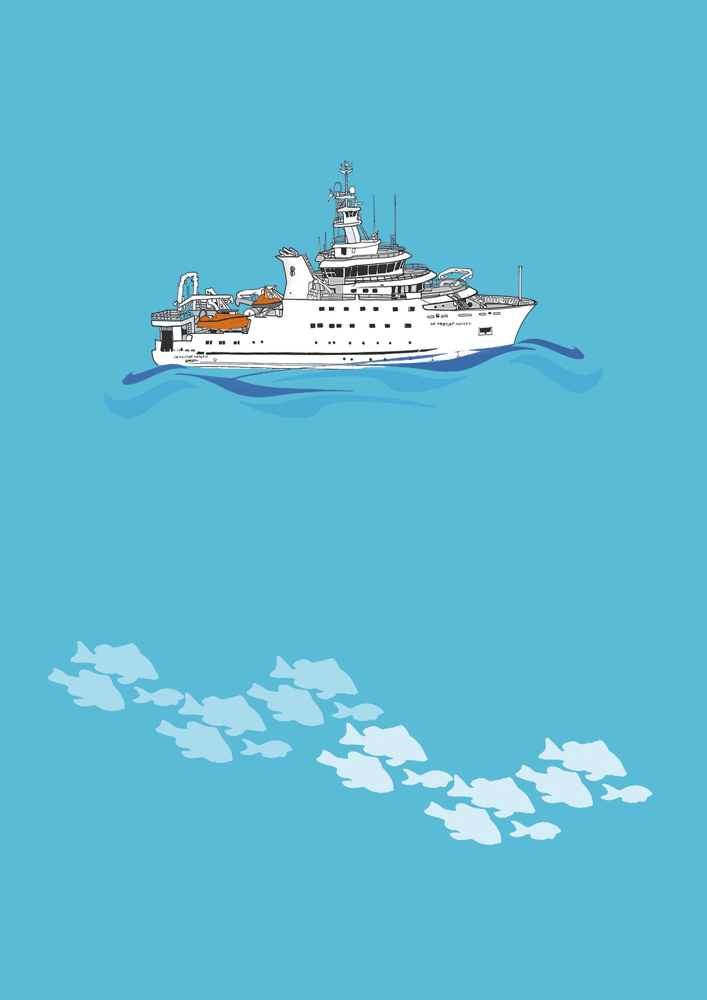
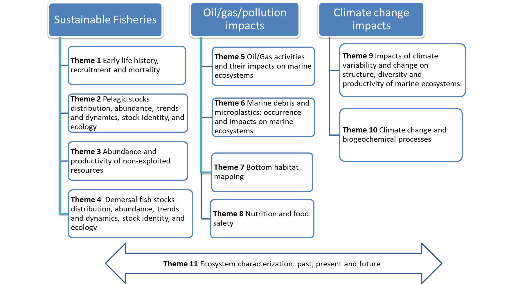
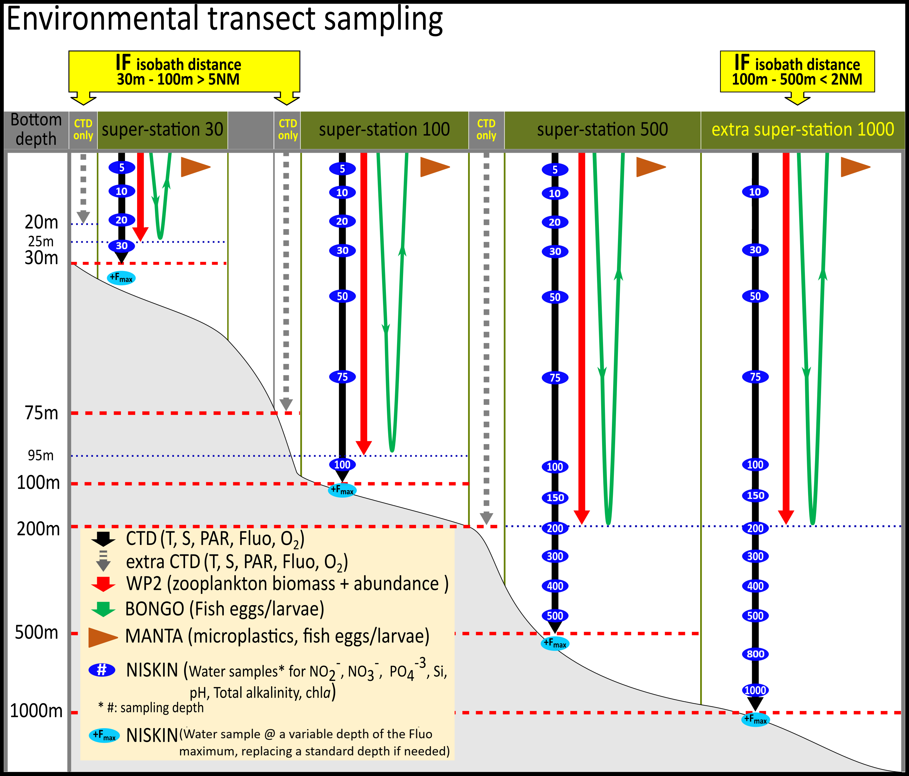
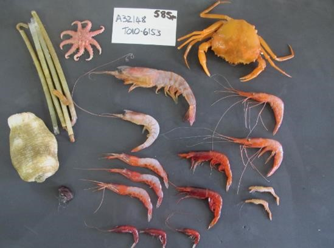
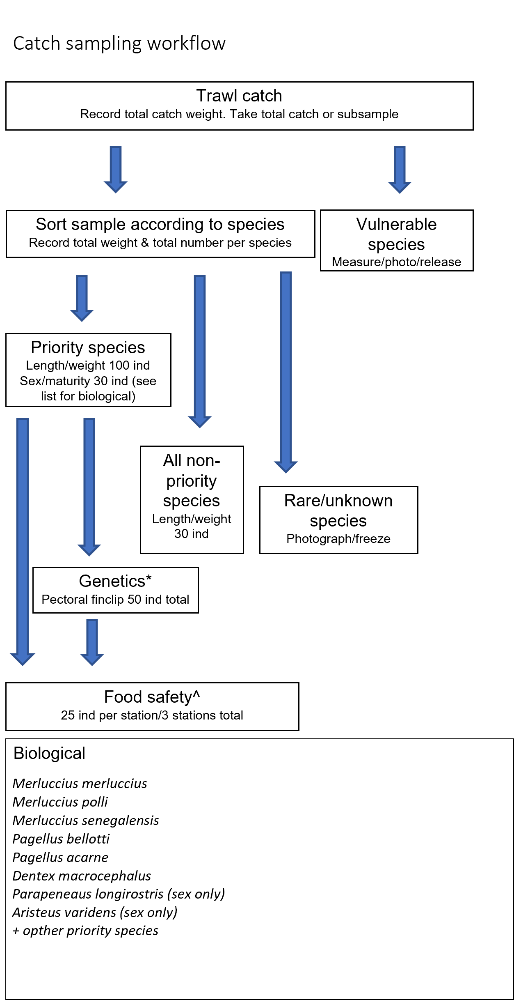
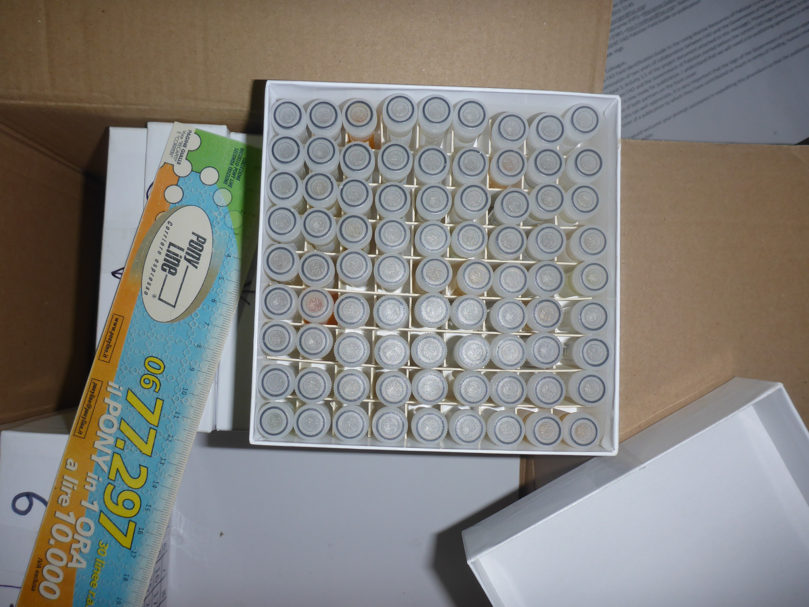
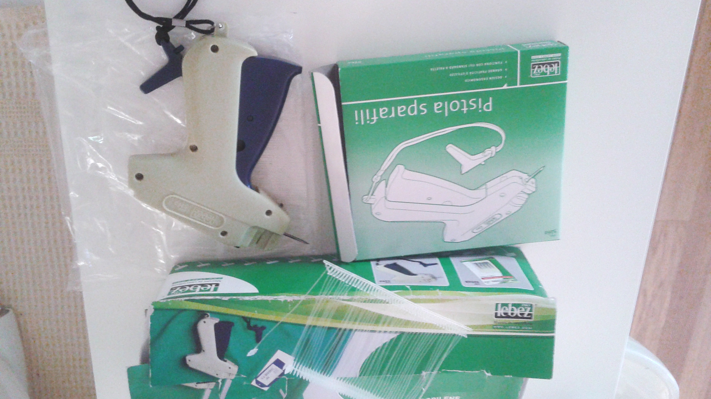
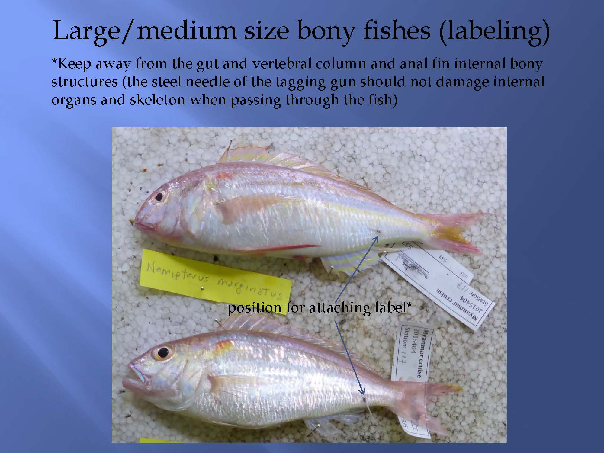
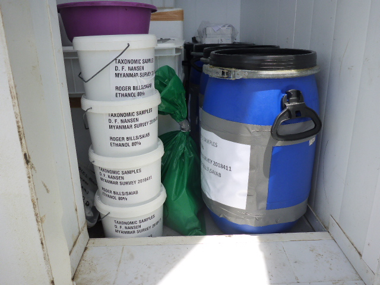
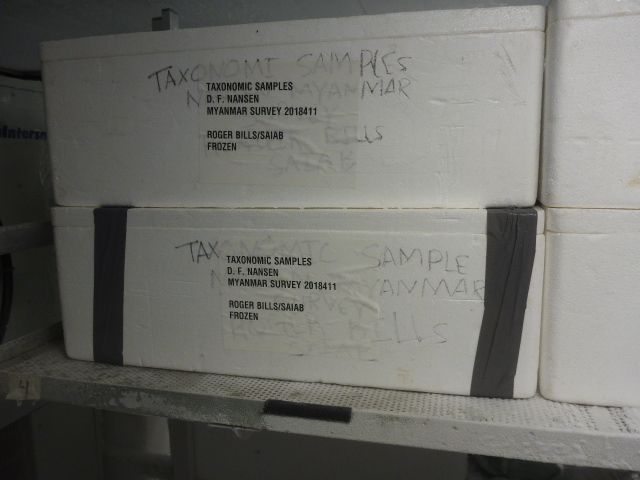

<!-- bookdown::render_book("index.Rmd", "bookdown::word_document2", params="ask") -->
<!-- ```{r user_settings, echo=FALSE, message=FALSE, warning=FALSE} -->
<!-- ### This chunck contains settings that can be modified by the user.  -->
<!-- #finalVersion = FALSE -->


<!-- ``` -->

```{r setup, echo=FALSE, message=FALSE, warning=FALSE}
# runStoXFlag <- as.logical(params$runStoX)
# SOonlyFlag <- as.logical(params$SailingOrderOnly)

SurveyAreaMap <- data.frame(lon=c(params$minDecLon, params$maxDecLon),
                            lat=c(params$minDecLat, params$maxDecLat))

# SurveyAreaMap_sf <- st_as_sf(SurveyAreaMap, 
#                              coords = c("lon","lat"),
#                              crs="+proj=utm +zone=28 +datum=WGS84 +units=m +no_defs") 
  

################
## NOTE TO SELF: to have cross-references compiled correctly, you need to first compile the bookdown:gitbook format, then the word document.
################

knitr::opts_chunk$set(
	message = FALSE,
	warning = FALSE
)

options(skipen=999)
#For dates to display in the proper way the locale needs to be set to English on the local machine
invisible(Sys.setlocale(locale = "English"))
#Load required packages
packages <- c("knitr", 
              "textreadr", 
              "tokenizers", 
              "readxl", 
              "bookdown", 
              "RPostgreSQL", 
              "leaflet", 
              "leaflet.extras", 
              "leaflet.minicharts", 
              "tidyverse", 
              "ftExtra",
              "lubridate", 
              "sf", 
              "cowplot", 
              "viridisLite", 
              "janitor", 
              "leafsync",  
              "qdapRegex", 
              "rstudioapi", 
              "flextable", 
              "officer", 
              "marmap", 
              "dtplyr",
              "ggOceanMaps", 
              "ggnewscale", 
              "rnaturalearth", 
              "jsonlite", 
              "data.table",
              "RstoxBase", 
              "RstoxData", 
              "RstoxFramework", 
              "ggspatial", 
              "ggrepel", 
              "mapview", 
              "webshot"
)


installed_packages <- packages %in% rownames(installed.packages())
if (any(installed_packages == FALSE)) {
  install.packages(packages[!installed_packages], repos = "http://cran.us.r-project.org")
}


# #The package RstoxData is needed to read in the biotic.xml that contains the catch-related data. The biotic.xml will be used since there is a scheduled switch from the Nansis punching interface to that of the Biotic Editor (from which data are saved in the .xml format). The same biotic.xml format is used as input to the functions utilized by the EAF-Nansen-Biotic-Explorer https://github.com/niknikos/EAF-Nansen-Biotic-Explorer forked and modified from the Biotic Explorer https://github.com/MikkoVihtakari/BioticExplorer, so this is the reasoning for the usage of the biotic.xml format on the survey report. The relevant biotic.xml is now created for past surveys (where Nansis has been used as the punching interface and data are stored in the Nansis table) with the usage of a middleware that has been create for that purpose. The middleware (nansisclient ftp.imr.no/nmd/apps/nansisclient install and make sure you update it to the latest version through the Tools menu) connects to the IMR server or the localhost mode of the Nansis DB, reads in Nansis DB tables and passes the info to the relevant .xml fields.
# 
# if (!"RstoxData" %in% installed.packages()[,"Package"]) {
#   devtools::install_github("StoXProject/RstoxData")
# }
# 
# if (!"ggOceanMaps" %in% installed.packages()[,"Package"]) {
#   devtools::install_github("MikkoVihtakari/ggOceanMaps")
# }
# 
# if (!"rnaturalearthhires" %in% installed.packages()[,"Package"]) {
#   devtools::install_github("ropensci/rnaturalearthhires")
# }


# Packages loading
invisible(lapply(X = packages, FUN = require, character.only = TRUE))

# Install install_phantomjs only if it is not installed
if (is_phantomjs_installed() == FALSE) {
  webshot::install_phantomjs()
}

# End of Packages loading
# Suppress dplyr's summarizing info
options(dplyr.summarise.inform = FALSE)
opts_knit$set(eval.after = "fig.cap")
#The functions used by the Biotic Explorer require some minor modifications of the Nansen data. These modifications are
# in lines 25-46 of the processBiotic_functions.R that is shipped with the project under the path below.
# source("./_R_functions/processBiotic_functions.R", encoding = "utf-8")
#Sourcing some helper functions and figure functions that are used later in the report creation
source('./_R_functions/helper_functions.R', encoding = "utf-8")
source('./_R_functions/figure_functions.R', encoding = "utf-8")

```


```{r setTableFormat, message=FALSE, warning=FALSE, include=FALSE, results='hide'}
# This chunck of code set the format (background color, padding, etc) of the tables produced in the report, so to have it standardized throughout.
set_flextable_defaults(big.mark = " ", 
  font.family = 'cambria',
  font.size = 9, 
  theme_fun = theme_zebra, 
  line_spacing = 0.8,
  padding.bottom = 5, 
  padding.top = 5,
  padding.left = 4,
  padding.right = 4,
  extra_css = "caption {text-align: left;}")

```


```{r data_loading, message=FALSE, warning=FALSE, include=FALSE, results='hide'}
survey <- as.numeric(params$surveyNumber)
#Loading of data, tidying up and preparation of the data for further usage
source('./_R_functions/data_input_and_preparation.R', encoding = "utf-8")
#Currently, the text input for the various sections of the report is done through calling in a .docx file. For details see the header in the input_text_preparation.R file found in the following path
source('./_R_functions/input_text_preparation.R', encoding = "utf-8")

```

<!--chapter:end:index.Rmd-->

---
output:
  word_document: default
  html_document: default
editor_options:
  chunk_output_type: inline
---


#  {.unnumbered}

<p style="text-align: center;">

**NORAD-FAO PROJECT GCP/INT/690/NOR, CRUISE REPORTS "DR. FRIDTJOF NANSEN"**

</p>


```{r fig_cover, echo=FALSE, fig.align='center', message=FALSE, warning=FALSE, out.width='200%'}
# Provide info for cover page. Most of the info here is manually entered now (see below the code chunk) but the idea is that elements are pulled in from the afforementioned .docx or an excel file (or another, better solution). Also, I need to work on a solution that the info is printed on the Cover page background, i.e. on the DFN sketch. On the to-do list but not a priority for the moment.

# The survey period is dynamically derived from the tracklog_df (see data_input_and_preparation.R file for details)
survey_period <- paste(paste(as.character(format(tracklog_df_input$dat[1], "%d %B")), 
                       as.character(format(tracklog_df_input$dat[nrow(tracklog_df_input)],  "%d %B")), sep = " - "),
                       format(Sys.Date(), format="%Y"), sep = ", ")
survey_period <- "20 November - 15 December, 2022" #bypass for Cabo Verde
authoring_place_year <- paste0('Bergen, ', format(Sys.Date(), format="%Y"))


```

\newpage

<p style="text-align: center;">

**CABO VERDE ECOSYSTEM SURVEY**

</p>

<p style="text-align: center;">

**Survey no: `r as.character(survey)`**

</p>

<p style="text-align: center;">

**`r survey_period`**

</p>

\newpage

\newpage

<p style="text-align: center;">

CRUISE REPORTS "DR FRIDTJOF NANSEN"

</p>

<p style="text-align: center;">

CABO VERDE ECOSYSTEM SURVEY

</p>

<!-- <p style="text-align: center;"> Survey no `r survey` </p> -->

<p style="text-align: center;">

Leg 2


</p>

<p style="text-align: center;">

Cabo Verde


</p>

<p style="text-align: center;">

`r survey_period`

</p>

<p style="text-align: center;">

by

</p>

<p style="text-align: center;">

`r paste(unlist(input_dataframes$authors), collapse=', ')`

</p>

<p style="text-align: center;">

```{r affiliations, echo=FALSE, tidy=TRUE, results='asis'}
cat(paste0("^", input_dataframes$affiliations$ID, "^", input_dataframes$affiliations$Affiliation), sep = "\n\n")
```

<!-- <br> \newline --><!-- <br> \newline -->

<p style="text-align: center;">

Institute of Marine Research

</p>

<p style="text-align: center;">

`r authoring_place_year`

</p>

\newpage

\newpage

<p style="text-align: center;">

**THE EAF-NANSEN PROGRAMME (2017–2021)**

The EAF-Nansen Programme “Supporting the Application of the Ecosystem Approach to Fisheries Management considering Climate and Pollution Impacts” supports partner countries and regional organizations in Africa and the Bay of Bengal improving their capacity for the sustainable management of their fisheries and other uses of marine and coastal resources through the implementation of the Ecosystem Approach to Fisheries (EAF), taking into consideration the impacts of the climate and pollution.

The Programme is executed by the Food and Agriculture Organization of the United Nations (FAO) in close collaboration with the Institute of Marine Research (IMR) of Bergen, Norway, and funded by the Norwegian Agency for Development Cooperation (Norad). This Programme is the current phase (2017–2021) of the Nansen Programme which started in 1975.

The aim of the Programme is that sustainable fisheries improve food and nutrition security for people in partner countries. It builds on three pillars, Science, Fisheries Management, and Capacity Development, and supports partner countries to produce relevant and timely evidence-based advice for management, to manage fisheries according to the EAF principles and to further develop their human and organizational capacity to manage fisheries sustainably. In line with the EAF principles, the Programme adopts a broad scope, taking into consideration a wide range of impacts of human activities and natural processes on marine resources and ecosystems including fisheries, pollution, climate variability and change.

A new state of the art research vessel, the Dr Fridtjof Nansen, is an integral part of the Programme. A comprehensive science plan, covering a broad selection of research areas, and directed at producing knowledge for informing policy and management decisions, guides the Programme’s scientific work.

The Programme works in partnership with countries, regional organizations, other UN agencies as well as other partner projects and institutions.


**LE PROGRAMME EAF-NANSEN (2017-2021)**

Le programme EAF-Nansen « Soutenir l'application de l'approche écosystémique pour la gestion des pêches compte tenu des impacts du climat et de la pollution » appui les pays partenaires et les organisations régionales en Afrique et dans le golfe du Bengale pour améliorer leur capacité de gestion durable de leurs pêcheries et d'autres usages de la mer ainsi que les ressources côtières, grâce à la mise en œuvre de l'Approche écosystémique des pêches (AEP), en tenant compte des impacts du climat et de la pollution.

Le programme est exécuté par l'Organisation des Nations Unies pour l'alimentation et l'agriculture (FAO) en étroite collaboration avec l'Institut de recherche marine (IMR) de Bergen, en Norvège, et financé par l'Agence norvégienne de coopération au développement (Norad). Ce programme est la phase actuelle (2017-2021) du programme Nansen qui a débuté en 1975.

L'objectif du programme est que la pêche durable améliore la sécurité alimentaire et nutritionnelle des populations des pays partenaires. Il s'appuie sur trois piliers, la science, la gestion des pêches et le développement des capacités, et aide les pays partenaires à produire des avis pertinents et opportuns fondés sur des données factuelles pour la gestion, à gérer les pêcheries conformément aux principes de l'AEP et à développer davantage leur capacité humaine et organisationnelle à gérer durablement les pêches. Conformément aux principes de l'AEP, le programme adopte une large vision, prenant en considération un large éventail d'impacts des activités humaines et des processus naturels sur les ressources et les écosystèmes marins, y compris la pêche, la pollution, la variabilité et le changement climatique.

Un nouveau navire de recherche de pointe, le Dr Fridtjof Nansen, fait partie intégrante du programme. Un plan scientifique complet, couvrant un large éventail de domaines de recherche et visant à produire des connaissances pour éclairer les décisions de politique et de gestion, guide les travaux scientifiques du programme.

Le programme travaille en partenariat avec des pays, des organisations régionales, d'autres agences des Nations Unies ainsi que d'autres projets et institutions partenaires.


This report should be cited as:

Michalsen et al. 2022. Cabo Verde ecosystem survey, `r survey_period`. NORAD-FAO PROGRAMME GCP/GLO/690/NOR, CRUISE REPORTS DR FRIDTJOF NANSEN, EAF-Nansen/CR/2019/10. xxxxxxxxxx p.

</p>

\newpage

# **List of Abbreviations** {.unnumbered}

To be filled in for the final version of the report

```{r abbreviations, echo=FALSE, comment=NA, results='asis', tidy=FALSE}
# The list of abbreviations will be pulled in as the rest of the text. This can be a separate chapter if needed.
```

\newpage

# **EXECUTIVE SUMMARY** {.unnumbered}


```{r execsum prep, comment=NA, include=FALSE, results='asis', tidy=FALSE}
execsum <- execsum_text[(str_which(execsum_text, execsum_text$`1. EXECUTIVE SUMMARY`)+1):(str_which(execsum_text, execsum_text$`2. END`))]
if(all(names(execsum)[-length(execsum)]=="NA")){
  execsum <- execsum[names(execsum)=="NA"]
  execsum_names <- as.character(c(1:length(execsum)))
  names(execsum) <- execsum_names
} else {
  execsum <- execsum[names(execsum)!="NA"]
  execsum_names <- names(execsum)
  execsum <- lapply(seq_along(execsum), function(x) paste0('execsum_text[(str_which(execsum_text,
                                                                     execsum_text$`',execsum[x],'`)+1):(str_which(execsum_text,
                                                                     execsum_text$`',(execsum[x+1]),'`)-1)]'))
  names(execsum) <- execsum_names
  execsum[length(execsum)] <- NULL
}

```

```{r execsum, echo=FALSE, comment=NA, results='asis', tidy=FALSE}
writeLines(unlist(execsum), sep = "  \n\n")
```

\newpage

<!--chapter:end:00-Preface.Rmd-->

# Hello bookdown 

All chapters start with a first-level heading followed by your chapter title, like the line above. There should be only one first-level heading (`#`) per .Rmd file.

## A section

All chapter sections start with a second-level (`##`) or higher heading followed by your section title, like the sections above and below here. You can have as many as you want within a chapter.

### An unnumbered section {-}

Chapters and sections are numbered by default. To un-number a heading, add a `{.unnumbered}` or the shorter `{-}` at the end of the heading, like in this section.

<!--chapter:end:01-intro.Rmd-->

---
output:
  word_document: default
  html_document: default
---

# **ANNEXES** {-}

# **ANNEX I SAILING ORDERS** 

**R/V _Dr Fridtjof Nansen_** 

**`r input_dataframes$SO.cruise.plan$Survey`**

```{r ANNEX_SO prep, comment=NA, include=FALSE, results='asis', tidy=FALSE}
ANNEX_SO <- input_text_SO[(str_which(input_text_SO, input_text_SO$`6. SAILING ORDERS`)+1):(str_which(input_text_SO, input_text_SO$`7. END`))]
ANNEX_SO <- ANNEX_SO[names(ANNEX_SO)!="NA"]
ANNEX_SO_names <- names(ANNEX_SO)
ANNEX_SO <- lapply(seq_along(ANNEX_SO), function(x) paste0('input_text_SO[(str_which(input_text_SO, input_text_SO$`',ANNEX_SO[x],'`)+1):(str_which(input_text_SO, input_text_SO$`',(ANNEX_SO[x+1]),'`)-1)]'))
names(ANNEX_SO) <- ANNEX_SO_names
ANNEX_SO[length(ANNEX_SO)] <- NULL

## if starting with '\n', add numbering. 
# input_text_SO[(lapply(input_text_SO, function(so) substr(so, 1, 3) == '\n') )]
# startsWith(so, '\n', trim=FALSE, ignore.case=FALSE))
# ANNEX_SO
```


## **SURVEY PLAN FOR ** `r input_dataframes$SO.cruise.plan$Survey`

<br>

```{r survey_plan, echo=FALSE, comment=NA, results='asis', tidy=FALSE}
survey_plan.text <- paste(eval(str2expression(ANNEX_SO$`6.1 SURVEY PLAN FOR`)), collapse = "\n\n")
writeLines(unlist(survey_plan.text))
```


```{r SOcruiseplantab, echo=FALSE, tidy=TRUE, label="SOcruiseplantab"}
ft_surveyplan <- flextable(input_dataframes$SO.cruise.plan) %>% theme_booktabs(bold_header = TRUE) %>% bg(bg='transparent', part = "header") %>% ftExtra::colformat_md()
# Add caption
autonum <- run_autonum(seq_id = "tab", bkm = "SOcruiseplantab", pre_label = "Table ", start_at=1)
ft_surveyplan <- set_caption(ft_surveyplan, caption = paste(input_dataframes$SO.tab.captions[input_dataframes$SO.tab.captions$`tab name`=="SOcruiseplantab","caption"]), style = "Table Caption", autonum=autonum)

# # set table width to span page width
set_table_properties(ft_surveyplan,layout = "autofit")
```

<br>

### **Survey objectives** 

```{r survey_obj_SO, echo=FALSE, comment=NA, results='asis', tidy=FALSE}
survey_obj.text <- eval(str2expression(ANNEX_SO$`6.1.1 Survey objectives`))
# objective.text <- grep(":", survey_obj.text)
# sub_objective.text <- survey_obj.text[-(1:objective.text)]
# survey_obj.text <- survey_obj.text[1:objective.text]
# # # sub_objective <- grep("To ", survey_obj.text)
# for(i in objective.text){
#   # survey_obj.text[[i]][1] <- paste('\n', paste0("* ", survey_obj.text[[i]][1]), sep = " ")
#   survey_obj.text[[i]][1] <- paste('\n', survey_obj.text[[i]][1], sep = " ")
# }
# for(i in 1:length(sub_objective.text)){
#   #i =1
#   #survey_obj.text[[i]][1] <- paste('\n', paste0("    * ", survey_obj.text[[i]][1]), sep = " ")
#   sub_objective.text[[i]][1] <- paste('\n', paste0("", sub_objective.text[[i]][1]), sep = " ")
# }
writeLines(unlist(survey_obj.text))
# writeLines(unlist(sub_objective.text))
```


### **Survey area** 

```{r survey_area_SO, echo=FALSE, comment=NA, results='asis', tidy=FALSE}
survey_area_SO.text <- paste(eval(str2expression(ANNEX_SO$`6.1.2 Survey area`)), collapse = "\n\n")
writeLines(unlist(survey_area_SO.text))
```


```{r surveyareamapSOfig, echo=FALSE, fig.cap=paste(input_dataframes$SO.fig.captions[input_dataframes$SO.fig.captions$`fig name`=="surveyareamapSOfig","caption"]), fig.align='center', label='surveyareamapSOfig'}
knitr::include_graphics("./_images/sailingOrders/surveyareamapSOfig.png")
```

<br>

### **Proposed participation in different legs and experience required** 

```{r SOreqpart, echo=FALSE, comment=NA, results='asis', tidy=FALSE}
SOreqpart.text <- paste(eval(str2expression(ANNEX_SO$`6.1.3 Proposed participation in different legs and experience required`)), collapse = "\n\n")
writeLines(unlist(SOreqpart.text))
```


## **SCIENTIFIC RATIONALE** 


```{r scienceplanSO, echo=FALSE, comment=NA, results='asis', tidy=FALSE}
scienceplan_SO.text <- paste(eval(str2expression(ANNEX_SO$`6.2 SCIENTIFIC RATIONALE`)), collapse = "\n\n")
writeLines(unlist(scienceplan_SO.text))
```


```{r scienceplanSOfig, echo=FALSE, fig.cap=paste(input_dataframes$SO.fig.captions[input_dataframes$SO.fig.captions$`fig name`=="scienceplanSOfig","caption"]), fig.align='center', label='scienceplanSOfig'}

```

<br>

```{r SOsciencethemestab, echo=FALSE, tidy=TRUE, label="SOsciencethemestab"}
ft_SOsciencethemestab <- flextable(input_dataframes$SO.sciencethemestab) %>% theme_booktabs(bold_header = TRUE) %>% bg(bg='transparent', part = "header") %>% ftExtra::colformat_md()
# Add caption
autonum <- run_autonum(seq_id = "tab", bkm = "SOsciencethemestab", pre_label = "Table ")
ft_SOsciencethemestab <- set_caption(ft_SOsciencethemestab, caption = paste(input_dataframes$SO.tab.captions[input_dataframes$SO.tab.captions$`tab name`=="SOsciencethemestab","caption"]), style = "Table Caption"
                             , autonum=autonum
                             )

# # set table width to span page width
set_table_properties(ft_SOsciencethemestab,layout = "autofit")

```

<br>


### **Specific objectives and scientific questions for the survey** 

```{r specific_survey_obj, echo=FALSE, comment=NA, results='asis', tidy=FALSE}

survey_obj.text <- eval(str2expression(ANNEX_SO$`6.2.1 Specific objectives and scientific questions for the survey`))
# objective.text <- grep(":", survey_obj.text)
# sub_objective.text <- survey_obj.text[-(1:objective.text)]
# survey_obj.text <- survey_obj.text[1:objective.text]
# # # sub_objective <- grep("To ", survey_obj.text)
# for(i in objective.text){
#   # survey_obj.text[[i]][1] <- paste('\n', paste0("* ", survey_obj.text[[i]][1]), sep = " ")
#   survey_obj.text[[i]][1] <- paste('\n', survey_obj.text[[i]][1], sep = " ")
# }
# for(i in 1:length(sub_objective.text)){
#   #i =1
#   #survey_obj.text[[i]][1] <- paste('\n', paste0("    * ", survey_obj.text[[i]][1]), sep = " ")
#   sub_objective.text[[i]][1] <- paste('\n', paste0("* ", sub_objective.text[[i]][1]), sep = " ")
# }
writeLines(unlist(survey_obj.text))
# writeLines(unlist(sub_objective.text))
```


## **SAMPLING METHODS** 

```{r samplingmethods_SO, echo=FALSE, comment=NA, results='asis', tidy=FALSE}
samplingmethods_SO.text <- paste(eval(str2expression(ANNEX_SO$`6.3.1 Survey design`)), collapse = "\n\n")
writeLines(unlist(samplingmethods_SO.text))
```


### **Meteorological and hydrographic sampling in surface water** 

#### *Weather Station* 

```{r meteooceanosampling_SO, echo=FALSE, comment=NA, results='asis', tidy=FALSE}
meteooceanosampling_SO.text <- paste(eval(str2expression(ANNEX_SO$`6.3.2.1 Weather Station`)), collapse = "\n\n")
writeLines(unlist(meteooceanosampling_SO.text))
```

#### *Thermosalinograph* 

```{r thermosalinograph_SO, echo=FALSE, comment=NA, results='asis', tidy=FALSE}
thermosalinograph_SO.text <- paste(eval(str2expression(ANNEX_SO$`6.3.2.2 Thermosalinograph`)), collapse = "\n\n")
writeLines(unlist(thermosalinograph_SO.text))
```

#### *Underway pCO~2~* 

```{r pCO2_SO, echo=FALSE, comment=NA, results='asis', tidy=FALSE}
pCO2_SO.text <- paste(eval(str2expression(ANNEX_SO$`6.3.2.3 Underway pCO2`)), collapse = "\n\n")
writeLines(unlist(pCO2_SO.text))
```

#### *Current speed and direction measurements - ADCP* 

```{r currents_SO, echo=FALSE, comment=NA, results='asis', tidy=FALSE}
currents_SO.text <- paste(eval(str2expression(ANNEX_SO$`6.3.2.4 Current speed and direction measurements - ADCP`)), collapse = "\n\n")
writeLines(unlist(currents_SO.text))
```

### **Hydrographic sampling in the water column** 

#### *CTD* 

```{r ctd_SO, echo=FALSE, comment=NA, results='asis', tidy=FALSE}
ctd_SO.text <- paste(eval(str2expression(ANNEX_SO$`6.3.3.1 CTD`)), collapse = "\n\n")
writeLines(unlist(ctd_SO.text))
```

```{r envtransectsSOfig, echo=FALSE, fig.cap=paste(input_dataframes$SO.fig.captions[input_dataframes$SO.fig.captions$`fig name`=="envtransectsSOfig","caption"]), fig.align='center', label='envtransectsSOfig'}

```

<br>

#### *Ocean Acidification parameters - pH and total alkalinity* 

```{r pH_TA_SO, echo=FALSE, comment=NA, results='asis', tidy=FALSE}
pH_TA_SO_SO.text <- paste(eval(str2expression(ANNEX_SO$`6.3.3.2 Ocean Acidification parameters - pH and total alkalinity`)), collapse = "\n\n")
writeLines(unlist(pH_TA_SO_SO.text))
```

<br>

#### *Dissolved Nutrients* 

```{r nutrients_SO, echo=FALSE, comment=NA, results='asis', tidy=FALSE}
nutrients_SO.text <- paste(eval(str2expression(ANNEX_SO$`6.3.3.3 Dissolved Nutrients`)), collapse = "\n\n")
writeLines(unlist(nutrients_SO.text))
```

### **Primary productivity** 

```{r primprod_SO, echo=FALSE, comment=NA, results='asis', tidy=FALSE}
primprod_SO.text <- paste(eval(str2expression(ANNEX_SO$`6.3.4 Primary productivity`)), collapse = "\n\n")
writeLines(unlist(primprod_SO.text))
```

### **Zooplankton** 

```{r zooplankton_SO, echo=FALSE, comment=NA, results='asis', tidy=FALSE}
zooplankton_SO.text <- paste(eval(str2expression(ANNEX_SO$`6.3.5 Zooplankton`)), collapse = "\n\n")
writeLines(unlist(zooplankton_SO.text))
```

### **Ichthyoplankton** 

```{r ichthyoplankton_SO, echo=FALSE, comment=NA, results='asis', tidy=FALSE}
ichthyoplankton_SO.text <- paste(eval(str2expression(ANNEX_SO$`6.3.6 Ichthyoplankton`)), collapse = "\n\n")
writeLines(unlist(ichthyoplankton_SO.text))
```

### **Benthos and benthic habitats**

#### *Bottom habitats* 

```{r botthabitats, echo=FALSE, comment=NA, results='asis', tidy=FALSE}
botthabitats.text <- paste(eval(str2expression(ANNEX_SO$`6.3.7.1 Bottom habitats`)), collapse = "\n\n")
writeLines(unlist(botthabitats.text))
```

### **Microplastics** 

```{r microplastics_SO, echo=FALSE, comment=NA, results='asis', tidy=FALSE}
microplastics_SO.text <- paste(eval(str2expression(ANNEX_SO$`6.3.8 Microplastics`)), collapse = "\n\n")
writeLines(unlist(microplastics_SO.text))
```

### **Biological sampling for fisheries resources** 

```{r fisheries_SO, echo=FALSE, comment=NA, results='asis', tidy=FALSE}
fisheries_SO.text <- paste(eval(str2expression(ANNEX_SO$`6.3.9 Biological sampling for fisheries resources`)), collapse = "\n\n")
writeLines(unlist(fisheries_SO.text))
```


<br>

```{r SObiosamplingtab, echo=FALSE, tidy=TRUE, label="SObiosamplingtab"}
ft_SObiosamplingtab <- flextable(input_dataframes$SO.biosampling) %>% theme_booktabs(bold_header = TRUE) %>% bg(bg='transparent', part = "header") %>% ftExtra::colformat_md()
# Add caption
autonum <- run_autonum(seq_id = "tab", bkm = "SObiosamplingtab", pre_label = "Table ")
ft_SObiosamplingtab <- set_caption(ft_SObiosamplingtab, caption = paste(input_dataframes$SO.tab.captions[input_dataframes$SO.tab.captions$`tab name`=="SObiosamplingtab","caption"]), style = "Table Caption"
                             , autonum=autonum
                             )

# # set table width to span page width
set_table_properties(ft_SObiosamplingtab,layout = "autofit")

```

<br>

#### *Demersal fish*  

```{r demersal_SO, echo=FALSE, comment=NA, results='asis', tidy=FALSE}
demersal_SO.text <- paste(eval(str2expression(ANNEX_SO$`6.3.9.1 Demersal fish`)), collapse = "\n\n")
writeLines(unlist(demersal_SO.text))
```

#### *Pelagic fish*  

```{r pelagic_SO, echo=FALSE, comment=NA, results='asis', tidy=FALSE}
pelagic_SO.text <- paste(eval(str2expression(ANNEX_SO$`6.3.9.2 Pelagic fish`)), collapse = "\n\n")
writeLines(unlist(pelagic_SO.text))
```

#### *Other trawl-related sampling*  

```{r othertrawl_SO, eval=FALSE, comment=NA, include=FALSE, results='asis', tidy=FALSE}
othertrawl_SO.text <- paste(eval(str2expression(ANNEX_SO$`6.3.9.3 Other trawl-related sampling`)), collapse = "\n\n")
writeLines(unlist(othertrawl_SO.text))
```

##### *Fish and macroinvertebrates samples for regional taxonomy course and post-survey taxonomic studies* {-}

```{r taxonomy_SO, echo=FALSE, comment=NA, results='asis', tidy=FALSE}
taxonomy_SO.text <- paste(eval(str2expression(ANNEX_SO$`6.3.9.3.1 Fish and macroinvertebrates samples for regional taxonomy course and post-survey taxonomic studies`)), collapse = "\n\n")
writeLines(unlist(taxonomy_SO.text))
```

##### *Cartilaginous fish* {-}

```{r cartilaginous_SO, echo=FALSE, comment=NA, results='asis', tidy=FALSE}
cartilaginous_SO.text <- paste(eval(str2expression(ANNEX_SO$`6.3.9.3.2 Cartilaginous fish`)), collapse = "\n\n")
writeLines(unlist(cartilaginous_SO.text))
```

<br>


```{r foodsafety_SO, echo=FALSE, comment=NA, results='asis', tidy=FALSE}
foodsafety_SO.text <- paste(eval(str2expression(ANNEX_SO$`6.3.9.3.3 Sardinella samples for food safety analysis`)), collapse = "\n\n")
writeLines(unlist(foodsafety_SO.text))
```

<br>

##### *Marine debris* {-}

```{r debris_SO, echo=FALSE, comment=NA, results='asis', tidy=FALSE}
debris_SO.text <- paste(eval(str2expression(ANNEX_SO$`6.3.9.3.4 Marine debris`)), collapse = "\n\n")
writeLines(unlist(debris_SO.text))
```

<br>

##### *Epibenthos* {-}

```{r epibenthos_SO, echo=FALSE, comment=NA, results='asis', tidy=FALSE}
epibenthos_SO.text <- paste(eval(str2expression(ANNEX_SO$`6.3.9.3.5 Epibenthos`)), collapse = "\n\n")
writeLines(unlist(epibenthos_SO.text))
```

<br>

```{r epibenthosSOfig, echo=FALSE, fig.cap=paste(input_dataframes$SO.fig.captions[input_dataframes$SO.fig.captions$`fig name`=="epibenthosSOfig","caption"]), fig.align='center', label='epibenthosSOfig'}

```

<br>

#### *Demersal fish biomass estimated based on the swept area method*  

```{r demestimates_SO, echo=FALSE, comment=NA, results='asis', tidy=FALSE}
demestimates_SO.text <- paste(eval(str2expression(ANNEX_SO$`6.3.9.4 Demersal fish biomass estimated based on the swept area method`)), collapse = "\n\n")
writeLines(unlist(demestimates_SO.text))
```

<!-- #### *Pelagic fish biomass estimation - acoustics*   -->

```{r pelbiomass_SO, eval=FALSE, comment=NA, include=FALSE, results='asis', tidy=FALSE}
pelbiomass_SO.text <- paste(eval(str2expression(ANNEX_SO$`6.3.9.5 Pelagic fish biomass estimation - acoustics`)), collapse = "\n\n")
writeLines(unlist(pelbiomass_SO.text))
```


## **DATA COLLECTED AND STANDARD PROCEDURE FOR HANDING OVER SAMPLES TO PARTNERS**

```{r collecteddata_SO, echo=FALSE, comment=NA, results='asis', tidy=FALSE}
collecteddata_SO.text <- paste(eval(str2expression(ANNEX_SO$`6.4 DATA COLLECTED AND STANDARD PROCEDURE FOR HANDING OVER SAMPLES TO PARTNERS`)), collapse = "\n\n")
writeLines(unlist(collecteddata_SO.text))
```


## **REFERENCES** {-}

```{r references_SO, eval=FALSE, comment=NA, include=FALSE, results='asis', tidy=FALSE}
references_SO.text <- paste(eval(str2expression(ANNEX_SO$`6.6 REFERENCES`)), collapse = "\n\n")
writeLines(unlist(references_SO.text))
```

\newpage

## **ANNEXES** {-}

### **ANNEX I. Requested participation** {.unnumbered #ANNEX_I}

```{r ANNEX1_SO, eval=FALSE, comment=NA, include=FALSE, label='ANNEX1_SO', results='asis', tidy=FALSE}
ANNEX1_SO.text <- paste(eval(str2expression(ANNEX_SO$`6.6.1 ANNEX I. Requested participation`)), collapse = "\n\n")
writeLines(unlist(ANNEX1_SO.text))
```

<br>

```{r SOreqparttab, echo=FALSE, tidy=TRUE, label="SOreqparttab"}
ft_SOreqparttab <- flextable(input_dataframes$SO.requested.participants) %>% theme_booktabs(bold_header = TRUE) %>% bg(bg='transparent', part = "header") %>% ftExtra::colformat_md()
# Add caption
autonum <- run_autonum(seq_id = "tab", bkm = "SOreqparttab", pre_label = "Table ")
ft_SOreqparttab <- set_caption(ft_SOreqparttab, caption =  paste(input_dataframes$SO.tab.captions[input_dataframes$SO.tab.captions$`tab name`=="SOreqparttab","caption"]), style = "Table Caption"
                             , autonum=autonum
                             )

# # set table width to span page width
set_table_properties(ft_SOreqparttab,layout = "autofit")

```

<br>

\newpage

### **ANNEX II. Planned participation** {.unnumbered #ANNEX_II}

```{r ANNEX2_SO, eval=FALSE, comment=NA, include=FALSE, label='ANNEX2_SO', results='asis', tidy=FALSE}
ANNEX2_SO.text <- paste(eval(str2expression(ANNEX_SO$`6.6.2 ANNEX II. Planned list of participants`)), collapse = "\n\n")
writeLines(unlist(ANNEX2_SO.text))
```

<br>

```{r SOplannedparticipantstab, echo=FALSE, tidy=TRUE, label="SOplannedparticipantstab"}
ft_SOplannedparticipantstab <- flextable(input_dataframes$SO.planned.participants) %>% theme_booktabs(bold_header = TRUE) %>% bg(bg='transparent', part = "header") %>% ftExtra::colformat_md()
# Add caption
autonum <- run_autonum(seq_id = "tab", bkm = "SOplannedparticipantstab", pre_label = "Table ")
ft_SOplannedparticipantstab <- set_caption(ft_SOplannedparticipantstab, caption =  paste(input_dataframes$SO.tab.captions[input_dataframes$SO.tab.captions$`tab name`=="SOplannedparticipantstab","caption"]), style = "Table Caption"
                             , autonum=autonum
                             )

# # set table width to span page width
set_table_properties(ft_SOplannedparticipantstab,layout = "autofit")

```

<br>

\newpage

### **ANNEX III. Fish lab workflow** {.unnumbered #ANNEX_III}

<br>

```{r catchsamplingworkflowSOfig, echo=FALSE, fig.cap=paste(input_dataframes$SO.fig.captions[input_dataframes$SO.fig.captions$`fig name`=="catchsamplingworkflowSOfig","caption"]), fig.align='center', label='catchsamplingworkflowSOfig'}

```

<br>

\newpage

### **ANNEX IV. Scales used for biological sampling** {.unnumbered #ANNEX_IV}

<br>

```{r SOmatstagetab, echo=FALSE, tidy=TRUE, label="SOmatstagetab"}
ft_SOmatstagetab <- flextable(input_dataframes$SO.matstagetab) %>% theme_booktabs(bold_header = TRUE) %>% bg(bg='transparent', part = "header") %>% ftExtra::colformat_md()
# Add caption
autonum <- run_autonum(seq_id = "tab", bkm = "SOmatstagetab", pre_label = "Table ")
ft_SOmatstagetab <- set_caption(ft_SOmatstagetab, caption = paste(input_dataframes$SO.tab.captions[input_dataframes$SO.tab.captions$`tab name`=="SOmatstagetab","caption"]), style = "Table Caption"
                             , autonum=autonum
                             )

# # set table width to span page width
set_table_properties(ft_SOmatstagetab,layout = "autofit")

```

<br>

\newpage

### **ANNEX V. Survey-specific additional sampling** {.unnumbered #ANNEX_V}

<br>

```{r SOtaxonomytab, echo=FALSE, tidy=TRUE, label="SOtaxonomytab"}
ft_SOtaxonomytab <- flextable(input_dataframes$SO.taxonomy) %>% theme_booktabs(bold_header = TRUE) %>% bg(bg='transparent', part = "header") %>% ftExtra::colformat_md()
# Add caption
autonum <- run_autonum(seq_id = "tab", bkm = "SOtaxonomytab", pre_label = "Table ")
ft_SOtaxonomytab <- set_caption(ft_SOtaxonomytab, caption = paste(input_dataframes$SO.tab.captions[input_dataframes$SO.tab.captions$`tab name`=="SOtaxonomytab","caption"]), style = "Table Caption"
                             , autonum=autonum
                             )

# # set table width to span page width
set_table_properties(ft_SOtaxonomytab,layout = "autofit")

```

<br>

#### **Sampling procedure** {-}

```{r sampling_SO, eval=FALSE, comment=NA, include=FALSE, results='asis', tidy=FALSE}
sampling_SO.text <- paste(eval(str2expression(ANNEX_SO$`6.6.5.1 Sampling procedure`)), collapse = "\n\n")
writeLines(unlist(sampling_SO.text))
```


#### *STEP 1* {-}
```{r step1_SO, echo=FALSE, comment=NA, results='asis', tidy=FALSE}
step1_SO.text <- paste(eval(str2expression(ANNEX_SO$`6.6.5.2 STEP 1`)), collapse = "\n\n")
writeLines(unlist(step1_SO.text))
```

```{r SOaddsamplingtab, echo=FALSE, tidy=TRUE, label="SOaddsamplingtab"}
ft_SOaddsamplingtab <- flextable(input_dataframes$SO.additional.sampling) %>% theme_booktabs(bold_header = TRUE) %>% bg(bg='transparent', part = "header") %>% ftExtra::colformat_md()
# Add caption
autonum <- run_autonum(seq_id = "tab", bkm = "SOaddsamplingtab", pre_label = "Table ")
ft_SOaddsamplingtab <- set_caption(ft_SOaddsamplingtab, caption = paste(input_dataframes$SO.tab.captions[input_dataframes$SO.tab.captions$`tab name`=="SOaddsamplingtab","caption"]), style = "Table Caption"
                             , autonum=autonum
                             )

# # set table width to span page width
set_table_properties(ft_SOaddsamplingtab,layout = "autofit")

```

<br>

#### *STEP 2* {-}
```{r step2_SO, echo=FALSE, comment=NA, results='asis', tidy=FALSE}
step2_SO.text <- paste(eval(str2expression(ANNEX_SO$`6.6.5.3 STEP 2`)), collapse = "\n\n")
writeLines(unlist(step2_SO.text))
```

<br>

```{r examplephotoSOfig, echo=FALSE, fig.cap=paste(input_dataframes$SO.fig.captions[input_dataframes$SO.fig.captions$`fig name`=="examplephotoSOfig","caption"]), fig.align='center', label='examplephotoSOfig'}
knitr::include_graphics("./_images/sailingOrders/Taxonomy/examplephotoSOfig.JPG")
```

<br>

#### *STEP 3* {-}
```{r step3_SO, echo=FALSE, comment=NA, results='asis', tidy=FALSE}
step3_SO.text <- paste(eval(str2expression(ANNEX_SO$`6.6.5.4 STEP 3`)), collapse = "\n\n")
writeLines(unlist(step3_SO.text))
```

<br>

```{r cryoboxSOfig, echo=FALSE, fig.cap=paste(input_dataframes$SO.fig.captions[input_dataframes$SO.fig.captions$`fig name`=="cryoboxSOfig","caption"]), fig.align='center', label='cryoboxSOfig'}

```

<br>

```{r bonyfishSOfig, echo=FALSE, fig.cap=paste(input_dataframes$SO.fig.captions[input_dataframes$SO.fig.captions$`fig name`=="bonyfishSOfig","caption"]), fig.align='center', label='bonyfishSOfig'}
knitr::include_graphics("./_images/sailingOrders/Taxonomy/Genetic_sampling_Bony_fishes.JPG")
```

<br>

```{r cartilagSOfig, echo=FALSE, fig.cap=paste(input_dataframes$SO.fig.captions[input_dataframes$SO.fig.captions$`fig name`=="cartilagSOfig","caption"]), fig.align='center', label='cartilagSOfig'}
knitr::include_graphics("./_images/sailingOrders/Taxonomy/Cartilaginous_fishes_tagging_Genetic_sample.JPG")
```

<br>

#### *STEP 4* {-}
```{r step4_SO, echo=FALSE, comment=NA, results='asis', tidy=FALSE}
step4_SO.text <- paste(eval(str2expression(ANNEX_SO$`6.6.5.5 STEP 4`)), collapse = "\n\n")
writeLines(unlist(step4_SO.text))
```

<br>

```{r taggunfastenersSOfig, echo=FALSE, fig.cap=paste(input_dataframes$SO.fig.captions[input_dataframes$SO.fig.captions$`fig name`=="taggunfastenersSOfig","caption"]), fig.align='center', label='taggunfastenersSOfig'}

```

<br>

```{r taggingbonyfishSOfig, echo=FALSE, fig.cap=paste(input_dataframes$SO.fig.captions[input_dataframes$SO.fig.captions$`fig name`=="taggingbonyfishSOfig","caption"]), fig.align='center', label='taggingbonyfishSOfig'}

```

<br>

```{r taggingbonyfishsmallSOfig, echo=FALSE, fig.cap=paste(input_dataframes$SO.fig.captions[input_dataframes$SO.fig.captions$`fig name`=="taggingbonyfishsmallSOfig","caption"]), fig.align='center', label='taggingbonyfishsmallSOfig'}
knitr::include_graphics("./_images/sailingOrders/Taxonomy/Tagging_Bony_fishes_small.JPG")
```

<br>

#### *STEP 5* {-}
```{r step5_SO, echo=FALSE, comment=NA, results='asis', tidy=FALSE}
step5_SO.text <- paste(eval(str2expression(ANNEX_SO$`6.6.5.6 STEP 5`)), collapse = "\n\n")
writeLines(unlist(step5_SO.text))
```

<br>

```{r barrelsSOfig, echo=FALSE, fig.cap=paste(input_dataframes$SO.fig.captions[input_dataframes$SO.fig.captions$`fig name`=="barrelsSOfig","caption"]), fig.align='center', label='barrelsSOfig'}

```

<br>

```{r boxesSOfig, echo=FALSE, fig.cap=paste(input_dataframes$SO.fig.captions[input_dataframes$SO.fig.captions$`fig name`=="boxesSOfig","caption"]), fig.align='center', label='boxesSOfig'}

```

<br>

#### *STEP 6* {-}
```{r step6_SO, echo=FALSE, comment=NA, results='asis', tidy=FALSE}
step6_SO.text <- paste(eval(str2expression(ANNEX_SO$`6.6.5.7 STEP 6`)), collapse = "\n\n")
writeLines(unlist(step6_SO.text))
```


\newpage

### **ANNEX VI. Biological sampling plan for caught species** {.unnumbered #ANNEX_VI}

<br>

```{r SOequipmenttab, echo=FALSE, tidy=TRUE, label="SOequipmenttab"}
ft_SOequipmenttab <- flextable(input_dataframes$SO.equipmenttab) %>% theme_booktabs(bold_header = TRUE) %>% bg(bg='transparent', part = "header") %>% ftExtra::colformat_md()
# Add caption
autonum <- run_autonum(seq_id = "tab", bkm = "SOequipmenttab", pre_label = "Table ")
ft_SOequipmenttab <- set_caption(ft_SOequipmenttab, caption = paste(input_dataframes$SO.tab.captions[input_dataframes$SO.tab.captions$`tab name`=="SOequipmenttab","caption"]), style = "Table Caption"
                             , autonum=autonum
                             )

# # set table width to span page width
set_table_properties(ft_SOequipmenttab,layout = "autofit")

```

<br>

\newpage

### **ANNEX VII. Biological sampling plan for caught species** {.unnumbered #ANNEX_VII}

<br>

```{r SOdatahandovertab, echo=FALSE, tidy=TRUE, label="SOdatahandovertab"}
ft_SOdatahandovertab <- flextable(input_dataframes$SO.datahandovertab) %>% theme_booktabs(bold_header = TRUE) %>% bg(bg='transparent', part = "header") %>% ftExtra::colformat_md()
# Add caption
autonum <- run_autonum(seq_id = "tab", bkm = "SOdatahandovertab", pre_label = "Table ")
ft_SOdatahandovertab <- set_caption(ft_SOdatahandovertab, caption = paste(input_dataframes$SO.tab.captions[input_dataframes$SO.tab.captions$`tab name`=="SOdatahandovertab","caption"]), style = "Table Caption"
                             , autonum=autonum
                             )

# # set table width to span page width
set_table_properties(ft_SOdatahandovertab,layout = "autofit")

```

<br>

\newpage

### **ANNEX VIII. Biological sampling plan for caught species** {.unnumbered #ANNEX_VIII}

<br>

```{r SOcollectedsamplestab, echo=FALSE, tidy=TRUE, label="SOcollectedsamplestab"}
ft_SOcollectedsamplestab <- flextable(input_dataframes$SO.collectedsamplestab) %>% theme_booktabs(bold_header = TRUE) %>% bg(bg='transparent', part = "header") %>% ftExtra::colformat_md()
# Add caption
autonum <- run_autonum(seq_id = "tab", bkm = "SOcollectedsamplestab", pre_label = "Table ")
ft_SOcollectedsamplestab <- set_caption(ft_SOcollectedsamplestab, caption = paste(input_dataframes$SO.tab.captions[input_dataframes$SO.tab.captions$`tab name`=="SOcollectedsamplestab","caption"]), style = "Table Caption"
                             , autonum=autonum
                             )

# # set table width to span page width
set_table_properties(ft_SOcollectedsamplestab,layout = "autofit")

```

<br>

<!--chapter:end:01-SailingOrder.Rmd-->

# Cross-references {#cross}

Cross-references make it easier for your readers to find and link to elements in your book.

## Chapters and sub-chapters

There are two steps to cross-reference any heading:

1. Label the heading: `# Hello world {#nice-label}`. 
    - Leave the label off if you like the automated heading generated based on your heading title: for example, `# Hello world` = `# Hello world {#hello-world}`.
    - To label an un-numbered heading, use: `# Hello world {-#nice-label}` or `{# Hello world .unnumbered}`.

1. Next, reference the labeled heading anywhere in the text using `\@ref(nice-label)`; for example, please see Chapter \@ref(cross). 
    - If you prefer text as the link instead of a numbered reference use: [any text you want can go here](#cross).

## Captioned figures and tables

Figures and tables *with captions* can also be cross-referenced from elsewhere in your book using `\@ref(fig:chunk-label)` and `\@ref(tab:chunk-label)`, respectively.

See Figure \@ref(fig:nice-fig).

```{r nice-fig, fig.cap='Here is a nice figure!', out.width='80%', fig.asp=.75, fig.align='center', fig.alt='Plot with connected points showing that vapor pressure of mercury increases exponentially as temperature increases.'}
par(mar = c(4, 4, .1, .1))
plot(pressure, type = 'b', pch = 19)
```

Don't miss Table \@ref(tab:nice-tab).

```{r nice-tab, tidy=FALSE}
knitr::kable(
  head(pressure, 10), caption = 'Here is a nice table!',
  booktabs = TRUE
)
```

<!--chapter:end:02-cross-refs.Rmd-->

# Parts

You can add parts to organize one or more book chapters together. Parts can be inserted at the top of an .Rmd file, before the first-level chapter heading in that same file. 

Add a numbered part: `# (PART) Act one {-}` (followed by `# A chapter`)

Add an unnumbered part: `# (PART\*) Act one {-}` (followed by `# A chapter`)

Add an appendix as a special kind of un-numbered part: `# (APPENDIX) Other stuff {-}` (followed by `# A chapter`). Chapters in an appendix are prepended with letters instead of numbers.


<!--chapter:end:03-parts.Rmd-->

# Footnotes and citations 

## Footnotes

Footnotes are put inside the square brackets after a caret `^[]`. Like this one ^[This is a footnote.]. 

## Citations

Reference items in your bibliography file(s) using `@key`.

For example, we are using the **bookdown** package [@R-bookdown] (check out the last code chunk in index.Rmd to see how this citation key was added) in this sample book, which was built on top of R Markdown and **knitr** [@xie2015] (this citation was added manually in an external file book.bib). 
Note that the `.bib` files need to be listed in the index.Rmd with the YAML `bibliography` key.


The RStudio Visual Markdown Editor can also make it easier to insert citations: <https://rstudio.github.io/visual-markdown-editing/#/citations>

<!--chapter:end:04-citations.Rmd-->

# Blocks

## Equations

Here is an equation.

\begin{equation} 
  f\left(k\right) = \binom{n}{k} p^k\left(1-p\right)^{n-k}
  (\#eq:binom)
\end{equation} 

You may refer to using `\@ref(eq:binom)`, like see Equation \@ref(eq:binom).


## Theorems and proofs

Labeled theorems can be referenced in text using `\@ref(thm:tri)`, for example, check out this smart theorem \@ref(thm:tri).

::: {.theorem #tri}
For a right triangle, if $c$ denotes the *length* of the hypotenuse
and $a$ and $b$ denote the lengths of the **other** two sides, we have
$$a^2 + b^2 = c^2$$
:::

Read more here <https://bookdown.org/yihui/bookdown/markdown-extensions-by-bookdown.html>.

## Callout blocks


The R Markdown Cookbook provides more help on how to use custom blocks to design your own callouts: https://bookdown.org/yihui/rmarkdown-cookbook/custom-blocks.html

<!--chapter:end:05-blocks.Rmd-->

# Sharing your book

## Publishing

HTML books can be published online, see: https://bookdown.org/yihui/bookdown/publishing.html

## 404 pages

By default, users will be directed to a 404 page if they try to access a webpage that cannot be found. If you'd like to customize your 404 page instead of using the default, you may add either a `_404.Rmd` or `_404.md` file to your project root and use code and/or Markdown syntax.

## Metadata for sharing

Bookdown HTML books will provide HTML metadata for social sharing on platforms like Twitter, Facebook, and LinkedIn, using information you provide in the `index.Rmd` YAML. To setup, set the `url` for your book and the path to your `cover-image` file. Your book's `title` and `description` are also used.


This `gitbook` uses the same social sharing data across all chapters in your book- all links shared will look the same.

Specify your book's source repository on GitHub using the `edit` key under the configuration options in the `_output.yml` file, which allows users to suggest an edit by linking to a chapter's source file. 

Read more about the features of this output format here:

https://pkgs.rstudio.com/bookdown/reference/gitbook.html

Or use:

```{r eval=FALSE}
?bookdown::gitbook
```


<!--chapter:end:06-share.Rmd-->

`r if (knitr::is_html_output()) '
# References {-}
'`

<!--chapter:end:07-references.Rmd-->

